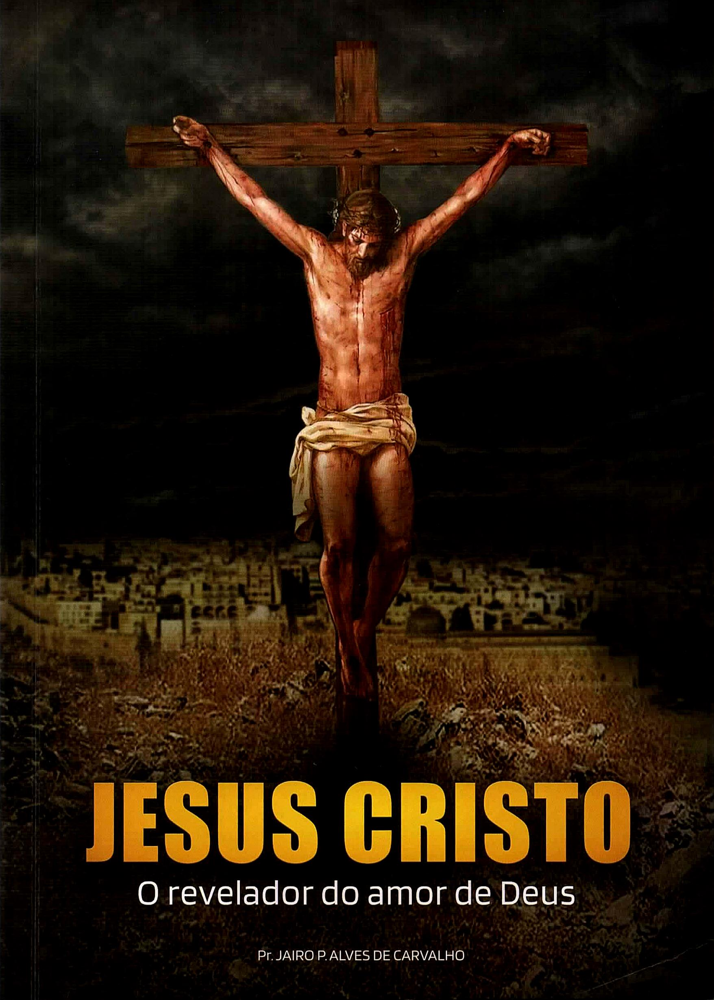

# Jesus Cristo 

O Revelador do Amor de Deus


# Prefácio

Muitos não conseguem ver um Deus de amor no relato de várias histórias da Bíblia, especialmente do Antigo Testamento e nas profecias do Apocalipse. E isso, não pela rejeição aberta, mas, pela falta de encontrar Cristo e Sua obra representados no texto que lêem. Mas, quando verem Ele e Sua obra apresentados naquela passagem, o que era obscuro ficará claro, transparecendo então a verdade sobre o caráter da obra de Deus. Misericórdia e justiça serão então vistas como estando em perfeito equilíbrio em todo o trato de Deus, desde as eras eternas até os tempos dos séculos, demonstrando a sabedoria do Seu governo e sua perfeita adequação para promover a felicidade de todas as criaturas.

Que a mensagem deste livro coopere para este propósito, é o sincero desejo do autor. Deus te abençoe durante sua leitura! 


# Introdução

!!!quote ""
      Uma revelação sobre a origem, a natureza de Cristo e Sua obra por nós

A profundidade da revelação do amor de Deus em Cristo está muito além da capacidade de compreensão humana, e certamente será objeto de estudo pelos redimidos do Senhor pelos séculos dos séculos. Contudo, há verdades sobre Cristo ocultas desde os tempos dos apóstolos as quais, se entendidas hoje, podem contribuir para remover o véu que impede muitos de conhecer a Deus como Ele é, aceitarem Seu plano e serem salvos. Exponho neste volume algumas delas as quais aprouve ao Senhor nos revelar pelo estudo da Sua Palavra. Está escrito: **“As coisas escondidas são para o SENHOR, nosso Deus; porém as reveladas são para nós e para nossos filhos, para sempre, para cumprirmos todas as palavras desta lei”**{class=verso} **Deuteronômios 29:29**{class=livro}. **“O que era desde o princípio, o que temos ouvido, o que temos visto com os nossos próprios olhos, o que contemplamos, e as nossas mãos apalparam, com respeito ao Verbo da vida (e a vida se manifestou, e nós a temos visto, e dela damos testemunho, e vo-la anunciamos, a vida eterna, a qual estava com o Pai e nos foi manifestada), o que temos visto e ouvido anunciamos também a vós outros, para que vós, igualmente, mantenhais comunhão conosco; e a nossa comunhão é com o Pai e com Seu Filho Jesus Cristo.”**{class=verso} **I João 1:1-3**{class=livro}. 

A Bíblia nos exorta: **“prossigamos em conhecer o SENHOR”**{class=verso}. Então, como resultado desta busca, **“Ele virá a nós como a chuva, como chuva serôdia que rega a terra.”**{class=verso} **Oséias 6:3**{class=livro}. Cumpre-nos conhecer a revelação de Cristo em cada trecho das Escrituras Sagradas. 

Convém esclarecer que a revelação de Jesus Cristo exposta nos capítulos seguintes não é a _única_ que pode levar um ser humano a receber a **“chuva serôdia”**. Nas mais de mil páginas da Bíblia há bálsamo para toda a espécie de feridas da alma. E posto que cada um de nós tem necessidades diferentes, o Senhor guiará cada ovelha Sua ao pasto da Palavra que ela precisa para crescer em graça, vencer suas falhas particulares e aperfeiçoar um caráter à semelhança de Jesus. Portanto o objetivo deste livro é contribuir com tua caminhada rumo a perfeição cristã e, principalmente, te motivar a realizar a mesma busca que fiz, na Palavra, a qual resultou nos seus capítulos. E que esta busca te leve a, juntamente comigo e com todos os que nela se unirem, receber o Senhor **“como a chuva, como chuva serôdia que rega a terra”**{class=verso}. Portanto, vamos logo ao tema, no capítulo 1. 


# 1 - O concerto eterno de Deus fundado em Cristo 

!!!quote ""
      Seu propósito e promessa nos dias da eternidade

 **“Antes que os montes nascessem, ou que Tu formasses a terra e o mundo, mesmo de eternidade a eternidade, Tu és Deus”**{class=verso} **Salmos 90:2**{class=livro}. Houve uma ocasião, na eternidade passada, em que somente Deus existia. A origem de Cristo ocorreu posteriormente, também nos dias da eternidade. Na Palavra se lê: **“E tu, Belém Efrata, posto que pequena entre milhares de Judá, de ti Me sairá o que será Senhor em Israel, e _cujas origens_ são desde os tempos antigos, _desde os dias da eternidade_ .”**{class=verso} **Miquéias 5:2**{class=livro}. 

Quando ainda estava só, na eternidade, sem nenhum companheiro, Deus anteviu o futuro. Ele declara a respeito de Si mesmo: **“Eu Sou Deus... _que anuncio o fim desde o princípio e, desde a antiguidade, as coisas que ainda não sucederam_ ”**{class=verso} **Isaías 46:9, 10**{class=livro}. Ele **“chama as coisas que não são como se já fossem.”**{class=verso} **Romanos 4:17**{class=livro}. Portanto, sabia que, após criar seres inteligentes e locais para sua morada - o céu, o universo e os planetas, duas ordens de seres - alguns anjos e os homens - se rebelariam contra Sua vontade. Esta rebelião os colocaria sob uma irremediável sentença de morte. Deus diz: **“Mas o que pecar contra Mim violentará a sua própria alma; todos os que Me odeiam amam a morte”**{class=verso} **Provérbios 8:36**{class=livro}.

No Seu governo, Sua vontade seria a lei. Suas ordens, ou mandamentos, seriam a expressão da lei, e estariam alinhados com o Seu próprio caráter, podendo ser considerados como uma transcrição do mesmo.

**“O pecado é a transgressão da lei”**{class=verso} **I João 3:4**{class=livro}. Vai na contramão da vontade de Deus. Ele é a materialização da vontade da criatura de não obedecer a Deus. É também é o testemunho que a criatura dá de rebelião contra a Sua vontade, e também a demonstração do desejo de não querer ser governado por Ele e pertencer ao Seu reino. Mas, posto que Deus é o Criador de todas as coisas, a jurisdição, ou o limite do Seu governo, é todo o Universo, ou tudo e todos. Portanto, não há como a criatura sair dos limites do governo de Deus. Disse o salmista: **“Para onde me irei do Teu espírito ou para onde fugirei da Tua face? _Se subir ao céu, Tu aí estás; se fizer no Seol a minha cama, eis que Tu ali estás também; se tomar as asas da alva, se habitar nas extremidades do mar, até ali a Tua mão me guiará e a Tua destra me susterá._ ”**{class=verso} **Salmos 139:7-10**{class=livro}. Apenas pela morte poderia uma criatura abandonar o reino de Deus. A conclusão inevitável é que o caminho de rebelião contra Deus leva a morte. Ou, como está escrito, “o salário” ou recompensa “do pecado” é a morte (**Romanos 6:23**{class=livro}). É impossível um pecador viver eternamente. 

O governo do Criador só seria estável, sem morte, na ausência de pecado. Ou seja, se houvesse submissão e obediência implícita e voluntária das Suas criaturas. Seres pensantes e inteligentes somente demonstrariam tal lealdade por amor. 

Deus sabia quem Ele era desde o princípio: **“Deus é amor”**{class=verso} (**I João 4:8**{class=livro}). Mas Suas criaturas precisariam conhecê-Lo. Ele Se daria a conhecer pelas obras que criasse. O apóstolo Paulo testificou, muito mais tarde, que **“o que de Deus se pode conhecer... Deus lho manifestou. Porque as Suas coisas invisíveis, desde a criação do mundo, tanto o Seu eterno poder como a Sua divindade, se entendem e claramente se vêem pelas coisas que estão criadas”**{class=verso}. **Romanos 1:19, 20**{class=livro}. Contudo, ainda vivendo em meio a esta manifestação, Adão, Eva e seus descendentes humanos pecariam, e a sentença de morte recairia sobre eles. 

O pecado poderia se manifestar de duas formas. A primeira, na presença imediata de Deus, e diante da plena revelação do Seu amor, poder e glória. A segunda seria na Sua ausência - diante de uma manifestação parcial do amor de Deus. Isso será melhor explicado a seguir.

Alguns anjos cometeram pecado na presença imediata do Pai. Satanás foi, outrora, Lúcifer, o portador de luz, um anjo que cobria com suas asas a glória de Deus; que estava mais próximo dEle do que qualquer outra criatura: **“tu eras querubim ungido para proteger, e te estabeleci; no monte santo de Deus estavas, no meio das pedras afogueadas andavas. _Perfeito eras nos teus caminhos, desde o dia em que foste criado, até que se achou iniquidade em ti._ ”**{class=verso} **Ezequiel 28:14, 15**{class=livro}. Uma vez que o rebelde conhecia e via o próprio Deus, e em face de todo o Seu amor demonstrado diante dos seus olhos ainda obstinava- se contra os sábios conselhos da Sua vontade, nada mais havia que Deus poderia revelar de Si mesmo para convencer o pecador a retornar à obediência voluntária. Tal rebelião se afigurava irremediável. Por esta razão, uma vez tendo ele e os seus anjos firmado sua posição, nada haveria que se pudesse fazer para salvá-los. Não havia possibilidade de redenção para os anjos rebeldes. 

A raça humana pecou em face de uma revelação parcial da glória e do caráter de Deus. O jardim do Éden era maravilhoso, posto que **“Éden”** significa _paraíso_ ; contudo, suas formas gloriosas eram a apresentação de uma pequena faceta do caráter de Deus; uma demonstração parcial do mesmo. Sobre o pecado da raça humana, o apóstolo Paulo escreveu: **“temo que, assim como a serpente enganou Eva com a sua astúcia, assim também sejam de alguma sorte corrompidos os vossos sentidos”**{class=verso} 2 **Coríntios 11:3**{class=livro}. Diferentemente dos anjos, Eva e todos os homens que por ela nasceram até hoje não sabiam - em toda a profundidade - contra Quem estavam se rebelando. Para esses haveria a esperança de reconquistar sua lealdade, desfazendo a obra do engano e revelando a Deus em Seu verdadeiro caráter. Em face desta revelação os homens poderiam escolher retornar à obediência ao Seu governo e a Sua lei, e escapar da morte. O evangelho compreende esta revelação, e será apresentado a seguir. 

Como, e a que preço, poderia ser concedida aos homens esta oportunidade? **“O salário do pecado é a morte”**{class=verso} **Romanos 6:23**{class=livro}. A estabilidade do governo de Deus somente seria mantida pela aplicação da pena ao transgressor. Portanto, para que o homem pudesse viver, uma vez tendo pecado, alguém deveria morrer por ele. 

Havia um problema a ser resolvido: se o homem peca, e alguém morre por ele; então salva-se o homem e perde-se quem se sacrifica. Dá-se uma vida por outra; uma se perde para que outra se salva. Não seria a solução perfeita. Seria possível salvar o homem, sem perder ninguém? Sim, mas somente se alguém pudesse morrer e depois ressuscitar. Deus não poderia morrer pelo homem, pois Ele é imortal: **“ao Rei dos séculos, imortal, invisível, ao único Deus sábio... Aquele que tem, ele só, a imortalidade, e habita na luz inacessível; a quem nenhum dos homens viu nem pode ver”**{class=verso} (**I Timóteo 1:17; 6:16**{class=livro}). Havia a necessidade de trazer à existência um Ser - um Salvador, o qual, após morrer pelo homem, pudesse ressuscitar por Sua própria justiça. 

Mas este Ser não poderia ser uma criatura. Cada ser inteligente é criado **“a imagem de Deus”**{class=verso} **Gênesis 1:26**{class=livro}. Mas não a igualdade com Ele. Assim, embora cada uma possua traços do caráter divino, não se pode dizer que as criaturas tenham a _plenitude_ dele. Portanto, por mais que uma criatura se dispusesse a morrer pelo homem pecador ela estaria sujeita a falhas por ignorância, ou desconhecimento parcial do caráter e da vontade de Deus. Nem mesmo os anjos, a mais elevada ordem de seres criados, fogem à regra. Está escrito: **“Seria, porventura, o varão mais puro do que o seu Criador? Eis que nos Seus servos não confia e nos Seus anjos encontra loucura”**{class=verso} **Jó 4:17, 18**{class=livro}. Se um anjo morresse pelo homem pecador, não poderia ressuscitar por sua própria justiça; pois ela estaria muito aquém da amplitude das exigências da lei. Como diz o salmista: **“A toda perfeição vi limite, mas o Teu mandamento é amplíssimo”**{class=verso} **Salmos 119:96**{class=livro}. A lei é a expressão do caráter divino. E todas as criaturas são súditas da lei (governadas por ela).

Neste contexto, somente um Ser poderia ressuscitar: Um com altura de caráter igual a da lei; tão elevado que se igualasse com as exigências da lei de Deus em toda a sua amplitude. Que não possuísse nenhuma identificação com a rebelião, e não cometesse nenhum erro, nem mesmo por ignorância. Ele poderia viver sem pecar; e, após morrer, ressuscitar por Sua própria justiça. E isso sem provocar agravo à Sua lei ou governo. Uma vez que a lei é uma transcrição do caráter de Deus, a santidade de caráter deste Ser deveria ser igual a do próprio Deus. 

A partir desta constatação, Deus concebeu a solução que atendia as condições: gerar um Filho, o qual não fosse Deus (portanto não fosse imortal, para que pudesse morrer), e possuísse santidade de caráter igual à dEle. Aqui na Terra, observamos que os filhos herdam traços de caráter do pai. E Deus fez com que fosse assim, que pudéssemos entender a relação **“pai - filho”,** para que, por meio das coisas naturais, pudéssemos entender Suas obras desde a eternidade. No caso de Deus gerar um Filho, a transmissão de caráter seria perfeita, pois toda Sua obra é perfeita (**Deuteronômios 32:4**{class=livro}). Então, o Filho teria um caráter igual ao do Pai. A vontade do Filho seria perfeitamente alinhada com a Sua. E como Sua vontade é a lei, a do Filho também o seria. Portanto, Ele, assim como Deus, Seu Pai, seria o Doador da lei para os seres que ambos, juntos, viessem a criar. 

A esta altura cabe um esclarecimento: Deus não possui a limitação dos homens para gerar um filho. Não precisa de uma mulher. Ele disse: **“Eis que Eu Sou o Senhor, o Deus de toda a carne; acaso haveria alguma coisa demasiado difícil para Mim?”**{class=verso} **Jeremias 32:27**{class=livro}. Ele criou homens e mulheres; Ele lhes deu a faculdade de procriar mediante a união de ambos. Mas estaria Ele, o Criador, sujeito às limitações que impôs às Suas criaturas? Concluiríamos que o artista que esculpisse a estátua de uma mulher estaria limitado a fazer somente esculturas de mulheres, não podendo fazer esculturas de homens? Em outras palavras: estaria Deus limitado, em Suas ideias, Seu pensamento criativo e Seu poder, à nossa forma de pensar? Ele diz em Sua Palavra: **“Porque os Meus pensamentos não são os vossos pensamentos, nem os vossos caminhos os Meus caminhos, diz o Senhor. Porque assim como os céus são mais altos do que a terra, assim são os Meus caminhos mais altos do que os vossos caminhos, e os Meus pensamentos mais altos do que os vossos pensamentos.”**{class=verso} **Isaías 55:8, 9**{class=livro}. Ademais, Ele ensina, pela natureza, que a geração de uma nova vida se dá não apenas pela união de pai e mãe, mas também a partir de um pedaço do corpo do **“pai”.** Diversas espécies de plantas não precisam da união **“macho e fêmea”** para se reproduzirem; antes, podem gerar outras novas a partir de pedaços de si mesmas. Basta arrancar-se um galho, enterrá-lo na terra e ele forma uma nova planta. Assim, vê-se que várias plantas podem **“gerar filhos”** a partir de galhos. Se Deus criou plantas que podem reproduzir-se desta forma, é evidente que Ele também pode gerar um filho por este meio, se o quiser. 

Voltando ao início, Deus, na eternidade passada, enquanto ainda só, considerou tudo isso. Ficou claro que poderia ser dada a possibilidade de os homens serem salvos, após pecarem, Se Ele gerasse um Filho. Este Filho seria enviado para salvar os homens, morrendo em Seu lugar. Daí ter o nome Messias, ou Cristo. **“Cristo”** vem da tradução do termo Messias para o grego, a qual é **“Kristos”,** e significa **“Enviado”.** 

Além disso, por herdar um caráter igual ao de Deus, enquanto vivesse com os homens O revelaria a eles. Seria, portanto, verdadeiro dizer que o próprio Deus Se daria a conhecer aos homens na pessoa do Seu Filho. E ao terem os homens a revelação de Deus em Cristo, poderiam conhecê-Lo, escolher Sua salvação e serem súditos do Seu reino, escapando da morte eterna. E não somente os homens seriam beneficiados. Todas as ordens de seres inteligentes compreenderiam melhor o caráter e o amor de Deus demonstrados na vida de uma criatura, o Messias, o Filho de Deus encarnado, o homem Jesus Cristo. E os laços de amor que os uniriam ao Seu Criador seriam robustecidos na medida em que estudassem e conhecessem mais desta grandíssima e suficiente revelação, a qual garantiria a estabilidade eterna do Seu governo e a felicidade plena de todas as Suas criaturas. 

Uma promessa de salvação deveria ser dada aos futuros pecadores. E o fundamento para a mesma era o Filho de Deus que seria gerado e Se tornaria o Messias, o Cristo. Portanto, o propósito de Deus para com todo o universo das criaturas e conosco baseou-se nEle. E embora Cristo tenha tido origem **“nos dias da eternidade”**{class=verso} (**Miquéias 5:2**{class=livro}), o propósito de Deus por meio dEle é anterior a Sua existência, é **“_o eterno propósito que fez em Cristo Jesus, nosso Senhor_”**{class=verso} **Efésios 3:10, 11**{class=livro}. 

Uma verdade consequente é a que o propósito de Deus, seja para qualquer das Suas criaturas ou para o universo no qual elas habitam, é baseado em Cristo. Daí o entendermos que Cristo é **“o princípio da criação de Deus”**{class=verso} **Apocalipse 3:14;**{class=livro} ou seja, o princípio do projeto de Deus para tudo e todos, oriundo do Seu propósito eterno de salvar e garantir a felicidade eterna de todos pelo sacrifício e obra realizados por meio do Seu Filho. Neste mesmo sentido, **“nEle foram criadas todas as coisas”**{class=verso} **Colossences 1:14;**{class=livro} ou seja, tudo o que foi criado, ou projetado para existir, teve a Cristo como base. Se Ele não fosse gerado, nada seria criado, pois o universo e os seres ficariam sem garantia contra o pecado. Portanto, **“sem Ele nada do que foi feito se fez”**{class=verso} **João 1:3**{class=livro}. 

A criação do universo e dos seres não foi baseada meramente na geração ou na existência de Cristo. Baseou-se também no projeto da Sua missão, da Sua encarnação e do Seu sacrifício pelos homens. Paulo diz: **“Deus.. tudo criou por meio de Jesus Cristo”**{class=verso} **Efésios 3:9**{class=livro}. Neste verso o apóstolo não está falando da participação pessoal, física, do Filho de Deus na criação da Terra e dos outros planetas. Pois ele apresenta o nome **“Jesus Cristo”.** O nome **“Jesus”** foi-Lhe dado somente quando Ele encarnou e veio a este mundo. Foi então quando o anjo disse: **“Maria, não temas, porque achaste graça diante de Deus, E eis que em teu ventre conceberás, e darás à luz um Filho, e pôr-lhe-ás o nome de Jesus.”**{class=verso} **Lucas 1:30, 31**{class=livro}. Portanto, ao dizer que Deus criou tudo por meio de “Jesus Cristo”, Paulo está informando que a viabilidade da criação se deu pela promessa da vinda do homem Jesus Cristo, o Filho de Deus encarnado, e do Seu sacrifício. 

O homem Jesus Cristo é a base, ou a pedra fundamental do projeto da criação. Por isso Ele, e nenhum outro, é **“a Pedra... a qual foi colocada por cabeça de esquina”**{class=verso} (**Marcos 12:10**{class=livro}), a pedra sobre a qual a igreja, o conduto determinado para a transmissão do conhecimento da mensagem de salvação na Terra, deve ser edificada. 

No contexto deste maravilhoso plano, pelo que até aqui se vê, seria uma perversão, um infinito rebaixamento do grandiosíssimo plano de Deus ao plano comum do dia a dia dos homens, entender que um homem qualquer, nascido como criatura, como nós, e não tendo vida pré-existente junto a Deus, como Filho unigênito, ocupasse o lugar de Cristo na Terra. Aceitar isso seria colocar a criatura no lugar do Criador; o homem impuro e pecador no lugar do Imaculado, Perfeito e bendito Filho de Deus; trocar a Âncora que nos foi posta para salvação, a verdadeira Pedra, retirando a Majestade do céu e colocando em seu lugar uma **“pedrinha”.** Este foi o nome dado por Cristo a Pedro em **Mateus 16:18**{class=livro}. Do original: **“também Eu te digo que tu és Pedro (Pedrinha) e sobre esta pedra edificarei a minha igreja, e as portas do inferno não prevalecerão sobre ela”.** Trocar a grande Pedra, Cristo Jesus, por uma **“pedrinha”** seria rebaixar a infinita grandeza e pureza do Filho de Deus, que Se assenta junto ao Pai no trono do Universo, à de um homem comum, participante da vileza natural comum à raça humana caída. 

Voltando ao ponto, tendo compreendido o exposto até aqui, podemos exclamar, como Paulo: **“Bendito o Deus e Pai de nosso Senhor Jesus Cristo, o qual... nos elegeu nEle antes da fundação do mundo”**{class=verso} **Efésios 1:3, 4**{class=livro}. Ele pensou em nós, tinha um propósito eterno para conosco e nos amou, em Cristo, na eternidade, antes mesmo de gerar Seu Filho. A partir do que vimos entendemos que a graça de Deus para nossa salvação não nos foi concedida há apenas dois mil anos atrás, na cruz; mas na própria eternidade, pela promessa do sacrifício do Filho de Deus, o qual se tornaria, posteriormente, o homem Cristo Jesus. **“Deus.. nos salvou e chamou com uma santa vocação; não segundo as nossas obras, mas segundo o Seu próprio propósito e _graça que nos foi dada_ em Cristo Jesus, _antes dos tempos dos séculos_”**{class=verso} **2 Timóteo 1:8,9**. 

Assim, vê-se que Deus é verdadeiro quando diz: **“Porquanto com amor eterno te amei, por isso com benignidade te atraí.”**{class=verso} **Jeremias 31:3**{class=livro}. Cristo é o **“Filho do Seu amor”**{class=verso} (**Colossences 1:13**{class=livro}); Aquele no qual o Seu eterno amor foi e é, continuamente, manifestado a nós e a todo o Universo. E, para nós, Cristo é o Garantidor da nossa própria existência, o Revelador do verdadeiro caráter de amor de Deus; é o nosso Salvador, o eterno Mediador do concerto da graça; a Garantia eterna do cumprimento da promessa de reconciliação com o eterno Pai pela libertação do pecado, e de vida eterna futura ao Seu lado. **“Deus nos deu a vida eterna; e esta vida está em Seu Filho”**{class=verso} **1 João 5:2**{class=livro}. 

O preço da redenção do homem é a vida do Filho de Deus. Ele poderá ser melhor avaliado a partir da revelação sobre como Cristo foi gerado por Deus, na eternidade, a qual veremos no próximo capítulo. 


# 2 - Cristo, o Unigênito de Deus e o preço da salvação 

!!!cite ""
      O sofrimento de Deus ao gerar Seu Filho. Todas as promessas às criaturas foram dadas em Cristo.

É uma verdade assentada em toda a Escritura, tanto no Antigo como no Novo Testamento, que Cristo era um Filho literal de Deus. Já no Antigo Testamento, ao falar com Jó, Deus faz referência a Ele dizendo: “Onde estavas Tu, quando Eu fundava a terra?... Onde está o caminho onde mora a luz? E, quanto às trevas, onde está o seu lugar; Para que as tragas aos seus limites, e para que saibas as veredas da sua casa? De certo Tu o sabes, porque _já então eras nascido, e por ser grande o número dos Teus dias_ !” **Jó 38:4, 19-21**{class=livro}. É evidente que o texto não se refere a Jó. Nem o pai da humanidade, Adão, era nascido quando Deus fundava a Terra. Mas Cristo sim, O era. **“Ele estava no princípio com Deus”**{class=verso} **João 1:2**{class=livro}. Mais adiante, no livro de Provérbios, o próprio Cristo, denominado ali de “Sabedoria” de Deus (**I Coríntios 1:24, 31**{class=livro}), declarou que _nasceu_ nos dias da eternidade: **“O Senhor Me possuía no início de Sua obra, antes de Suas obras mais antigas. Desde a eternidade fui estabelecida, desde o princípio, antes do começo da Terra. Antes de haver abismos, _Eu nasci_ , e antes ainda de haver fontes carregadas de águas. Antes que os montes fossem firmados, antes de haver outeiros, _Eu nasci_. Ainda Ele não tinha feito a Terra, nem as amplidões, nem sequer o princípio do pó do mundo.”**{class=verso} **Provérbios 8:22-26**{class=livro}. Então, após nascer, participou com Deus da criação de todas as coisas: **“Quando Ele preparava os céus, aí estava Eu...”**{class=verso} **Provérbios 8:27**{class=livro}. Já no Novo Testamento, enquanto cumprindo Sua missão na Terra, Cristo declarou a Pilatos que nasceu antes de vir ao mundo: “Jesus respondeu: Tu dizes que Eu Sou rei. Eu para isso _nasci e_ para isso _vim ao mundo_ , a fim de dar testemunho da verdade” **João 18:37**{class=livro}. Note a ordem das informações: primeiro Ele nasceu; depois veio ao mundo. Primeiro, lá na eternidade passada, nasceu; depois, poucos anos antes, veio ao mundo, no útero de Maria. Confirmando as Palavras de Cristo, Paulo testifica que Cristo é Filho de Deus por nascimento literal, diferenciando Sua origem da dos anjos, estes últimos criados: “pelo Filho, a quem constituiu herdeiro de tudo, por quem fez também o mundo. O qual, sendo o resplendor da Sua glória, e a expressa imagem da Sua pessoa... feito tanto mais excelente do que os anjos, quanto herdou mais excelente nome do que eles. Porque a qual dos anjos disse jamais: Tu és Meu Filho, hoje _Te gerei_? E outra vez: Eu Lhe serei por Pai, e Ele Me será por Filho?” **Hebreus 1:1-5**{class=livro}. São mencionadas aqui somente características de um Filho literal: herdeiro **“do nome do Pai”;** **“gerado pelo Pai”;** sendo a **“expressa imagem da Sua pessoa”**{class=verso}. E o próprio Pai disse: **“Tu és Meu Filho, hoje Te gerei”**{class=verso}. Não há como entender de outra maneira. Uma vez tendo visto e aceitado a completa evidência de que Cristo é o Filho literal, nascido de Deus, estamos em condições de voltar para onde estávamos ao final do capítulo anterior. Tínhamos compreendido que, lá na eternidade passada, o propósito de Deus para com as criaturas e com o governo que as regeria estava todo baseado em Cristo. Mas, naquela altura dos acontecimentos, todo este conceito só existia na mente de Deus. Cristo ainda não tinha nascido. Deus estava só. Esta realidade é retratada em **João 1:1, **{class=livro} na versão do texto original grego, cuja tradução literal é: **“No princípio era a Palavra, e a Palavra estava em Deus, e Deus era a Palavra”**{class=verso} (**João 1:1**{class=livro}). Sei que é diferente do que está na tua versão moderna da Bíblia. Ocorre que as versões modernas distorcem o original. Veja o texto grego traduzido palavra por palavra: ἐν ἀρχῇ ἦν ὁ λόγος καὶ ὁ λόγος ἦν πρὸς τὸν θεόν καὶ θεὸς ἦν ὁ λόγος em o princípio era a palavra e a palavra estava em o Deus e Deus era a palavra O sentido do original era: Ele, Deus, o Pai eterno, era “a Palavra” que existia no princípio. E como estava só, Deus falava por Si mesmo. Mais tarde, após o nascimento do Filho, Deus determinou que Cristo fosse, doravante, Seu porta-voz. A unidade de pensamento e propósito entre ambos era tão perfeita que é correto dizer que, o que a Palavra é para o pensamento, Cristo o era para o Pai. Por isso a Bíblia se refere a Cristo como sendo: “a Palavra”: **“e a Palavra se fez carne, e habitou entre nós”**{class=verso} (**João 1:14**{class=livro}). Compreendendo que Cristo era a Palavra, podemos retornar até o tempo de **João 1:1**{class=livro} e entender mais profundamente seu significado. Atentemos novamente para o texto original: **“No princípio era a Palavra, e a Palavra estava em Deus, e Deus era a Palavra”**{class=verso}. Note agora a expressão do meio do verso: **“a Palavra estava em Deus”**{class=verso}. Esta não tem o mesmo sentido da última: “_e Deus era a Palavra_”**{class=verso} (**João 1:1**{class=livro}). O único entendimento possível é: a Palavra - Cristo - estava em Deus. Quando somente Deus havia, Cristo estava _em_ Deus; não somente como um projeto em Sua mente, mas nEle. Como assim? “Em” quer dizer “dentro de”. O texto expressa literalmente que Cristo nasceu a partir de _dentro_ de Deus, ou seja, foi gerado a partir de um pedaço tirado de dentro do Seu corpo. Jesus disse isso claramente em Sua oração sacerdotal: “porque lhes dei as palavras que Me deste; e eles as receberam, e têm verdadeiramente conhecido que _saí de Ti_ , e creram que Me enviaste.” **João 17:8**{class=livro}. A expressão “saí de Ti” não pode significar “saí da Tua presença”, porque isso é expressado na sequência, pelas palavras “Me enviaste”. Atente para a ordem das informações: primeiro “saí de Ti” no passado remoto; depois “Me enviaste”. Ele saiu do corpo de Deus nos dias da eternidade; mas foi enviado à nos há cerca de dois mil anos atrás. Embora tenha saído de Deus, Ele não foi formado no Seu ventre, como uma mulher gesta seu bebê. Pois ela não o faz sozinha, sem a união com o marido. Sem a soma de pai e mãe não se forma um filho humano. Mas como Deus estava absolutamente sozinho, o Filho deveria ser gerado a partir dEle somente. No livro de Gênesis encontramos um relato que até aqui mostrou-se a melhor ilustração do processo de geração do Filho de Deus: “Então, o Senhor Deus fez cair um sono pesado sobre Adão, e este adormeceu; e tomou uma das suas costelas e cerrou a carne em seu lugar. _E da costela que o Senhor Deus tomou do homem formou uma mulher; e trouxe-a a Adão. E disse Adão: Esta é agora osso dos meus ossos e carne da minha carne_ ; esta será chamada varoa, porquanto do varão foi tomada_._ ” **Gênesis 2:21-23**{class=livro}. Eva foi gerada a partir do corpo de Adão. E embora ambos fossem distintos, preservando, cada um a sua individualidade, compartilhavam da mesma natureza: humana. Eram feitos de carne e ossos. A propósito, o nome Adão significa “homem”. A Bíblia, falando da origem da humanidade, diz: “Este é o livro das gerações de Adão. No dia em que Deus criou o homem, à semelhança de Deus o fez. _Macho e fêmea os criou, e os abençoou, e chamou o seu nome Adão, no dia em que foram criados._ ” **Gênesis 5:1, 2**{class=livro}. Deus denominou a ambos, Adão e Eva, de “Adão”, ou homem. Desta forma fez referência a igualdade de sua natureza física, caráter e propósito - ambos eram humanos, tinham saído das mãos do próprio Criador, dEle herdado traços de caráter e estavam alinhados em seus objetivos. Juntos conviviam em harmonia e cuidavam do jardim do Éden, seu lar. O exemplo de Adão e Eva lança luz sobre o mistério do nascimento de Cristo, nos dias da eternidade. De um pedaço do corpo de Adão Deus formou Eva. Esse era uma costela, localizada no seu seio. Isso ilustra como sucedeu com o “Unigênito”, ou único Filho gerado de Deus. Como está escrito, **“as coisas invisíveis”**{class=verso} de Deus **“se entendem e claramente se vêem pelas coisas que estão criadas”**{class=verso} (**Romanos 1:19, 20**{class=livro}). João disse que “o Filho unigênito” está “no seio do Pai” **João 1:18**{class=livro}. O verso evidencia que Deus gerou Seu Filho retirando um pedaço do Seu próprio corpo, da altura do seio, tal como fez para formar Eva a partir de Adão, e a partir dele formou o Filho. Não o retirou nem dos pés nem das mãos, mas do seio, para que O exaltasse a posição de igualdade conSigo mesmo. Há algo, contido nesta verdade, que impressiona sobremaneira. Quando Deus formou Eva, **“fez cair um pesado sono sobre Adão”**{class=verso}, e ele adormeceu” (**Gênesis 2:21**{class=livro}). Ele anestesiou-o para que não sentisse a dor da retirada da sua costela, mas apenas a alegria posterior de ver sua companheira. Assim não o foi com Deus. Ninguém havia para O anestesiar, para mitigar Sua dor ao retirar um pedaço do Seu próprio corpo, fechar o local do ferimento e a partir dele gerar um Filho. Certa vez um tatuador mencionou que o peito está entre os lugares onde mais a pessoa sente dor ao fazer uma tatuagem. E Deus tirou um pedaço do Seu próprio peito, o local onde mais sentimos dor. Daí podemos entender a dor física que Ele sentiu, pois fomos feitos **“conforme a Sua semelhança”**{class=verso} (**Gênesis 1:26**{class=livro}). Tudo isso porque nós, que nem ainda tínhamos sido criados, pecaríamos e precisaríamos de salvação da morte. Deus, na eternidade passada, infligiu sobre Si mesmo um sacrifício que Lhe causou uma dor indizível a fim de gerar um Filho e por Ele poder nos proporcionar um Salvador. Assim, ao olhar para a eternidade passada vemos, em Deus, a revelação do amor que se sacrifica. “Deus é amor” **I João 4:8**{class=livro}. E “o amor é sofredor” **I Coríntios 13:4**{class=livro}. Ele Se sacrificou, porque te valorizou, te amou, desde a eternidade. Diz: **“com eterno amor te amei”**{class=verso} **Jeremias 31:3**{class=livro}. Pela “semelhança” do nosso corpo com Deus, declarada em **Gênesis 1:26**{class=livro}, podemos entender que, ao tirar um pedaço do seio, Ele tirou a parte do Seu corpo que estava junto do coração. O coração é o órgão mais relacionado com o amor. Isso mostra que a intenção de Deus era fazer com que, no futuro - hoje - quando olhássemos para este misterioso sacrifício, pudéssemos nos assegurar de que foi por amor, e não por outra razão, que Ele o realizou. O nascimento de Cristo, na eternidade passada, é uma demonstração do amor de Deus. Desde o nascimento, o Filho já cumpria o propósito de demonstrar ao universo o amor do Pai. Como está escrito, o amor de Deus **“está em Cristo Jesus”**{class=verso} (**Romanos 8:39**{class=livro}). A partir desta revelação entendemos com mais clareza as palavras de Paulo, ao escrever que Deus “nos salvou, e chamou com uma santa vocação... segundo o Seu próprio propósito e graça que nos foi dada _em Cristo Jesus_ ” (2 Timóteo 1:9), e também quando diz que Ele prometeu, em Cristo, “vida eterna” **“antes dos tempos dos séculos”**{class=verso} (2**Tito 1:1, 2**{class=livro}). Ou seja, na eternidade, antes de criar o Universo e o próprio tempo, Deus, por um sacrifício indizível, nos propiciou Cristo, a Pedra fundamental da nossa esperança, e por Ele assegurou para nós a graça do perdão dos nossos pecados e a vida eterna. O pai e a mãe humanos esforçam-se para preparar o enxoval com cama, roupas e quarto para o pequeno bebê, comprando-o antes de ele nascer. Deus também nos preparou um enxoval de graça para nós, muito antes de nascermos. Portanto, que ninguém permita-se, nem por um momento, achar que não é extremamente precioso aos olhos de Deus. Você e eu fomos amados, queridos e esperados. Como disse o salmista: **“os Teus olhos viram o meu corpo ainda informe, e no Teu livro todas estas coisas foram escritas, as quais iam sendo dia a dia formadas, quando nem uma delas havia”**{class=verso} (**Salmos 133: 16**{class=livro}). Em face de tudo isso, olhando para Cristo e vendo nEle o amor de Deus por nós, nos entregaremos a Ele? Abandonaremos o caminho do pecado, da transgressão da lei de Deus, da rebelião contra a Sua vontade, para serví-Lo, porque Ele nos ama, porque Seu governo certamente será o melhor para nós? Ordenaremos nossa vida em harmonia com Sua vontade expressa nos Seus mandamentos (**Êxodo 20:3-17**{class=livro})? De que nos vale a vida antiga, de rebelião? Morramos para ela! Consideremos nossas obras de desobediência como realmente são: não _prazeres,_ mas odiosas e injustificáveis obras de rebelião contra Aquele que nos amou a ponto de Se sacrificar por nós desde a eternidade! Passatempos completamente sem importância e significado real em comparação com o viver para servir o Criador que nos ama! Pois o súdito do reino de Deus e de Cristo, “quanto a ter morrido, de uma vez morreu para o pecado; mas, quanto a viver, vive para Deus” **Romanos 6:10**{class=livro}. **“Deus amou o mundo de tal maneira que deu Seu Filho Unigênito”**{class=verso} o único Filho gerado a partir dEle (por isso Unigênito), com um tremendo sacrifício para Si mesmo, não somente quando O entregou aos homens, mas muito antes de os homens virem a existência, **“para que todo aquele que nEle crê, não pereça, mas tenha a vida eterna”**{class=verso} (**João 3:16**{class=livro}). E isso não é tudo. O amor de Deus é mais profundo do que as águas do oceano. Serão necessários muitos, incontáveis mergulhos para vislumbrar suas maravilhas ocultas em todas as suas dimensões. E nós faremos o próximo no capítulo a seguir, onde estudaremos a natureza, glória e majestade de Cristo, o único Filho gerado de Deus, e conheceremos um pouco mais da magnitude do sacrifício feito por Deus e Seu Filho para a nossa salvação. 

# Capítulo 3 

## Cristo, o Unigênito 
_A natureza, glória e majestade de Cristo._ 

Na ocasião em que Cristo nasceu, na longínqua eternidade, Deus Lhe disse: **“Tu és Meu Filho, hoje Te gerei”**{class=verso} **Hebreus 1:5**{class=livro}. Ele era **“a expressa imagem da Sua pessoa”**{class=verso} **Hebreus 1:3**{class=livro}. O termo “expressa imagem” significa que Jesus espelhava perfeitamente o Pai; no corpo físico, externa e internamente, na moral, no caráter e na alma. Deus falou a Moisés do Seu Filho como sendo o Seu Anjo, e disse que Ele recebeu Seu nome. O termo “anjo” significa também “mensageiro” - daí a razão de ser aplicado por Deus a Cristo. Segue o texto: “Eis que Eu envio um Anjo diante de ti, para que te guarde neste caminho... guarda-te diante dEle e ouve a Sua voz, e não o provoques à ira; porque não perdoará a vossa rebelião; porque o Meu nome está nEle” (**Êxodo 23:20**{class=livro}). E, no novo testamento, Paulo, por inspiração divina, aclara, falando sobre Cristo: **“feito tanto mais excelente que os anjos quanto herdou mais excelente nome do que eles”**{class=verso} **Hebreus 1:4**{class=livro}. Na Bíblia, o nome representa caráter. Um exemplo é o de Jacó, que significa “enganador”. Ele revelou seu traço de caráter quando enganou seu pai Isaque para obter a bênção da primogenitura, antes designada a Esaú, seu irmão mais velho. Foi quando Esaú disse: “não foi o seu nome justamente chamado Jacó? Por isso, que já duas vezes me enganou” **Gênesis 27:36**{class=livro}. Quando venceu este mau traço do caráter, Jacó teve mudado seu nome para Israel, que significa “vencedor”. Ao lhe mudar o nome, Cristo justificou dizendo: **“pois como príncipe lutaste com Deus e com os homens e prevaleceste”**{class=verso} **Gênesis 32:28**{class=livro}. Assim, voltando ao ponto, quando em **Hebreus 1:4 **{class=livro}é mencionado que Cristo recebeu o nome de Deus, o apóstolo está nos ensinando que Ele herdou o Seu “caráter”. Outra forma de compreender isso é por analogia com a própria natureza, pois a coisas criadas revelam as coisas espirituais, invisíveis, de Deus (**Romanos 1:20**{class=livro}). Os pais conferem traços de caráter aos seus filhos. É comum, ao se ver que o filho repete as coisas que o pai fazia, dizer: “tal pai, tal filho”. Como nós, seres humanos, somos imperfeitos, esta transmissão de traços de caráter também o é. Mas não assim com Deus. Ao gerar Seu Filho, a transmissão do Seu caráter a Ele foi perfeita. Assim, o caráter do Filho é igual ao do Pai. Como vimos no capítulo anterior, era necessário que assim o fosse, para que o Filho pudesse tornar-se o Salvador das criaturas que caíssem sob o poder do pecado. Voltando a natureza de Cristo, quanto ao Seu corpo a Bíblia ensina que Ele era “em forma de Deus”, pelo que compreendemos que Ele tinha estatura, aparência e feição iguais às do Pai (Fil. 2:5). Agora, analisemos por um momento a “alma” do Cristo unigênito de Deus. O termo “alma”, na Bíblia, tem o sentido de “vida”. Em **Levítico 17:11, **{class=livro} lê-se “a _alma_ da carne está no sangue”; mas a nota de rodapé apresenta como tradução alternativa o termo “vida”. Na tradução para o português Versão Almeida Revista e Atualizada encontra-se esta variante: “a _vida_ da carne está no sangue”. O mesmo sentido se percebe em **Gênesis 2:7: **{class=livro}“e formou o SENHOR Deus o homem do pó da terra e soprou em seus narizes o fôlego de vida; e o homem foi feito alma vivente”. Daí entendemos que a “alma” do Cristo gerado de Deus corresponde a Sua vida. Portanto, posto que Cristo foi gerado a “expressa imagem” da pessoa do Pai (**Hebreus 1:3**{class=livro}), possuía a mesma _alma_ , ou seja, a mesma vida que o Pai possuía. Como o entendimento deste conceito implica na compreensão correta de dezenas de textos bíblicos os quais doutra forma pareceriam confusos, faz-se necessário fundamentá-lo melhor, o que será feito a seguir, nos próximos parágrafos. Podemos entender o que significa a “vida de Deus” a partir do texto de **Efésios 4: **{class=livro}“E digo isto, e testifico no Senhor, para que não andeis mais como andam também os outros gentios, na vaidade da sua mente. Entenebrecidos no entendimento, _separados da vida de Deus_ pela ignorância que há neles, pela dureza do seu coração; os quais, havendo perdido todo o sentimento, se entregaram à dissolução, para com avidez cometerem toda a impureza.” **Efésios 4:17-19**{class=livro}. Segundo o texto, os gentios estão separados da vida de Deus porque andam **“na vaidade da sua mente”**{class=verso} e se entregam “à dissolução e a impureza”. Dito de outra forma: estão separados da vida de Deus porque se entregam para cometer pecado, fazer o mal, andar na impiedade. Daí se entende que a “vida” de Deus é o contrário destas coisas. Se os gentios estivessem ligados a vida de Deus, andariam em santidade, para fazerem o bem e andar no amor. A vida de Deus está relacionada com a santidade, a pureza e a justiça. A justiça é expressa na lei dos dez mandamentos de Deus; pois **“todos os Seus mandamentos são justiça”**{class=verso} **Salmos 119:172**{class=livro}. “A lei é santa” **Romanos 7:12, **{class=livro} e **“o cumprimento da lei é o amor”**{class=verso} **Romanos 13:10**{class=livro}. Portanto, o amor é a vida de Deus, o qual se revela no proceder com justiça, ou em conformidade com a lei;. E isso é o mesmo que andar em santidade e viver em pureza. Pelo que vimos até aqui podemos concluir que, ao estudarmos o amor de Deus revelado por meio de Cristo, mesmo desde o Seu nascimento, somos colocados em contato com a própria vida de Deus, pois o amor é a vida de Deus, e **“o amor de Deus... está em Cristo Jesus”**{class=verso} **Romanos 8:39**{class=livro}. Por consequência, nosso espírito (mente) é impressionado; e se nos rendemos a esta revelação, seremos cheios da vida de Deus, do Seu amor. O desejo do apóstolo Paulo era que os cristãos tivessem esta experiência: **“Por causa disto me ponho de joelhos perante o Pai de nosso Senhor Jesus Cristo... a fim de, estando arraigados e fundados em amor, poderdes perfeitamente compreender, com todos os santos, qual seja a largura, e o comprimento, e a altura, e a profundidade, e conhecer o amor de Cristo, que excede todo o entendimento, para que sejais cheios de toda a plenitude de Deus”**{class=verso} **Efésios 3:14-19**{class=livro}. Retornando ao ponto, convém ressaltar que encontramos, na Bíblia, vários termos associados a vida de Deus. Isso demonstra que nossa linguagem humana é demasiadamente pobre para definir a vida de Deus numa só palavra. Mas através dos diferentes termos apresentados na Escritura, podemos aprender mais do que aprouve a Deus nos revelar sobre Si mesmo. Cabe dizer que esta análise está ligada ao tema da natureza do Cristo unigênito de Deus. Isso porque, como Ele foi gerado na “expressa imagem” do Pai (**Hebreus 1:3**{class=livro}), compreender melhor como o Pai era nos permitirá entender como Ele era ao nascer. Agora, particularmente, estamos analisando a “vida” de Deus. A Bíblia diz que: **“como o Pai tem vida em Si mesmo, assim deu também ao Filho ter a vida em Si mesmo”**{class=verso} **João 5:26**{class=livro}. Esta expressão é muito mal compreendida no meio cristão, justamente pela falta do conhecimento mais aprofundado do que é a “vida” de Deus. Portanto, vamos analisar alguns termos associados a ela. Jesus disse: “o Pai, que Me enviou, Ele Me deu mandamento sobre o que hei de dizer... e sei que _o Seu Mandamento é a vida_ eterna” **João 12:50**{class=livro}. Os dez mandamentos são a expressão do caráter de Deus, e portanto da Sua vontade. Encontramos a “vida” na obediência a eles. Mas os mandamentos não são a essência de Deus, e sim a expressão dela. Paulo diz que “o mandamento _era para_ a vida” **Romanos 7:10**{class=livro}. Mas ele não é “a vida _”_. A “vida” é a essência de Deus; ou o que Ele é. Em outras passagens a Bíblia encontramos os vários termos utilizados na linguagem humana para nos dar a entender diferentes facetas do significado da “vida” de Deus. “Deus é amor” **I João 4:8; **{class=livro}“Deus é luz” **I João 1:5; **{class=livro}“Deus é espírito” **João 4:24; **{class=livro} e Ele diz de Si mesmo: “Eu o SENHOR, vosso Deus, Sou _santo”_ Lev. 19:2. O amor, a luz e a santidade correspondem a vida de Deus, o que se comprova também por outros textos, apresentados a seguir. - Deus é amor: João afirmou que nós “passamos da morte para a _vida_ , porque amamos os irmãos” **I João 3:14**{class=livro}. - Deus é luz: Jesus disse: “Eu Sou a luz do mundo; quem Me segue não andará em trevas, mas terá a luz da _vida_ ” (**João 8:12**{class=livro}), esclarecendo que o proceder em harmonia com o Seu exemplo corresponde ao andar na luz. Por contraste, o recusar-se a seguí-Lo equivale a andar em trevas. E Jesus guardou os mandamentos (**João 15:10**{class=livro}). Portanto, andar na luz significa andar em obediência aos mandamentos, do que se conclui que os mandamentos são “luz”. Isso foi declarado pelo salmista, nas palavras: “lâmpada para os meus pés é a Tua palavra” **Salmos 119:105**{class=livro}. E o sábio Salomão disse: “a lei é luz” Provérbios 6:23. A luz corresponde a correção, a santidade e a justiça dos mandamentos. E as trevas equivalem a incorreção, a impiedade e a injustiça da desobediência a eles. Como exemplo, cito que reconhecemos o sexto mandamento - “não matarás” - como correto e justo, enquanto que a transgressão do mesmo, o assassinato, é vista como um erro, uma impiedade e uma injustiça. - Deus é espírito: Paulo diz que “a lei é espiritual” **Romanos 7:14**{class=livro}. A lei é uma expressão da Sua vontade. Deus é o doador da lei; portanto, a lei está alinhada com os Seus pensamentos. Por consequência, Sua mente está sempre em harmonia com ela. É neste sentido que Deus é _espírito_ - Seus pensamentos estão sempre em acordo com a lei que Ele estabeleceu. E é neste mesmo sentido que o homem convertido a Cristo é “espírito”. Jesus comparou os estados do homem, prévio e posterior a sua conversão, pelas palavras: “o que é nascido da carne é carne; e o que é nascido do espírito é espírito” **João 3:6**{class=livro}. Ainda no ponto, pode se dizer também que Deus é um ser espiritual, ou seja, que pensa e age em harmonia com os princípios e a letra da Sua lei. Vimos até aqui que ambas as expressões “Deus é luz” e “Deus é espírito” estão relacionadas com Ele estar em perfeita harmonia com a Sua lei. E isso teria que ser assim, pois ela é uma expressão da Sua vontade. Quando avaliada, a lei se demonstra “santa; e o mandamento é santo, justo e bom” **Romanos 7:12**{class=livro}. A palavra “santo” refere-se a conclusão que se chega após constatar-se a ausência de defeito, e é usada com este sentido em **Romanos 7: **{class=livro}“que diremos pois? É a lei pecado? De modo algum!... Mas o pecado, tomando ocasião... despertou em mim toda a concupiscência... assim a lei é santa; e o mandamento santo, justo e bom” **Romanos 7:7-12**{class=livro}. Portanto, a afirmação de que Deus, o doador da lei, é “santo” representa a _perfeição_ de Deus. Por isso vemos que, embora a Bíblia declare que Deus é amor, é luz e é espírito, quando Ele próprio fala sobre Si, diz “Sou _santo_ ” Lev. 19:2. Os próprios anjos cobridores, que circundam o Seu trono, não encontraram nenhum outro termo que pudesse melhor expressar a essência que viam em Seu Criador. Por isso, “não descansam nem de dia nem de noite, dizendo: Santo, Santo, Santo é o Senhor Deus, o Todo-Poderoso” **Apocalipse 4:8**{class=livro}. A repetição tem o sentido de superlativo, ou seja, significa que O vêem como Santíssimo, perfeito em amor, caráter, propósitos, obras e caminhos. E a expressão **“não descansam nem de dia nem de noite”**{class=verso}, significa que eles não se cansam de declarar a santidade que vêem em Deus. Portanto, o termo “santidade” significa _perfeição_ e é o termo usado pelo próprio Deus para demonstrar quem Ele é, em essência. A esta altura cabe fazer um pequeno parêntese, para agregar um ponto que contribuirá com o entendimento do tema. Deus não retém exclusivamente para Si esta magnífica perfeição, ou _santidade_. Antes, a comunica a nós; nos entrega porções dela ao conceder Seu espírito _santo_ , na proporção em que desejemos receber. Jesus afirmou que o espírito “procede do Pai” (**João 15:26**{class=livro}), ou seja, vem de dentro dEle. Pelo espírito _santo_ Deus nos entrega Sua _santidade_. Falando do espírito santo, Jesus disse: **“o espírito é o que vivifica”**{class=verso} (**João 6:63**{class=livro}), ou o que dá _vida_. Paulo o denomina como sendo o “espírito de vida” (**Romanos 8:2**{class=livro}). Daí entende- se que, pelo espírito santo nos é comunicada a _vida_ de Deus. A santidade é a _vida_ , e o espírito é o “meio”, ou “canal”, pelo qual ela é entregue. Na santidade está incluso o amor, pois “o amor de Deus está derramado em nossos corações pelo Espírito Santo que nos foi dado” **Romanos 5:5**{class=livro}. Santidade significa perfeição; e **“o amor é o vínculo da perfeição”**{class=verso} **Colossences 3:14**{class=livro}. Quem tem o amor de Deus no coração, tem santidade e também é perfeito, na sua esfera de influência, aos olhos dEle. Jesus relacionou o amor com a perfeição nas palavras: “Amai a vossos inimigos, bendizei os que vos maldizem, fazei bem aos que vos odeiam, e orai pelos que vos maltratam e vos perseguem; para que sejais filhos do vosso Pai que está nos céus; Porque faz que o Seu sol se levante sobre maus e bons, e a chuva desça sobre justos e injustos. Pois, se amardes os que vos amam, que galardão tereis? Não fazem os publicanos também o mesmo? E, se saudardes unicamente os vossos irmãos, que fazeis de mais? Não fazem os publicanos também assim? Sede vós pois perfeitos, como é perfeito o vosso Pai que está nos céus.” **Mateus 5:44-48**{class=livro}. Aqui cabe esclarecer a diferença entre a santidade, ou perfeição, de Deus, e a que as criaturas podem ter. No contexto das criaturas, perfeição é a ausência de dolo, ou intenção, de fazer o mal. A Bíblia diz, de Lúcifer: “Perfeito eras nos teus caminhos, desde o dia em que foste criado, até que se achou _iniquidade_ em ti” **Ezequiel 28:15**{class=livro}. “Iniquidade” significa _dolo_ , ou intenção: “Bem-aventurado o homem a quem o Senhor não atribui iniquidade e em cujo espírito não há dolo” **Salmos 32:2 **{class=livro}(Versão Almeida Revista e Atualizada). Mas na perfeição da criatura estão excluídas as falhas por ignorância. Deus **“aos seus anjos atribui loucura”**{class=verso} **Jó 4:18, **{class=livro} ou seja, vê imperfeições neles. Falando das criaturas, o salmista diz: “Tenho visto que toda perfeição tem seu limite; mas o Teu mandamento é ilimitado” **Salmos 119:96**{class=livro}. Ou seja, perfeição absoluta há somente em Deus. As criaturas só podem andar em perfeição na medida do seu grau de conhecimento do que é perfeição. Se não planejam o mal, ou seja, dentro da sua limitação de conhecimento, entendem, decidem e fazem o que é certo, ou, em dizendo outras palavras, andam em amor a Deus e ao próximo, são consideradas como perfeitas, em sua esfera, por Ele. Este é o sentido do texto de Mateus: **“sede vós perfeitos como perfeito é vosso Pai, que está nos céus”**{class=verso} **Mateus 5:48**{class=livro}. Portanto, Deus não leva em conta “os tempos da ignorância” (**Atos 17:30**{class=livro}). Antes, avalia as criaturas segundo a luz do conhecimento da perfeição, da santidade, do amor divino, que iluminou suas consciências: “Porque, quando os gentios, que não têm lei, fazem naturalmente as coisas que são da lei, não tendo eles lei, para si mesmos são lei; os quais mostram a obra da lei escrita em seus corações, testificando juntamente a sua consciência, e os seus pensamentos, quer acusando-os, quer defendendo-os; no dia em que Deus há de julgar os segredos dos homens, por Jesus Cristo, segundo o meu evangelho.” **Romanos 2:14-16**{class=livro}. Portanto, a enquanto a perfeição, ou santidade de Deus, é a ausência total, absoluta, de qualquer falha, mesmo por ignorância, a perfeição da criatura é proporcional ao seu grau de conhecimento da santidade, ou amor, de Deus. Voltanto ao ponto e resumindo o que até aqui vimos sobre a essência de Deus, temos que Deus é Santo; a santidade é a perfeição, ou a vida de Deus; ela engloba o amor a Ele e ao próximo, os quais, por sua vez, são o resumo e o cumprimento da lei dos dez mandamentos. A lei é de natureza espiritual, é a vontade de Deus pormenorizada, ou explicada em linguagem compreensível às criaturas, habilitando-as a diferenciar o certo do errado. Neste sentido a lei é também a luz para os homens, a qual lhes mostra o caminho de conduta que leva para a vida eterna. Tendo compreendido isso, podemos voltar ao estudo da natureza de Cristo. Cristo foi gerado “a expressa imagem” de Deus. Portanto, possuía a _vida_ , ou seja, a santidade ou perfeição absoluta de Deus. Este é o sentido das palavras de Jesus: **“porque, como o Pai tem a vida em Si mesmo, assim deu também ao Filho ter a vida em Si mesmo”**{class=verso} **João 5:26**{class=livro}. Em Cristo há vida (santidade) original, não emprestada, não derivada. Na Bíblia, todos os termos englobados pela palavra “santidade” usados em referência a Deus, também são aplicados ao Filho. A Bíblia diz que “Deus é amor” **I João 4:8; **{class=livro} e também que **“o amor de Deus está em Cristo”**{class=verso} (**Romanos 8:39**{class=livro}). O apóstolo João revelou que “Deus é luz” (**I João 1:5**{class=livro}); e ele mesmo disse com respeito a Cristo: **“Nele estava a vida, e a vida era a luz dos homens”**{class=verso} **João 1:4**{class=livro}. Ou seja, a santidade de Deus, ou o amor e a conformidade com a lei, estavam em Cristo; esses iluminavam os homens quanto ao que é santo, justo e bom. A Bíblia também diz: “Deus é espírito” **João 4:24; **{class=livro} e falando de Cristo, afirma: **“o Senhor é o Espírito”**{class=verso} (**II Coríntios 3:17**{class=livro}). Ou seja, assim como Deus é um ser em harmonia com a lei que é espiritual (**Romanos 7:14**{class=livro}), Cristo também o é. Isso porque Ele foi gerado de uma parte do próprio corpo de Deus, sendo Seu Filho literal; e portanto herdou, por nascimento, a essência do Pai. Não podia ser diferente. E isso é reconhecido no céu. Tal como faziam (e fazem) relativamente ao Pai, os anjos serafins que circundavam a Cristo e cobriam Sua glória **“clamavam uns para os outros, dizendo: Santo, Santo, Santo é o SENHOR dos Exércitos”**{class=verso} **Isaías 6:3 **{class=livro} reconhecendo a santidade - ou perfeição - do Filho como igual a de Deus. Por esta razão, a presença de Cristo equivale a do Pai, fato que é manifesto em várias passagens da Bíblia. Uma delas, bem conhecida, encontra-se em **Êxodo 3: **{class=livro}“E apascentava Moisés o rebanho de Jetro... e veio ao monte de Deus... e apareceu-lhe o Anjo do SENHOR em uma chama de fogo, no meio de uma sarça... e vendo o SENHOR que se virava para lá ver, bradou Deus a ele do meio da sarça e disse: Moisés! ... Não te chegues para cá: tira os teus sapatos de teus pés; porque o lugar em que tu estás é terra santa. Disse mais: Eu Sou o Deus de teu pai, o Deus de Abraão” (**Êxodo 3:1-6**{class=livro}). No livro de Atos, Estevão diz claramente que Moisés falou com Cristo, o Anjo do Senhor: “apareceu-lhe o anjo do Senhor, no deserto do monte Sinai... então, Moisés... maravilhou da visão; e, aproximando-se para observar, foi-lhe dirigida a voz do Senhor, dizendo: Eu Sou o Deus de teus pais” **Atos 7:30-32**{class=livro}. Cristo estava presente, em pessoa, diante de Moisés; porém naquele momento representava a Deus, Seu Pai. A voz era Sua, mas as palavras eram do Pai. Ele era o porta-voz, “a Palavra” (**João 1:14**{class=livro}). Por isso transmitiu as palavras do Pai: **“Eu Sou o Deus de teus pais”**{class=verso}. E acrescentou: “tira os teus sapatos de teus pés; porque o lugar em que tu estás é terra santa”, deixando claramente a entender que a Sua presença manifestava a mesma santidade que a de Seu Pai. A esta altura cabe ressaltar que, embora a Bíblia mostre que a vida do Pai estava no Filho, esclarece positivamente ser esta a vida espiritual, não a física. Pois quanto a vida física, a Escritura ensina que há uma marcada diferença entre o Pai e o Filho. De Deus, diz: **“ao Rei dos séculos, imortal... ao único Deus”**{class=verso} I Timóteo 1:17; e acrescenta, em I Timóteo 6:16: “aquele que tem, _Ele só, a imortalidade_ ”. E Cristo diz de Si mesmo: “Eu Sou... o que vivo e _fui morto_ , mas eis aqui estou vivo para todo o sempre” **Apocalipse 1:17, 18**{class=livro}. Portanto, vemos que, quando a Bíblia diz: **“como o Pai tem vida em Si mesmo, assim deu também ao Filho ter a vida em Si mesmo”**{class=verso} (**João 5:26**{class=livro}), o termo “vida” exclui a vida física. Somente Deus era absolutamente imortal, ou imortal no sentido estrito da palavra. O Filho não. O Pai era imortal para sempre. Nas palavras da Escritura, **“o que era, que é e que há de vir”**{class=verso}. **Apocalipse 1:8**{class=livro}. O Filho, entretanto, era imortal enquanto estivesse em harmonia com a vontade e a lei de Deus. Este é um ponto profundo e difícil, para muitos, de entender. Mas se esclarece a luz da Bíblia. Já vimos que Cristo herdou a santidade do Pai. Assim sendo, Sua vontade correspondia a dEle; e a lei, que era uma expressão da vontade do Pai, também era a da Sua vontade. O caminho de obediência à lei é o da “vida eterna” (**João 12:50**{class=livro}). Portanto, a situação de Cristo, desde que foi gerado, era a de que, ao fazer Sua própria vontade, cumpria perfeitamente a lei, pois ela era a expressão da Sua vontade e, neste sentido, Ele também era o Doador da lei. Era-Lhe natural, portanto, andar no caminho da vida eterna. Ao continuar fazendo Sua vontade pelos séculos, jamais correria qualquer risco de perder Sua vida. Sua perfeita santidade garantia-Lhe plena imortalidade. Contudo, não era imortal por natureza física. Isso é o que Lhe permitiu tornar-Se o sacrifício pelo homem. Ao depor Sua santidade e identificar-Se com os pecados da raça humana, fazendo-Se “pecado por nós” (**II Coríntios 5:21**{class=livro}); morreria. E foi o que Ele fez. A esta escolha Sua Ele Se referiu quando disse: “dou a Minha vida para tornar a tomá-la. Ninguém Ma tira de Mim, mas Eu de Mim mesmo a dou; tenho poder para a dar, e poder para tornar a tomá-la. Este mandamento recebi de Meu Pai.” **João 10:17, 18**{class=livro}. Entende-se o texto assim: “entrego a Minha santidade (agora, para poder morrer pelo homem) para tornar a tomá-la (quando ressuscitar, sem pecado). Ninguém Ma tira de Mim (só a perderia se Eu escolhesse pecar), mas Eu de Mim mesmo a dou (entrego a Minha santidade e aceito assumir os pecados dos homens, ser feito pecado por eles, e afastado do Pai); tenho poder para a dar (entregar Minha santidade) e poder para tornar a tomá-la (ressuscitar com esta santidade, pois nunca pequei). Este mandamento recebi de Meu Pai (a vontade de Deus era que Eu fizesse isso para poder salvar o homem). Voltando ao dia em que Cristo nasceu, vê-se que o Pai Lhe conferiu o ter santidade própria, ou seja, vida em Si mesmo. Cristo foi feito o **“resplendor da Sua glória”**{class=verso} **Hebreus 1:3; **{class=livro} do que se entende que a glória é a manifestação visível da santidade. O brilho da glória de Deus resplandece em Cristo. João viu Seu rosto **“como o Sol, quando na sua força resplandece”**{class=verso} **Apocalipse 1:16**{class=livro}. Paulo refere-se a “glória de Cristo” e diz que Ele é a “imagem de Deus” (2 **Coríntios 4:4**{class=livro}). E repisa o conceito mais a frente, falando do **“conhecimento da glória de Deus, na face de Jesus Cristo”**{class=verso} 2 **Coríntios 4:6**{class=livro}. Portanto, quando foi gerado, Cristo foi feito um com Deus em corpo, caráter, santidade e glória. Cristo foi o primeiro Ser gerado em “santidade”; pois até então somente Deus existia. Mas, a Bíblia revela que Ele o foi para que, posteriormente, outros o fossem também. Quando recém criados e saídos das mãos de Deus, os anjos e o santo par (Adão e Eva) possuíam santidade dada pelo Seu criador. A eles cumpriria conservá-la. Contudo, a perderam pelo pecado, e passaram a ter necessidade de serem novamente gerados em santidade. Isso se dá pelo novo nascimento, ao receberem o espírito _santo_. Jesus disse que devemos **“nascer de novo... nascer.. do espírito”**{class=verso} (**João 3:3,5**{class=livro}). Referindo- se a este nascimento, Pedro disse: “sendo de novo _gerados_ , não de semente corruptível, mas da incorruptível, pela Palavra de Deus” (**I Pedro 1:23**{class=livro}). E Paulo afirmou que o “novo homem... segundo Deus, é criado em verdadeira justiça e _santidade_ ” **Efésios 4:24**{class=livro}. Ou seja, depois de Cristo, homens outrora pecadores seriam **“gerados em santidade”**{class=verso}. Cristo foi o primeiro de muitos outros que seriam gerados. Por isso Paulo se refere a Ele como **“o primogênito de toda a criação”**{class=verso} **Colossences 1:15**{class=livro}. Primogênito significa “primeiro gerado”. Voltando ao dia em que Cristo foi gerado, temos que, após o Seu nascimento, realizou-se o misterioso concílio da paz. Convinha a Deus contar ao Seu Filho o plano de criar o Universo, o céu e povoá-los com seres santos e felizes; que alguns cairiam em pecado e, para salvá-los seria necessário que Ele entregasse Sua vida em sacrifício por eles. Dando prova disso, a Bíblia revela que o “sangue de Cristo... foi _conhecido_ , ainda _antes da fundação do mundo_ ” **I Pedro 1:20**{class=livro}. Cristo nos amou desde esse momento, concordando em executar o plano da redenção, manifestando assim que era igual com Deus em amor e misericórdia - amém! A Escritura relata a **“esperança de vida eterna”**{class=verso}, “segundo Seu propósito e graça que nos foi dada em Cristo Jesus, _antes dos tempos dos séculos_ ” (**Tito 1:2; 2 **{class=livro} Timóteo 1:9). Estas palavras nos remetem a este concílio. A expressão “tempos dos séculos” se refere ao tempo decorrido após a criação, o qual se conta em séculos. Contamos o tempo, e mesmo os anos, pelo movimento da Terra e dos astros do céu. Portanto, a reunião ocorrida “antes” do tempo dos séculos realizou-se antes mesmo de se criar o universo. Antes dos “tempos dos séculos” Deus e Cristo, em infinita bondade, traçaram o plano da nossa redenção, e a graça nos foi concedida. Glória ao Pai e ao Filho! Vê-se, pelos mesmos versos, que o plano abordado nesta momentosa reunião entre Deus e Seu Filho tinha “Cristo” como seu fundamento. Era preciso que Ele consentisse em dar a vida para que se pudesse, com segurança, criar o Universo e as ordens de seres, incluindo anjos e homens. Somente assim haveria segurança em criá- los, pois estaria então delineada uma providência para salvá-los, caso caíssem em pecado. Não se criaria nada se Cristo não consentisse em Se tornar nosso Salvador. Pois Deus, em Seu amor, não criaria seres sabendo que haveria uma possibilidade - ainda que remota - de eles mergulharem numa ruína eterna, sem que Ele pudesse salvá-los dela, se desejassem. Por isso João diz que **“sem Ele nada do que foi feito se fez”**{class=verso} **João 1:3, **{class=livro} e Paulo esclarece que “nEle”, o “primogênito”, o primeiro gerado em santidade, “foram criadas todas as coisas que há nos céus e na Terra, visíveis e invisíveis, sejam tronos, sejam dominações, sejam principados, sejam potestades; tudo foi criado por Ele e para Ele. Ele é antes de todas as coisas, e todas as coisas subsistem por Ele.” **Colossences 1:15-17**{class=livro}. Cristo, em Sua disposição de sacrificar-Se pelo homem, seria a Garantia de estabilidade eterna do governo do Universo e de felicidade dos seres que seriam criados; o Conduto por meio do qual o amor de Deus seria revelado a todas as criaturas. Através desta revelação, elas seriam conduzidas de forma consciente, voluntária e alegre, à lealdade para com o Seu Criador; e finalmente a rebelião que se levantasse seria subvertida fazendo com que, novamente, Deus fosse “tudo em todos” **I Coríntios 15:28; **{class=livro} ou seja, fosse entronizado no coração de todos. Assim, tendo o pré-conhecimento do futuro surgimento do pecado e suas consequências, Deus e Seu Filho sabiam que, iniciar a tarefa de criação do universo isso seria o equivalente a Cristo assinar Sua promessa de morrer por nós, ou Sua sentença de morte. Por isso está escrito que **“o Cordeiro foi morto desde a fundação do mundo”**{class=verso} **Apocalipse 13:8**{class=livro}. Por Sua vez, Deus sabia que teria que abrir mão da vida de Seu Filho, doando-O para a raça humana; teria que vê-Lo sofrer toda a espécie de abusos e maus tratos concebida pela mente enferma das criaturas rebeldes. 


# Capítulo 4 

## A posição e a obra de Cristo, o Unigênito 

_...na criação e no governo de Deus._ 

 **“No princípio, criou Deus os céus e a Terra”**{class=verso} **Gênesis 1:1**{class=livro}. E “Ele”, Cristo, **“estava no princípio com Deus. Todas as coisas foram feitas por Ele”**{class=verso} **João 1:3**{class=livro}. A criação do Universo e dos seres não apenas teve a participação ativa de Cristo; tudo e todos Lhe foram _dados_ por Deus como um presente. Paulo escreveu: **“tudo foi criado... para Ele”**{class=verso} **Colossences 1:17**{class=livro}. Cristo diz: “quando Ele (o Pai) preparava os céus, aí estava Eu; quando compassava ao redor a face do abismo; quando fortificava as fontes do abismo; quando punha ao mar o seu termo, para que as águas não trespassassem o Seu mando; quando compunha os fundamentos da Terra, então Eu estava com Ele e era Seu aluno, e era cada dia as Suas delícias, folgando perante Ele em todo o tempo” Provérbios 8:27-30. O texto descreve uma relação de amor paternal e filial. Deus se alegrava em criar para o Filho. E Cristo era “as Suas delícias”; aprendendo e Se alegrando pelo que via o poder do Pai realizar, através da Sua Palavra (do Filho) **“folgando perante Ele em todo o tempo”**{class=verso}. O texto de Provérbios 8 nos leva a entender que Cristo não nasceu onisciente, conhecedor de tudo, como Deus. Ele era “aluno”; portanto aprendia (Provérbios 8:30). Mas na medida em que o Pai Lhe revelava Seus propósitos, Cristo demonstrava que estava alinhado com a Sua vontade, possuindo a mesma natureza caráter - lembremo-nos que, a esta altura, já tinha decidido tornar-Se nosso Substituto e Salvador. Finalmente, temos que Deus não gerou Seu Filho como o Todo-Poderoso. Em toda a Bíblia, o único Ser apresentado como tal é Deus, o Pai (**Gênesis 17:1; **{class=livro}**Êxodo 6:3; **{class=livro}**Ezequiel 10:5; **{class=livro}**Apocalipse 4:8; 1:8; 11:17; 15:3; 16:7; 19:6, 15; 21:22**{class=livro}). Jesus disse aos fariseus que estaria assentado “a direita do Todo-Poderoso” Deus (**Mateus 26:64; **{class=livro}**Marcos 14:62; **{class=livro}**Lucas 22:69**{class=livro}). Mas Ele não era _o_ Todo-Poderoso. Embora Deus não Lhe tenha concedido poder inerente por ocasião do Seu nascimento, devido a Sua perfeita santidade e caráter, Deus podia, com segurança, respaldar todas as decisões do Filho. Por isso conferiu a Ele autoridade ilimitada. As decisões do Filho eram sempre respaldadas por manifestações de poder do Pai. Um exemplo disso é dado nas palavras de Deus para Moisés a respeito da missão que Seu Filho, como Anjo do Senhor, cumpriria, levando os israelitas para a terra de Canaã: “Porque o _Meu Anjo irá_ diante de ti e te levará aos amorreus, e aos heteus, e aos ferezeus, e aos cananeus, e aos heveus, e aos jebuseus; e _Eu os destruirei_ ” (**Êxodo 23:23**{class=livro}). Cristo conduziria Seu povo na conquista da terra prometida. Ele os comandaria e os guiaria na guerra. “Meu Anjo irá”, disse Deus. Mas o poder que destruiria os inimigos, dando cumprimento às ordens de Cristo, era o de Deus. O Pai disse: “Eu os destruirei”. Outro exemplo da autoridade irrestrita dada a Cristo está nos versos 20 e 21. Deus disse a Moisés: “Eis que Eu envio um Anjo diante de ti... guarda-te diante dEle, e ouve a Sua voz, e não O provoques a ira; porque Ele não perdoará a vossa rebelião” **Êxodo 23:20, 21**{class=livro}. Deus deixa claro que Cristo teria toda a liberdade de agir como quisesse, e a decisão do Filho seria final. Na mesma linha, no novo testamento, Jesus diz: **“E também o Pai a ninguém julga, mas deu ao Filho todo o juízo, para que todos honrem o Filho como honram o Pai. Quem não honra o Filho não honra o Pai, que O enviou”**{class=verso} **João 5:22, 23**{class=livro}. Por estas palavras fica demonstrado que Deus conferiu ao Filho autoridade igual a Sua, **“para que todos honrem o Filho como honram o Pai”**{class=verso}. A majestade de Cristo perante os seres criados se destacava pela santidade, pelo amor, pela glória, pelo caráter e pela autoridade iguais às de Deus. Soma-se a isso o fato de que Cristo participou ativamente na criação de cada ser. Assim, a primeira imagem que cada anjo viu ao ser criado foi a dEle, junto com Deus, saudando-o em seu primeiro dia de vida. Cristo criou até mesmo a Lúcifer, o querubim que mais tarde se rebelou: “tu eras querubim ungido para proteger, e te estabeleci; no monte santo de Deus estavas” **Ezequiel 28:14**{class=livro}. Note que Ele coloca a Deus, Seu Pai, em terceira pessoa, o que demonstra que foi Ele, Cristo, quem formou Lúcifer, dizendo: “te estabeleci”. O mesmo se deu na criação de Adão e Eva. **“Disse Deus: façamos o homem a nossa imagem”**{class=verso} **Gênesis 1:26**{class=livro}. Cristo estava no quadro do primeiro olhar do pai da nossa raça. Lembremos que todos nós fomos feitos “para Ele” **Colossences 1:16**{class=livro}. Ou seja, todos nós viemos a existência como propriedade Sua. Todos nasceram sendo dEle, dependentes dEle para viver e contemplando-O em santidade, glória, majestade e autoridade infinitas. Assim, por determinação de Seu Pai e por direito, perante as criaturas, partilhava Ele do trono universal. O apóstolo João viu um trono sendo o **“trono de Deus e do Cordeiro”**{class=verso} **Apocalipse 22:1**{class=livro}. Como Paulo diz, de acordo com a tradução mais fiel ao original: “Mas do Filho (o Pai) diz: o Teu trono é de Deus pelos séculos dos séculos” **Hebreus 1:8**{class=livro}. E junto com o Pai Cristo recebia as homenagens, o louvor e a adoração de todas as criaturas. João ouviu “toda criatura que está no céu, e na terra, e debaixo da terra, e que está no mar, e a todas as coisas que neles há, dizer: Ao que está assentado sobre o trono _e ao Cordeiro_ sejam dadas ações de graças, e honra, e glória, e poder para todo o sempre” **Apocalipse 5:13**{class=livro}. Foi desta magnífica posição de honra, majestade e glória que Ele abriu mão para tomar sobre Si nossa natureza humana enfraquecida e enfrentar o conflito com Satanás no terreno onde Adão e todos os seus descendentes até então tinham caído, para vencê- lo e nos salvar. Magnífica, maravilhosa, misteriosa condescendência. **“Sem dúvida alguma grande é o mistério da piedade: Aquele que Se manifestou em carne foi justificado em espírito, visto dos anjos, pregado aos gentios, crido no mundo”**{class=verso} I Timóteo 3:16. Estudaremos sobre este grande mistério de amor, da vinda e encarnação do Messias, o Filho de Deus, no próximo capítulo. 

# Capítulo 5 

## A encarnação 
_ **“E o Verbo Se fez carne, e habitou entre nós, e vimos Sua glória, como a glória do Unigênito do Pai, cheio de graça e de verdade”**{class=verso} **João 1:14**{class=livro}._ 

No dia em que Adão e Eva caíram em pecado, Deus revelou por primeira vez aquilo que havia sido decidido no misterioso concílio de paz e até então era oculto das criaturas. Disse à Satanás, dirigindo-se à serpente, o meio usado por ele para enganar: “E porei inimizade entre ti e a mulher, e entre a tua semente e a sua semente; esta te ferirá a cabeça, e tu lhe ferirás o calcanhar” **Gên 3:15**{class=livro}. O termo mulher, na Bíblia, representa igreja. Paulo disse aos coríntios: **“porque vos tenho preparado para vos apresentar como uma virgem pura a um marido, a saber, a Cristo.”**{class=verso} 2 **Coríntios 11:2**{class=livro}. A semente de Satanás seria composta pelas pessoas que o servissem, andando **“segundo o príncipe das potestades do ar, do espírito que agora opera nos filhos da desobediência... fazendo a vontade da carne e dos pensamentos”**{class=verso} **Efésios 2:2, 3**{class=livro}. A semente da mulher seria alguém vindo dentre o povo de Deus - Cristo. Paulo escreveu: “Ora, as promessas foram feitas a Abraão e à sua descendência. Não diz: E às descendências, como falando de muitas, mas como de uma só: E à tua descendência, que é Cristo.” **Gálatas 3:16**{class=livro}. O Filho de Deus viria ao mundo como uma semente humana, descendente da linhagem de Abraão. Segundo a Bíblia, a semente é o _esperma_ do homem, que fecunda o óvulo a fim de formar uma nova criatura. João escreveu: “Qualquer que é nascido de Deus não comete pecado; porque a sua _semente_ permanece nele; e não pode pecar, porque é nascido de Deus.” 1 **João 3:9**{class=livro}. A palavra “semente” é a tradução do original “sperma”. Ao dizer que Cristo viria como “semente” da mulher, mostra que Ele viria ao mundo como uma semente implantada no útero de Maria, para fecundar o seu óvulo e misteriosamente cobrir Sua alma divina com a natureza, ou carne humana. Daí o termo “encarnação”. A encarnação envolve um infinito sacrifício de amor, até aqui pouco compreendido e apreciado pela humanidade, o qual também permanece parcialmente envolto em mistério mesmo para os anjos. Pedro declarou: **“os profetas que profetizaram da graça que vos foi dada... o Espírito de Cristo, que estava neles, indicava... os sofrimentos que a Cristo haviam de vir... para as quais coisas os anjos desejam bem atentar.”**{class=verso} 1 **Pedro 1:10-12**{class=livro}. Cristo, “sendo em forma de Deus, não teve por usurpação ser igual a Deus, Mas esvaziou-Se a Si mesmo, tomando a forma de servo, fazendo-Se semelhante aos homens” Fil. 2:6, 7. A expressão ser _em forma de Deus_ nos remete ao Seu corpo físico. Gerado de Deus, igual ao Pai na aparência, possuindo as formas corporais majestosas e principescas, no vigor e pujança da perfeita e imortal varonilidade, sobressaindo-Se sobre as criaturas na proporção em que as formas de Deus seriam mais gloriosas do que as delas; com Seu corpo resplandecendo e irradiando a glória do Pai (**Hebreus 1:2**{class=livro}), Seu rosto brilhante como o Sol (Apoc .1:16), **“Seus olhos como tochas de fogo e os Seus braços e pés, como de bronze resplandecente”**{class=verso} Dan. 10:6. Sua voz era poderosa **“como voz de uma multidão”**{class=verso} (Dan. 10:6), e ao mesmo tempo doce e amável: **“Sua boca é muitíssimo suave”**{class=verso} (Cant. 5:16). E, em Sua aparência, era perfeitamente belo: **“sim, Ele é totalmente desejável”**{class=verso} (Cant. 5:16). **“Cristo... não teve por usurpação o ser igual a Deus”**{class=verso} Fil. 2:5, 6. No capítulo anterior, vimos parte do que o termo “ser igual a Deus” envolve. Ele engloba a posição ocupada por Cristo: co-Criador do Universo, de tudo e de todos, partilhando por determinação do Pai e por direito, perante as criaturas, do trono do Universo; recebendo pela mesma razão a honra e adoração de todas elas; sendo o Doador da lei para todas, participando de todos os íntimos propósitos de Deus e sendo o único Porta Voz autorizado da Sua vontade, ou o Verbo, a Palavra de Deus tornada audível às criaturas. O “ser igual a Deus” também significava que Ele possuia igualdade de perfeição, ou amor, caráter e, por consequência, propósito, com Deus. A perfeição de Cristo era absoluta, não relativa como a das criaturas; o que significa que Seu grau de conhecimento da santidade de Deus era pleno. E Ele possuia também, esta santidade. Não havia qualquer sombra de erro, engano mácula ou falta de amor, no menor grau que fosse, no Santo Filho de Deus. E, como já vimos, os anjos mesmo testificavam da perfeição do Filho repetindo o termo três vezes, mostrando que ele Lhe era atribuído no mais alto grau: **“Santo, Santo, Santo é o Senhor dos Exércitos”**{class=verso} **Isaías 6:3**{class=livro}. O texto de Filipenses diz que Cristo “não teve por _usurpação_ o ser igual a Deus” (Fip. 2:5). O termo “usurpação” refere-se a tomar, ou assumir, um lugar que não Lhe pertença. Segundo o texto, isso foi o que Jesus _não fez_. Portanto, o entendimento do mesmo é o inverso, ou seja, que Cristo era igual a Deus, não por usurpação, mas por nascimento, por direito e por determinação do Pai perante as criaturas. Em outras palavras, era igual a Deus de fato, em tudo o que diz respeito ao corpo físico, mente e caráter (a exceção, como já vimos, do poder e imortalidade absoluta). Existindo em bela e majestosa forma, estando nesta gloriosa condição, elevado a uma posição de exaltação infinita, “esvaziou-Se”; ou, no sentido dado ao termo pela tradução King James Version, tornou-Se de _nenhuma reputação_. Em outra versão, em lugar do termo “esvaziou-Se” encontra-se “aniquilou-Se” (Almeida Revista e Corrigida, 2009). Ambos entendimentos não só são cabíveis como se complementam ao explicar o mistério da infinita humilhação a qual Cristo voluntariamente Se submeteu, já em Sua encarnação. O sentido do termo “aniquilou-Se” é: Cristo, tendo um corpo físico igual ao de Deus, na essência, forma exterior e glória, ou, no termo bíblico, **“sendo em forma de Deus”**{class=verso}, condescendeu em perdê-Lo para sempre - o mesmo foi destruído. Ele deixou de ter a estatura e todas as glórias da forma de Deus, a foi reduzido ao tamanho de um minúsculo espermatozoide, sendo introduzido pelo Pai no óvulo de Maria. Cristo refere-Se a este momento, dizendo ao Pai: “Por isso, entrando no mundo, diz: ... _corpo Me preparaste_ ” **Hebreus 10:5**{class=livro}. A execução da entrega do Filho iniciou-se ainda no céu, por ocasião da encarnação, e a um custo infinito. E mais: teria sido quase uma infinita humilhação para Cristo o perder Seu corpo e formas superiores a de todos os demais seres a exceção de Deus, e assumir a natureza humana formada a partir do pó da terra. Não obstante, Ele a assumiu quando ela chegou ao limite inferior de sua fraqueza, após estar sendo degradada por quatro mil anos de pecado. No concílio de paz fora estabelecido que, para o bem do Universo e a fim de eliminar qualquer desculpa posterior para a rebelião contra a Sua vontade, seria conveniente que o Filho assumisse a natureza humana quando esta atingisse seu maior grau de debilidade para ali enfrentar Satanás. Para tanto, seria necessário esperar por séculos de degeneração. E então, **“vindo a plenitude dos tempos, Deus enviou Seu Filho, nascido de mulher”**{class=verso} **Gálatas 4:4**{class=livro}. A prova de que a humanidade havia atingido seu patamar mais baixo são os relatos das diferentes doenças evidenciando a fraqueza da raça, existentes no tempo de Cristo: cegos de nascença (**João 9:1**{class=livro}); coxos, surdos, mudos, leprosos (**Mateus 11:5**{class=livro}), paralíticos (**Mateus 4:24**{class=livro}), lunáticos, endemoniados (**Mateus 17:15**{class=livro}) e portadores de toda a sorte de enfermidades (**Mateus 9:35**{class=livro}). E isso no seio de Israel, o povo professo de Deus daquele tempo; o qual durante gerações, antes de sua apostasia, havia seguido orientações especiais quanto a alimentação, higiene e preservação da saúde, recebidas por Moisés e documentadas nos livros de Êxodo, Levítico e Deuteronômio. Mas a humilhação à qual o Filho de Deus Se submeteu não se limitou a isso. O texto de **Filipenses 2:7 **{class=livro} tem seu significado ampliado ao considerarmos também outra tradução possível, da Bíblia King James, qual entrega que Ele “tornou-Se de nenhuma reputação”. Deus escolheu, como hospedeiros de Seu Filho na terra, não os nobres nem os ricos, que teriam melhores condições de Lhe proporcionar conforto físico e boas oportunidades, segundo o padrão da sociedade humana. Elegeu uma dentre as famílias humildes, que não possuía nenhuma distinção especial entre os judeus. Escolheu, não um homem, mas uma mulher, numa época em que as mulheres eram claramente consideradas como de menor distinção na sociedade, como receptáculo do magnífico Dom do céu. E selecionou como bem aventurada uma dentre as mais pobres das mulheres de Israel. Além do até aqui exposto, ao contrário do que se vê nas muitas imagens e desenhos usadas como representativas da mãe de Jesus, Maria não era uma mulher bela. Os filhos, em regra, possuem aparência semelhante aos pais. E a Bíblia diz que Jesus “não tinha formosura nem beleza; e olhando nós para Ele, nenhuma beleza víamos para que O desejássemos” **Isaías 53:2**{class=livro}. O que tinha de humano, o Filho de Deus herdou de Maria, daí a conclusão de que ela não era uma mulher bela. E foi na consciência de que nada havia nela mesma que a recomendasse - aos olhos dos homens - para ser a mãe do Salvador, que ela disse, após saber ter sido escolhida: “A minha alma engrandece ao Senhor, e o meu espírito se alegra em Deus meu Salvador; porque atentou na _baixeza_ de Sua serva” **Isaías 53:2**{class=livro}. Portanto, Jesus não era um bebê belo, que chamasse a atenção neste particular, pois **“olhando nós, nenhuma beleza víamos, para que O desejássemos”**{class=verso} **Isaías 53:2**{class=livro}. Não houve nenhum alarde especial em torno do evento da Sua chegada à Terra. Uma comunicação direta à família foi enviada pelo anjo: “foi o anjo Gabriel enviado por Deus a uma cidade da Galiléia, chamada Nazaré, a uma virgem desposada com um homem, cujo nome era José, da casa de Davi; e o nome da virgem era Maria. E, entrando o anjo aonde ela estava, disse: salve, agraciada; o Senhor é contigo; bendita és tu entre as mulheres... não temas, porque achaste graça diante de Deus. E eis que em teu ventre conceberás e darás à luz um Filho, e pôr-lhe-ás o nome de Jesus. Este será grande, e será chamado filho do Altíssimo... Descerá sobre ti o Espírito Santo, e a virtude do Altíssimo te cobrirá com a sua sombra; por isso também o Santo, que de ti há de nascer, será chamado Filho de Deus” **Lucas 1:26-35**{class=livro}. Maria ficou grávida antes de ter-se unido ao Seu esposo - o que acarretou uma sombra adicional sobre a vida do Salvador, ligada às circunstâncias do seu nascimento. Mesmo o seu marido, “como era justo e não a queria infamar, intentou deixá-la secretamente. E projetando ele isso, eis que, em sonho, lhe apareceu um anjo do Senhor, dizendo: José, filho de Davi, não temas receber a Maria, tua mulher, porque o que nela está gerado é do Espírito Santo” **Mateus 1: 19, 20**{class=livro}. “Disse então Maria: A minha alma engrandece ao Senhor, e o meu espírito se alegra em Deus meu Salvador; Porque atentou na _baixeza_ de Sua serva; Pois eis que desde agora todas as gerações me chamarão bem-aventurada, porque me fez grandes coisas o Poderoso; e santo é Seu nome. E a Sua misericórdia é de geração em geração Sobre os que o temem. Com o Seu braço agiu valorosamente; dissipou os soberbos no pensamento de seus corações. Depôs dos tronos os poderosos, e _elevou os humildes_. Encheu de bens os famintos, e _despediu vazios os ricos_. Auxiliou a Israel Seu servo, recordando-se da Sua misericórdia; como falou a nossos pais, para com Abraão e a sua posteridade, para sempre”. **Lucas 1:46-55**{class=livro}. Como se não bastasse Deus escolheu, para local do Seu nascimento, uma cidade pequena que não gozava de nenhuma expressão política ou qualquer outra distinção na sociedade de Israel: “E tu, Belém Efrata, posto que _pequena entre os milhares de Judá_ , de ti Me sairá o que governará em Israel, e cujas saídas são desde os tempos antigos, desde os dias da eternidade.” **Miquéias 5:2**{class=livro}. E nesta desprezada cidade foi eleito um lugar que não poderia ser mais humilde - um estábulo construído e usado para os animais para passarem a noite. Seu berço foi uma manjedoura, um tabuleiro de alimentação de gado, como está escrito: “E subiu também José da Galiléia, da cidade de Nazaré, à Judéia, à cidade de Davi, chamada Belém (porque era da casa e família de Davi), a fim de alistar-se com Maria, sua esposa, que estava grávida. E aconteceu que, estando eles ali, se cumpriram os dias em que ela havia de dar à luz. E deu à luz a seu filho primogênito, e envolveu-o em panos, e deitou-o numa manjedoura, porque não havia lugar para eles na estalagem”... **“E o anjo lhes disse: Não temais, porque eis aqui vos trago novas de grande alegria, que será para todo o povo: Pois, na cidade de Davi, vos nasceu hoje o Salvador, que é Cristo, o Senhor. E isto vos será por sinal: Achareis o menino envolto em panos, e deitado numa manjedoura.”**{class=verso} **Lucas 2:4-7; 10-12**{class=livro}. No contexto do nascimento de Cristo, o termo “Se humilhou” assume seu pleno significado e exemplifica a disposição voluntária que deve haver em cada servo de Deus, lavado pelo sangue de Jesus: não ter em nenhuma conta a si mesmo, desde que assim o fazendo cumpra a boa vontade do Pai. Enviado do céu A Bíblia deixa suficiente evidência de que Jesus era o Messias, ou Cristo, o Filho de Deus _enviado_ do céu à Terra. Ele não foi meramente _mais um_ ser humano, filho de José. Cristo, falando de Sua encarnação, diz ao Pai: “Corpo Me preparaste” **Hebreus 10:5; **{class=livro} do que se entende que Ele, o pré-existente Filho de Deus, veio ao mundo no corpo preparado por Deus - neste caso o óvulo de Maria. A Escritura exclui qualquer possibilidade de Jesus ter sido filho literal de José, pois declara positivamente que “a _virgem conceberá_ , e dará luz um filho” **Mateus 1:23**{class=livro}. Quando o anjo anunciou a vinda do Filho de Deus para Maria, ela respondeu: “Como se fará isto, visto que _não conheço homem_ algum?” **Lucas 1:34**{class=livro}. E está escrito que José “ _não a conheceu até que deu à luz seu Filho_ , o primogênito, e pôs-lhe por nome Jesus” **Mateus 1:25**{class=livro}. A verdade é que “Maria, sua mãe, desposada com José, antes de se ajuntarem, achou-se ter concebido do Espírito Santo” **Mateus 1:18**{class=livro}. Como? O anjo disse _como_ isso se daria: “Descerá sobre ti o Espírito Santo, e a virtude do Altíssimo te cobrirá com a sua sombra; por isso também o Santo, que de ti há de nascer, será chamado Filho de Deus” **Lucas 1:35**{class=livro}. Jesus não foi gerado pelo Espírito Santo, como alguns pretendem, mal interpretando este verso. Ele mesmo declara que _veio_ ao mundo: “Eu... _vim ao mundo_ , a fim de dar testemunho da verdade” **João 18:37**{class=livro}. Portanto, a expressão usada pelo anjo: **“descerá sobre ti o Espírito Santo, e a virtude do Altíssimo te cobrirá”**{class=verso} apenas encerra e resume o mistério da obra de Deus ao colocar a alma divina de Seu Filho, o equivalente do nosso DNA, no óvulo de Maria. O espírito santo não é uma entidade nem uma pessoa; antes é uma virtude que “procede do Pai” (**João 15:36**{class=livro}). Por meio desta virtude, deste misterioso poder cuja natureza nos é desconhecida, Deus operou a obra da encarnação. Embora o processo físico da encarnação não nos tenha sido revelado, o resultado do mesmo, bem como o seu significado espiritual, são amplamente divulgados na Bíblia, posto que sua compreensão contribui grandemente com a nossa salvação. A encarnação resultou na implantação da _vida_ do pré-existente Filho de Deus dentro do ser humano (Maria). Na Bíblia, o termo “alma” representa a vida. Em Lev. 17:11 se lê que a “a _alma_ da carne está no sangue”; enquanto que a tradução Almeida Revista e Atualizada apresenta: “a _vida_ da carne está no sangue”. Em **Gênesis 2:7, **{class=livro} falando da criação de Adão, a Bíblia diz: **“formou o Senhor Deus ao homem do pó da terra e lhe soprou nas narinas o fôlego de vida, e o homem passou a ser alma vivente”**{class=verso} **Gênesis 2:7**{class=livro}. Como o Filho de Deus foi colocado “vivo” por Deus dentro do óvulo de Maria, é certo dizer que a “alma divina” de Cristo foi colocada nele. Daqui extraímos uma verdade digna de atenção especial. O fato de ter o Seu grandioso corpo, na forma de Deus, sido convertido em nada para que fosse “colocado em Maria” evidencia que a encarnação foi, por assim dizer, uma **“cirurgia de alto risco”**{class=verso} feita por Deus, a qual resultou na destruição, ou morte, do corpo anterior em forma de Deus. Então Deus trasladou cuidadosamente a parte que continha a essência de vida do Filho para dentro do óvulo de Maria. Esta verdade está implícita nas palavras do verso: “sendo em forma de Deus... aniquilou-Se a Si mesmo, tomando a forma de servo” Fil. 2:7. Qualquer cirurgia é um processo dolorido e que gera sequelas posteriores. Pelo que entendemos que foi por um processo cuja dor é incompreensível a nós, que Cristo teve Seu corpo anterior reduzido a nada e foi colocado em Maria. Que amor é esse, misterioso, maravilhoso, incompreensível, respeitável, admirável, reverenciável, que faz jus a perfeição de santidade e digno de todo o louvor e adoração! 

# Capítulo 6 

A santidade do bebê Jesus A luz do que estudamos no capítulo anterior, podemos extrair mais uma importante verdade contida na declaração do anjo sobre o nascimento de Jesus: “Descerá sobre ti o Espírito Santo, e a virtude do Altíssimo te cobrirá com a sua sombra; por isso também o Santo, que de ti há de nascer, será chamado Filho de Deus” **Lucas 1:35**{class=livro}. A encarnação foi o resultado da implantação da vida, ou alma divina, do pré-existente Cristo no óvulo de Maria. Como consequência natural, o bebê Jesus nasceria com a mesma santidade que Cristo possuía no céu, a qual, por sua vez, era igual à do próprio Deus. E isso o anjo revela pelas palavras: **“por isso também o Santo, que de ti há de nascer, será chamado Filho de Deus”**{class=verso}. Ou seja, _por isso_ , pelo fato de que o nascimento se deu pela obra de Deus, pelo Seu espírito, colocar Seu Filho em Maria, _o Santo que de ti há de nascer, será chamado Filho de Deus_. A santidade do bebê Jesus era a evidência e a prova de que Ele era o Filho de Deus pré-existente no céu e enviado a Terra. Isso Jesus argumentou, diversas vezes, ao falar com os judeus: “Rodearam-no, pois, os judeus e disseram-lhe: Até quando terás a nossa alma suspensa? Se Tu és o Cristo, dize-no-lo abertamente. Respondeu-lhes Jesus: Já vo-lo tenho dito, e não o credes. As obras que Eu faço em nome de Meu Pai, essas testificam de Mim.” **João 10:24, 25**{class=livro}. Suas obras de amor, justiça e misericórdia demonstravam Sua santidade, Seu amor, confirmando que Ele era o Messias, o Cristo, o Salvador enviado do céu. No bebê Jesus manifestava-se a santidade de Deus, porém na _forma_ humana, e era _revelada_ aos homens por meio dEle. Por isso Ele recebeu também o nome de Emanuel, que significa “Deus conosco”: “Eis que a virgem conceberá e dará à luz um Filho, e Ele será chamado pelo nome de Emanuel. (Emanuel traduzido é: Deus conosco)” **Mateus 1:23**{class=livro}. A luz do que estudamos até aqui percebemos claramente que este texto de maneira nenhuma argumenta em favor da doutrina, tão geralmente acariciada por muitos, de Cristo ser “Deus”, ou “Deus Filho”. Jesus disse positivamente que Seu Pai é o único Deus. Falando com Ele, em oração, declarou: **“E a vida eterna é esta: que conheçam a Ti só por único Deus verdadeiro”**{class=verso} **João 17:3**{class=livro}. E revelou a Si mesmo como sendo o Filho de Deus: **“disse: Sou Filho de Deus”**{class=verso} **João 10:36**{class=livro}. E, repisando o que já vimos anteriormente, declarar que Cristo é Deus seria negar o próprio fundamento da obra de redenção. Pois Deus é “imortal” (I Timóteo 1:17), não pode morrer; e o Filho teria que morrer - portanto não poderia ser “Deus”. Voltando ao ponto, uma vez tendo compreendido que a santidade de Deus se manifestava em Jesus desde bebê, podemos entender o sentido de outros textos que entregam esta gloriosa revelação: “NEle, estava a vida e a vida era a luz dos homens; e a luz resplandece nas trevas, e as trevas não a compreenderam” **João 1:4, 5**{class=livro}. Ou seja, nEle estava a santidade, a vida de Deus; ela iluminava os homens no sentido de que dava-lhes conhecimento de como Ele é. **“Ali estava a luz verdadeira, que alumia a todo homem que vem ao mundo”**{class=verso} **João 1:9**{class=livro}. O conhecimento sobre a santidade, a qual engloba o amor, o caráter de Deus e a natureza espiritual do Seu reino, vinculada a obediência perfeita aos dez mandamentos, era manifesto na vida de Jesus desde os primeiros segundos de Sua existência como Homem. Neste sentido a santidade de Cristo _iluminava_ toda a humanidade, mostrando qual era o caminho da vida eterna. Este fora aberto pela Sua obra em nosso favor e delineado pelo Seu exemplo de vida. O apóstolo João argumenta na mesma linha, em sua primeira carta: “(porque a vida foi manifestada, e nós a vimos, e testificamos dela, e vos anunciamos a vida eterna, que estava com o Pai e nos foi manifestada)” **I João 1:2**{class=livro}. Ou seja, em Cristo estava a santidade de Deus, e ela é a garantia de vida eterna ao que a possui. E o apóstolo acrescenta: **“o que vimos e ouvimos, isso vos anunciamos... E esta é a mensagem que dEle ouvimos e vos anunciamos: que Deus é luz, e não há nEle treva nenhuma”**{class=verso} **I João 1:3, 5**{class=livro}. Ou seja, João e os apóstolos aprenderam, de Cristo, que Deus é perfeitamente _Santo_ ; não há nEle nenhuma imperfeição, falta de amor, de justiça ou de cuidado para com as Suas criaturas. Eles viram as virtudes de Cristo, e entenderam que eram as mesmas que o Pai possuía. O ponto no qual estamos meditando abre outro ramo de estudo. A partir da constatação de que o bebê Jesus possuía santidade igual a de Deus - portanto infinita - vemos uma diferença marcante entre Ele e nós. Nós não nascemos santos. Jesus Se referiu ao nascimento dos homens nas palavras: **“o que é nascido da carne, é carne”**{class=verso} **João 3:6**{class=livro}. O que esta carne possui é retratado por Paulo: “os que são segundo a carne inclinam-se para as coisas da carne... a inclinação da carne é morte... é inimizade contra Deus... não é sujeita à lei de Deus, nem, em verdade, o pode ser” **Romanos 8:5-7**{class=livro}. Ser nascido da carne significa ser descendente de Adão. Quando viu Eva, ele disse: “Esta é agora osso dos meus ossos, e _carne da minha carne_ ” **Gênesis 2:23**{class=livro}. Após caírem em pecado, Adão e Eva transmitiram sua fraqueza física e degeneração moral aos seus descendentes. Dito de outra forma, eles passaram a ter uma inclinação natural para fazer o mal e a transmitiram aos seus filhos. Ela é o que conhecemos por tendência _hereditária_. Isso é o que Paulo retratou nas palavras: **“a inclinação da carne... é inimizade contra Deus... não é sujeita a lei de Deus”**{class=verso}. José e Maria eram descendentes de Adão. No livro de Mateus, a Bíblia traça a linha de familiares por parte de José, terminando assim: **“E Jacó gerou a José, marido de Maria, da qual nasceu JESUS”**{class=verso} **Mateus 1:16**{class=livro}. Já o livro de Lucas traça a linha ascendente de Jesus pelo lado de Maria: “E o mesmo Jesus começava a ser de quase trinta anos, sendo (como se cuidava) filho de José, e José de Heli” **Lucas 3:23**{class=livro}. Lucas apresenta o avô de Maria, o qual também se chamava José. As mulheres normalmente não eram mencionadas nas genealogias da Bíblia, pois o foco da mesma era apresentar a Cristo, o qual viria como _homem_. Jesus disse, sobre as Escrituras: **“são elas que de Mim testificam”**{class=verso} **João 5:39**{class=livro}. Lucas continua traçando a linha ascendente de Maria, até Adão: “E o mesmo Jesus... sendo (como se cuidava) filho de José, e José de Heli... e Enos de Sete, e Sete de Adão, e Adão de Deus” **Lucas 3:23-38**{class=livro}. Assim sendo, Maria, como todos os descendentes de Adão, nasceu _da carne_ e _como carne_ , com a mesma carne que qualquer ser humano possui. E herdou a mesma tendência, ou inclinação da carne, a qual **“é inimizade contra Deus”**{class=verso} e **“não é sujeita a lei de Deus”**{class=verso} **Romanos 8:7**{class=livro}. E por esta tendência, tornou-se pecadora como todos os demais homens se tornaram em maior ou menor grau. Está escrito: **“porque todos pecaram e estão destituídos da glória de Deus”**{class=verso} **Romanos 3:23**{class=livro}. “a morte passou a todos os homens por isso que _todos pecaram_ ” **Romanos 5:12**{class=livro}. Portanto, embora tenhamos todos os motivos para crer que Maria era uma cristã no verdadeiro sentido da palavra e uma genuína serva de Deus, o negar que ela nasceu com tendências ao pecado e foi uma pecadora seria contradizer a Palavra de Deus. Há quem pretenda que ela teria sido gerada sem pecado, com o fim de defender que por esta razão Jesus teria nascido santo. Mas, a luz da Bíblia, esta pretensão não prospera, ou seja, não se sustenta. Jesus nasceu santo porque veio santo desde o céu. Não podia ser diferente. Portanto Maria, como todos os demais seres humanos, tinha tendências ao pecado e estava sujeita a ele; e por consequência por vezes caia em pecado, como ocorre com qualquer pessoa, mesmo que esteja bem-intencionada. Por esta razão, se gerasse um filho somente pela sua união com José, esse teria a mesma inclinação da carne - e por consequência pecaria - como qualquer outro filho de Adão. Pois a natureza humana, sem a ajuda de Deus, não pode resistir ao mal. A única razão pela qual Jesus nasceu “Santo” após ser gestado em Maria, é o fato de Cristo já ser _Santo_ antes de vir à Terra. Na encarnação, Cristo, o Santo, foi colocado, por Deus, no útero de Maria. Os próprios demônios reconheciam o fato: “Ah! que temos contigo, Jesus Nazareno? Vieste destruir-nos? Bem sei quem és: o Santo de Deus” **Marcos 1:24**{class=livro}. A santidade de Cristo não é peculiar a raça humana. Após a queda de Adão, ela não possuiu, por natureza, nenhuma santidade, embora carecesse desesperadamente dela. Somente pela intervenção divina poderia a santidade perdida por Adão estar novamente no templo humano, e isso só seria possível pela vinda do Santo Filho de Deus, como _homem_. Esta verdade espiritual tinha sido ensinada durante séculos. Ao ordenar a Moisés que Israel construísse um santuário, disse: **“E Me farão um santuário, e habitarei no meio deles.”**{class=verso} **Êxodo 25:8**{class=livro}. O santuário era representativo da humanidade, como se esta fosse um templo para habitação da Sua santidade. Paulo escreveu, demonstrando isso: **“vós sois o templo do Deus vivente, como Deus disse: Neles habitarei”**{class=verso} 2 **Coríntios 6:16**{class=livro}. Este propósito divino foi concretizado primariamente em Cristo. Ele disse ao Pai: “corpo Me preparaste” **Hebreus 10:5**{class=livro}. Quando encarnou, então a plenitude da santidade, possuída por Cristo desde Seu nascimento, habitou por primeira vez o templo humano. E ela era o exemplo do que Deus desejava que ocorresse em todos os demais templos humanos - nós: **“para que sejais cheios de toda a plenitude de Deus”**{class=verso} **Efésios 3:19**{class=livro}. O propósito de Deus é que, por meio da missão de Jesus Cristo, a plenitude da Sua santidade seja implantada na alma de toda a humanidade. E isso ocorrerá na vida de todos os que realmente desejem que este propósito seja cumprido em suas vidas, como veremos mais adiante. 

# Capítulo 7 

Não existe pecado original Nesta altura, convém realizar um esclarecimento, com o objetivo de remover uma barreira, colocada por Satanás, ao cumprimento do propósito divino de implantar a plenitude do amor e santidade divinos em nossas almas. Há muitos séculos formulou-se uma doutrina, não bíblica, por autores os quais pretendiam que o homem nascesse herdando a culpa de Adão, sendo pecador _por natureza_. A consequência inevitável do raciocíonio é que, uma vez que o homem não pode livrar-se de sua própria natureza, lhe seria impossível deixar de ser pecador. Mas os autores da mesma falharam em compreender o que, segundo a Bíblia, faz do homem um pecador. Esse é o fundamento do seu erro. **“o pecado é a transgressão da lei”**{class=verso} **I João 3:4 **{class=livro}(Tradução Almeida Revista e Atualizada). Portanto, o pecado é um ato de desobediência ao mandamento de Deus. Não é uma “natureza” nem uma tendência, mas sim uma _ação_. É pecador quem _pratica_ a ação. Quem não pratica, não desobedece a Deus, não se faz pecador, ainda que seja descendente de Adão e Eva. Aqueles que se escoram no mencionado ensino anti-bíblico o fazem mal interpretando parte da oração de Davi: **“Eis que em iniquidade fui formado, e em pecado me concebeu minha mãe.”**{class=verso} **Salmos 51:5**{class=livro}. A partir dele deduzem que o homem seria _concebido_ já como pecador. Mas o verso em verdade ensina que _Davi era filho de uma pecadora_. Por isso ele diz: **“em pecado me concebeu minha mãe”**{class=verso}. Ademais a oração do salmo 51 é conhecida como a que Davi fez quando se arrependeu do seu pecado de adultério seguido de assassinato. Adulterou com Bate Sabe e ordenou que seu marido Urias fosse colocado numa situação na qual certamente seria morto em batalha - e o foi (ver 2 Samuel capítulos 11 e 12). Então, arrependido, declarou, a partir do **verso 2: **{class=livro}“Lava- me completamente da minha iniquidade, e purifica-me do meu pecado. Porque eu conheço as minhas transgressões, e o meu pecado está sempre diante de mim. Contra Ti, contra Ti somente pequei, e fiz o que é mal à Tua vista” **Salmos 51:2-4**{class=livro}. Davi não se lamentava por ter uma _natureza_ caída ou qualquer espécie de “culpa original”, mas sim pela má ação, pelo _pecado_ , que efetivamente tinha cometido. Disse: “pequei, e _fiz o que é mal_ ”. Ele claramente se refere ao _ato_ de transgredir o mandamento de Deus. Então, ao falar do seu pecado, Davi em seguida lamenta sua _fraqueza_ herdada, por ser filho de uma pecadora, no próximo verso, dizendo: **“Eis que em iniquidade fui formado, e em pecado me concebeu minha mãe”**{class=verso} **Salmos 51:5**{class=livro}. O verso não se refere a qualquer “culpa original” por natureza, que o homem pudesse ter. Não! Ele é o reconhecimento da fraqueza humana em sua luta contra o mal. Ainda no ponto, analisemos o termo: **“em iniquidade fui formado”**{class=verso}. A palavra original traduzida por “formado”, também tem o sentido de **“trazido a existência”**{class=verso}. O termo “iniquidade” é explicado em **Salmos 32:2: **{class=livro}“Bem-aventurado o homem a quem o Senhor não atribui iniquidade e em cujo espírito não há dolo” (Tradução Versão Revista e Atualizada). “Dolo” é um termo muito utilizado no meio jurídico e refere-se, segundo o dicionário, à vontade de enganar, a má fé, a deliberação de violar a lei **“com pleno conhecimento da criminalidade do que se está fazendo”**{class=verso} (Dicionário). Ora, o termo **“em iniquidade fui formado”**{class=verso} se refere a formação, ou geração do ser humano, o momento quando o espermatozoide fecunda o óvulo. Não se pode dizer que o embrião fecundado no útero da mãe possui **“a deliberação de violar a lei com pleno conhecimento da criminalidade do que se está fazendo”**{class=verso}. Ele ainda nem tem consciência de sua própria existência. Portanto, a “iniquidade” na qual o ser humano é formado, mencionada no termo, somente pode ser atribuível aos pais - estes sim já têm consciência para conhecer a lei e agir com “dolo”. No caso do verso, a palavra claramente se refere a mãe, pois diz: “Eis que em iniquidade fui formado, e _em pecado me concebeu minha mãe_ ” **Salmos 51:5**{class=livro}. A palavra do original traduzida pelo termo “concebeu”, no verso, também tem o sentido de “calor”, ligado ao relacionamento íntimo entre homem e mulher. Assim, ao dizer **“em pecado me concebeu minha mãe”**{class=verso} o texto literalmente se refere ao fato de que a mãe de Davi o concebera com a mente focada em agradar a si mesma, não a Deus; enquanto buscava ter um prazer na carne, ou por meio da relação homem x mulher. Vê-se que o verso retrata uma realidade que todos os adultos os quais são pais, especialmente os casados, não têm nenhuma dificuldade em reconhecer. Deus “concede os filhos”, como Sua herança, aos pais (**Salmos 127:3**{class=livro}). Mas como os envia? Por algo que ocorre no calor do momento. Na esmagadora maioria dos casos, homem e mulher não estavam focados em fazer a vontade de Deus - antes buscavam prazer na carne - quando trouxeram crianças ao mundo. Esta realidade é retratada por Davi em **Salmos 51:5**{class=livro}. Portanto, fechando o ponto, vê-se que, no controvertido texto de **Salmos 51:5, **{class=livro} Davi estava reconhecendo que a natureza humana é fraca, sendo que a própria geração de um ser humano é fruto de os pais buscarem o próprio prazer, e sua mãe era uma pecadora. Ele herdou a tendência dos pais, e cedendo a ela caiu em adultério. Contudo, ainda assim ele não enxergava a fraqueza humana como uma barreira insuperável para praticar a justiça. O próprio Davi tinha plena convicção de que Deus o poderia limpar e dar forças para, dali em diante, andar em pureza de vida - mesmo em sua natureza humana - o que se constata nos próximos versos: “Purifica-me com hissopo, e _ficarei puro_ ; lava-me, e ficarei mais branco do que a neve... Cria em mim, ó Deus, um coração puro, e renova em mim um espírito reto... sustém-me com um espírito voluntário. Então ensinarei aos transgressores os Teus caminhos, e os pecadores a Ti se converterão.” **Salmos 51:7-13**{class=livro}. Davi sabia que Deus poderia purificá-lo, sustê-lo com **“um espírito voluntário”**{class=verso}, ou seja, uma firme resolução de obedecê-Lo, e por fim dar-lhe forças para obedecer efetivamente os Seus mandamentos, ocasião a partir da qual Davi disse que se comprometeria a **“ensinar aos transgressores os Teus caminhos”**{class=verso}. Portanto, fechando o ponto, concluímos que nascemos com tendência ao pecado porque nossos primeiros pais as transmitiram a nós; mas não nascemos _pecadores_. Pecado é um ato, não uma tendência. **“O pecado é a transgressão da lei”**{class=verso} **I João 3:4 **{class=livro}(Tradução Versão Revista e Atualizada). Portanto, é o resultado da nossa escolha de transgredir. A Bíblia diz que **“a morte passou a todos os homens”**{class=verso} apenas porque “todos pecaram” **Romanos 5:12**{class=livro}. A morte é o salário do “pecado” (**Romanos 6:23**{class=livro}), não da tendência a ele. E embora todos nós nasçamos com tendências ao pecado, somente quando o cometemos somos sujeitos a morte: “o pecado, _sendo consumado_ , gera a morte” Tia. 1:15. Podemos e, segundo nos ensina o verdadeiro evangelho, _devemos resistí-lo_ pelo poder que Cristo nos dá. Disso trataremos mais adiante, após conhecermos mais sobre _a perfeição da humanidade de Cristo_ , a qual será nosso tema de estudo no próximo capítulo. 

# Capítulo 8 

A perfeição da humanidade de Cristo No contexto da salvação, a humanidade do Filho de Deus é tudo para nós. Porém, ela ainda não é claramente compreendida, e esta é a razão pela qual tantas pessoas sinceras falham em vencer suas próprias lutas na vida cristã. Elas não entendem em que grau Jesus Cristo Se assemelhou a elas quando esteve na Terra; por isso não olham para as vitórias que Ele teve sobre as tentações como um exemplo das que elas podem ter - e terão - se quiserem crer nEle, recebendo o mesmo poder que Ele recebeu. Pelo texto de **Filipenses 2:6, 7 **{class=livro} entendemos que o corpo anterior de Cristo deixou de existir quando Ele encarnou. Cristo foi transformado, de uma maneira misteriosa e não revelada pelo Pai, numa semente, equivalente ao esperma, e colocado no óvulo de Maria. A partir de então, Ele era um ser humano. **“O Verbo se fez carne”**{class=verso} **João 1:14**{class=livro}. Após a gestação, o nascimento de Cristo se deu como o de qualquer outro ser humano: “Maria... estava grávida. E aconteceu que, estando eles ali, se cumpriram os dias em que ela havia de dar à luz. E deu à luz a seu filho primogênito, e envolveu-o em panos” **Lucas 2:5-7**{class=livro}. O relato dos Seus primeiros dias em nada O diferenciava de qualquer um de nós: **“E crescia Jesus... em sabedoria, em estatura”**{class=verso} **Lucas 2:52**{class=livro}. Sua relação com José e Maria e seus irmãos é apresentada na Bíblia como sendo comum a de todos os seres humanos: “E desceu com eles, e foi para Nazaré, e era-lhes sujeito” **Lucas 2:51**{class=livro}. Seus conhecidos diziam: “Não é este Jesus, o filho de José, cujo pai e mãe nós conhecemos?” **João 6:42**{class=livro}. “Não é este o carpinteiro, filho de Maria, e irmão de Tiago, e de José, e de Judas e de Simão? E não estão aqui conosco suas irmãs?” **Marcos 6:3**{class=livro}. A mente de Jesus era a de um ser humano, com as limitações que lhe são peculiares. Não sabia _tudo_ , como testificou: **“Mas daquele dia e hora ninguém sabe, nem os anjos que estão no céu, nem o Filho, senão o Pai”**{class=verso} **Marcos 13:32**{class=livro}. Como humano, Sua capacidade mental era aquela transmitida pela força vital dos Seus pais. Jesus Cristo era **“Filho de Davi, filho de Abraão”**{class=verso} **Mateus 1:1**{class=livro}. Portanto, não era superior a de Davi nem a de Abraão. Tinha raciocínio, memória e consciência humanos, com suas limitações. **“Porque, na verdade, Ele não tomou os anjos, mas tomou a descendência de Abraão”**{class=verso} **Hebreus 2:16**{class=livro}. O corpo de Jesus também era limitado à força herdada de seus pais humanos. Participava das necessidades comuns a todos nós. Tinha fome e sede, cansava-Se e precisava de repouso. **“E, tendo jejuado quarenta dias e quarenta noites, depois teve fome”**{class=verso} **Mateus 4:2; **{class=livro}**“Jesus... disse: Tenho sede”**{class=verso} **João 19:28**{class=livro}. “Jesus, pois, cansado do caminho, assentou-Se assim junto da fonte” **João 4:6**{class=livro}. “E Ele estava na popa, dormindo sobre uma almofada, e despertaram-No, dizendo-lhe: Mestre, não se te dá que pereçamos?” **Marcos 4:38**{class=livro}. Quando com sede, diante de um poço, tinha que aguardar até que alguém viesse com o equipamento usado pelos seres humanos para dele extrair a água: “Jesus, pois, cansado do caminho, assentou-Se assim junto da fonte... Veio uma mulher de Samaria tirar água. Disse-lhe Jesus: Dá-me de beber” **João 4:6, 7**{class=livro}. Durante Sua conversa com a mulher, ela, referindo-se a água do poço, disse: **“Senhor, Tu não tens com que a tirar, e o poço é fundo”**{class=verso} **João 4:11**{class=livro}. Jesus disse: **“Eu não posso de Mim mesmo fazer coisa alguma”**{class=verso} **João 5:30**{class=livro}. Era o plano do Pai que Ele trilhasse o caminho pelo qual todos nós temos de passar, para que a Sua vitória fosse o exemplo que qualquer homem pudesse reproduzir em sua vida. Enfrentava o inimigo pelas armas que também estão ao nosso alcance: (i) a Escritura Sagrada, (ii) a fé e (iii) a oração. (i) A Escritura Sagrada: “E, chegando-se a Ele o tentador, disse: Se Tu és o Filho de Deus, manda que estas pedras se tornem em pães. Ele, porém, respondendo, disse: Está escrito: Nem só de pão viverá o homem, mas de toda a palavra que sai da boca de Deus. Então o diabo o transportou à cidade santa, e colocou-o sobre o pináculo do templo, E disse-lhe: Se Tu és o Filho de Deus, lança-Te de aqui abaixo; porque está escrito: Que aos seus anjos dará ordens a teu respeito, E tomar-te-ão nas mãos, Para que nunca tropeces com o teu pé em alguma pedra. Disse-lhe Jesus: Também está escrito: Não tentarás o Senhor teu Deus. Novamente o transportou o diabo a um monte muito alto; e mostrou-lhe todos os reinos do mundo, e a glória deles. E disse-lhe: Tudo isto te darei se, prostrado, me adorares. Então disse-lhe Jesus: Vai-te, Satanás, porque está escrito: Ao Senhor teu Deus adorarás, e só a Ele servirás. Então o diabo o deixou” **Mateus 4:3-11**{class=livro}. (ii) a fé: “à quarta vigília da noite, dirigiu-Se Jesus para eles, andando por cima do Marcos E os discípulos, vendo-O andando sobre o mar, assustaram-se, dizendo: É um fantasma. E gritaram com medo. Jesus, porém, lhes falou logo, dizendo: Tende bom ânimo, Sou Eu, não temais. E respondeu-lhe Pedro, e disse: Senhor, se és Tu, manda-me ir ter conTigo por cima das águas. E Ele disse: Vem. E Pedro, descendo do barco, andou sobre as águas para ir ter com Jesus. Mas, sentindo o vento forte, teve medo; e, começando a ir para o fundo, clamou, dizendo: Senhor, salva-me! E logo Jesus, estendendo a mão, segurou-o, e disse-lhe: Homem de pouca fé, por que duvidaste?” **Mateus 14:25-31**{class=livro}. Em outra ocasião, orando, Ele expressou Sua perfeita e inabalável fé no Pai celestial nas palavras: **“Eu bem sei que sempre Me ouves, mas Eu disse isto por causa da multidão que está em redor, para que creiam que Tu Me enviaste”**{class=verso} **João 11:42**{class=livro}. **“E Jesus lhes dizia: Não há profeta sem honra senão na sua pátria, entre os seus parentes, e na sua casa... E estava admirado da incredulidade deles”**{class=verso}. **Mateus 6:4, 6**{class=livro}. (iii) a oração: “O qual, nos dias da Sua carne, oferecendo, com grande clamor e lágrimas, orações e súplicas ao que O podia livrar da morte, foi ouvido” **Hebreus 5:7**{class=livro}. A continuação do texto de Hebreus apresenta outra prova da perfeita humanidade de Jesus. Ele tinha que aprender, como todos nós: **“Ainda que era Filho, aprendeu a obediência, por aquilo que padeceu”**{class=verso} **Hebreus 5:8**{class=livro}. Esta experiência Ele viveu desde a infância, pois a respeito dela está escrito: **“E crescia Jesus em sabedoria, e em estatura, e em graça para com Deus e os homens”**{class=verso} **Lucas 2:52**{class=livro}. Os milagres de Jesus O procurar entender como Jesus era um ser humano igual a nós, e ainda assim capaz realizar tantos milagres, traz perplexidades até para alguns dos mais sinceros estudantes da Bíblia. João escreveu: “Há, porém, ainda muitas outras coisas que Jesus fez; e se cada uma das quais fosse escrita, cuido que nem ainda o mundo todo poderia conter os livros que se escrevessem” **João 21:25**{class=livro}. Ainda assim, Jesus declarou: **“na verdade vos digo que aquele que crê em Mim também fará as obras que Eu faço, e as fará maiores do que estas, porque Eu vou para Meu Pai”**{class=verso} **João 14:21**{class=livro}. Ele deixou claro que é tudo uma questão de fé. Ele teve fé. Os milagres foram realizados por Deus, por intermédio dos anjos, em resposta a fé de Jesus. Ele certa vez disse a Pedro: “Ou pensas tu que Eu não poderia agora orar a Meu Pai, e que Ele não Me daria mais de doze legiões de anjos?” **Mateus 26:53**{class=livro}. Suas palavras, por ocasião da ressurreição de Lázaro, também confirmam isso: “E Jesus, levantando os olhos para cima, disse: Pai, graças Te dou, por Me haveres ouvido. Eu bem sei que sempre Me ouves, mas Eu disse isto por causa da multidão que está em redor, para que creiam que Tu Me enviaste. E, tendo dito isto, clamou com grande voz: Lázaro, sai para fora. E o defunto saiu, tendo as mãos e os pés ligados com faixas, e o seu rosto envolto num lenço. Disse-lhes Jesus: Desligai-o, e deixai-o ir.” **João 11:41-44**{class=livro}. Como evidência adicional de que os milagres foram feitos pela fé de Jesus, e que podem também ser feitos pelos demais homens, temos que Elias, Eliseu, Pedro e Paulo, pela fé, ressuscitaram mortos (**I Reis 17:22; 2 **{class=livro}**Reis 4:32-36; **{class=livro}**Atos 9:39-41; 20:9-12**{class=livro}); Eliseu multiplicou o pão (2 **Reis 4:42-44**{class=livro}), e por sua palavra Naamã, o leproso, foi curado (2 **Reis 5:9, 10, 14, 15**{class=livro}); Pedro, enquanto teve fé, andou sobre as águas (**Mateus 14:28-31**{class=livro}); Paulo curou um coxo de nascença (**Atos 14:9, 10**{class=livro}), bem como outras enfermidades, além de expulsar demônios (**Atos 16:18; 19:11,12**{class=livro}). **“Deus, pelas mãos de Paulo fazia maravilhas extraordinárias”**{class=verso} (**Atos 19:11**{class=livro}). Uma vez que Jesus foi um perfeito ser humano no que concerne a capacidade e as limitações físicas e mentais, as tentações que sofreu foram as mesmas as quais todos nós estamos sujeitos. **“Visto como os filhos participam da carne e do sangue, também Ele participou das mesmas coisas... convinha que em tudo fosse semelhante aos irmãos, para ser misericordioso e fiel Sumo Sacerdote naquilo que é de Deus... Porque naquilo que Ele mesmo, sendo tentado, padeceu, pode socorrer aos que são tentados”**{class=verso} **Hebreus 2:14, 17, 18**{class=livro}. **“temos um Sumo Sacerdote que... como nós, em tudo foi tentado, mas sem pecado”**{class=verso} **Hebreus 4:15**{class=livro}. As manifestações da Divindade no Homem Jesus Cristo Um tema que sempre gera dúvidas quando se estuda a humanidade de Cristo é: “como conciliar as manifestações sobrenaturais da Divindade, ocorridas na vida de Jesus Cristo, com o fato de Ele ser cem por cento humano?”. Neste conjunto de manifestações encontram-se a Sua transfiguração e outras que, embora não exatamente classificáveis como ela, o são, normalmente, pelas pessoas. Analisemos primeiro a transfiguração. Em Mateus, lemos: “...tomou Jesus conSigo a Pedro, e a Tiago, e a João, seu irmão, e os conduziu em particular a um alto monte, E transfigurou- Se diante deles; e o Seu rosto resplandeceu como o sol, e as Suas vestes se tornaram brancas como a luz” **Mateus 17:1, 2**{class=livro}. Esta aparência que Ele tomou coincide com a descrição dada por Daniel, quando O viu, cerca de quinhentos anos antes: “levantei os meus olhos, e olhei, e eis um Homem vestido de linho, e os Seus lombos cingidos com ouro fino de Ufaz. E o Seu corpo era como berilo, e o Seu rosto parecia um relâmpago, e os seus olhos como tochas de fogo, e os seus braços e os seus pés brilhavam como bronze polido; e a voz das suas palavras era como a voz de uma multidão” Dan. 10:5, 6. Daniel viu Cristo, o Unigênito, muito antes de encarnar. A coincidência da descrição revela que a transfiguração de Jesus foi uma demonstração dada aos discípulos de que Ele era o Cristo enviado do céu. Eles viram a glória que Ele possuía antes de vir a Terra. O apóstolo Pedro declara positivamente que foi Deus quem deu aos discípulos aquela manifestação da glória de Jesus, quando eles estavam sobre o monte: **“Porquanto Ele recebeu de Deus Pai honra e glória, quando da magnífica glória Lhe foi dirigida a seguinte voz: Este é o Meu Filho amado, em quem Me tenho comprazido. E ouvimos esta voz dirigida do céu, estando nós com Ele no monte santo”**{class=verso} 2 **Pedro 1:17, 18**{class=livro}. Portanto, a transfiguração foi uma manifestação da glória de Cristo proporcionada pelo Pai para o propósito de convencer os apóstolos que a viram de que Jesus era o Cristo, o Unigênito Filho de Deus. Não pode e nem deve ser interpretada como a apresentação de algo que Jesus tivesse inerentemente a Si mesmo. Isso seria desfigurar Sua perfeita humanidade, revelada na Palavra, e lançar sombras sobre a gloriosa verdade de que Ele enfrentou o pecado como qualquer homem o tem de fazer, e por isso Se tornou nosso Exemplo de conduta. A esta altura cabe repisar o conceito de _o que_ a glória visível representa, visto no capítulo 3. Ela é a manifestação externa, visível, da santidade interior, invisível. Cristo, o Unigênito, foi feito o **“resplendor da Sua glória”**{class=verso} **Hebreus 1:3; **{class=livro} do que se entende que Sua glória é a manifestação visível da santidade do Pai, presente nEle. Paulo refere-se à “glória de Cristo” e diz que Ele é a “imagem de Deus” (2 **Coríntios 4:4**{class=livro}). E também afirma que é possível obter o **“conhecimento da glória de Deus, na face de Jesus Cristo”**{class=verso} 2 **Coríntios 4:6**{class=livro}. Portanto, quando foi gerado, Cristo foi feito um com Deus em santidade e, consequentemente, glória. A glória decorrente da santidade não é peculiar a Cristo. Quando Moisés voltou de sua estada de quarenta dias na presença de Deus, **“a pele do seu rosto resplandecia”**{class=verso} **Êxodo 34:30**{class=livro}. E ao falar do brilho dos santos no céu, após a ressurreição, Paulo diz: “uma é a glória do sol, e outra a glória da lua, e outra a glória das estrelas; porque uma estrela difere em glória de outra estrela. Assim também a ressurreição dentre os mortos.” **I Coríntios 15:41, 42**{class=livro}. O brilho será proporcional à santidade adquirida pelo andar com Deus, por meio de Cristo, na Terra. Do que se conclui que, no universo de seres racionais e inteligentes, a glória é a manifestação visível da santidade interior de qualquer ser, seja Criador ou criatura. Ela foi concedida por Deus como um _dom_. O fato de Jesus, sendo um Ser humano, ter sido transfigurado em face de Seus discípulos é uma prova deste fato. Reiterando e resumindo, Jesus não possuía, enquanto homem, um poder inerente, sobrenatural, não comum a nós. O que ocorreu ali foi que Deus, na Sua providência, achou por bem revelar aos discípulos a glória que Seu Filho possuía antes de vir ao mundo. Esta era uma manifestação visível da santidade interior de Jesus; a qual, embora velada por Deus enquanto Seu Filho peregrinou entre os homens na Terra, seria plenamente manifesta, novamente, após Sua ressurreição. Então, quando João O viu no santuário celestial, declarou que o Seu rosto **“era como o Sol, quando na sua força resplandece”**{class=verso} **Apocalipse 1:16**{class=livro}. A família divina Ainda tratando da transfiguração, podemos extrair uma importante verdade. Já vimos que todos os seres humanos que recebem o Espírito Santo são, de fato, “santos”. O homem convertido, ou “novo homem”, **“é criado em verdadeira justiça e santidade”**{class=verso} **Efésios 4:24**{class=livro}. Ou seja, todos os que se unem a Cristo e a Deus são participantes da Sua santidade. A Bíblia declara que os anjos também são “santos”: “E quando o Filho do homem vier em Sua glória, e todos os _santos anjos_ com Ele...” **Mateus 25:31**{class=livro}. Portanto, Deus, Cristo, os anjos e os seres humanos convertidos a Deus formam uma grande família de santos, de seres que possuem santidade. Paulo se refere a ela quando diz: **“Por causa disto me ponho de joelhos perante o Pai de nosso Senhor Jesus Cristo, do qual toda a família nos céus e na terra toma o nome”**{class=verso} **Efésios 3:14, 15**{class=livro}. Note que, neste texto de Efésios, Paulo declara que “toda a família” de santos toma o nome do Pai. O Pai desta grande família é _Deus_. E em Salmos 82, declara, dos homens convertidos: “ _Vós sois deuses_ , e todos vós filhos do Altíssimo. Todavia morrereis como homens, e caireis como qualquer dos príncipes” **Salmos 82:6, 7**{class=livro}. Pela expressão o verso declara que todos os membros da família de santos são “deuses”, ou participantes da família da Divindade. Quando nascidos da carne, eram apenas membros da família da _humanidade_ , ou família humana. Porém, Deus nos adotou como filhos quando recebemos o Salvador Jesus Cristo. “E, porque sois filhos, Deus enviou aos vossos corações o Espírito de Seu Filho, que clama: Aba, Pai” **Gálatas 4:6**{class=livro}. Pelo espírito santo, implantou santidade em nossas almas e nos fez participantes da Sua família, à qual já pertenciam Cristo, Seu Filho, e os anjos: a família da _Divindade_. Por isso somos exortados a nos dirigir a Deus como nosso Pai: “vós orareis assim: _Pai nosso_ , que estás nos céus” **Mateus 6:9**{class=livro}. Nós e os anjos pertencemos à Sua família, somos Seus filhos. O termo “vós sois deuses” se aplica a nós, porque somos participantes da divindade. Mas não nos torna criadores ou todo-poderosos, antes confirma que somos participantes da Sua santidade. A santidade é, por assim dizer, o “DNA” da família divina; a marca que identifica seus membros; que atesta da Sua semelhança com o Pai celestial. Este conceito de família nos ajuda a esclarecer outra declaração de Jesus, a qual é geralmente mal-interpretada, resultando na distorção da verdade estabelecida pela Bíblia sobre a Sua perfeita humanidade. Trata-se de quando Ele disse: “Eu e o Pai somos um” **João 10:30**{class=livro}. Após proferir esta declaração, Jesus foi acusado pelos judeus de Se auto-declarar “Deus”. Então Ele respondeu aplicando a Si mesmo, e com o mesmo significado que aqui encontramos, este termo: “vós sois deuses”. Leiamos juntos: “Eu e o Pai somos um. Os judeus pegaram então outra vez em pedras para o apedrejar. Respondeu-lhes Jesus: Tenho-vos mostrado muitas obras boas procedentes de Meu Pai; por qual destas obras Me apedrejais? Os judeus responderam, dizendo-Lhe: Não Te apedrejamos por alguma obra boa, mas pela blasfêmia; porque, sendo Tu homem, Te fazes Deus a Ti mesmo. Respondeu-lhes Jesus: Não está escrito na vossa lei: Eu disse: _Sois deuses?_ Pois, se a lei chamou deuses àqueles a quem a palavra de Deus foi dirigida, e a Escritura não pode ser anulada, Àquele a quem o Pai santificou, e enviou ao mundo, vós dizeis: Blasfemas, porque disse: Sou Filho de Deus?” **João 10:30-36**{class=livro}. Jesus Se auto-declarou “Filho de Deus”, membro da família dos “deuses”, ou seja, da família da Divindade. Deus nos revelou não somente a _estrutura_ como também a _ordem hierárquica_ da família da Divindade em Sua palavra. Ela pode ser conhecida a partir do estudo da família da humanidade. A Bíblia nos diz que este comparativo nos levará a verdade. Falando dos homens, diz: “o que de Deus se pode conhecer _neles se manifesta_ , porque Deus lho manifestou. Porque as Suas coisas invisíveis, desde a criação do mundo, tanto o Seu eterno poder, como a Sua divindade, se entendem, e claramente se vêem pelas coisas que estão criadas” **Romanos 1:18-20**{class=livro}. O início da família humana se deu na criação de Adão: “E formou o Senhor Deus o homem do pó da terra, e soprou em suas narinas o fôlego da vida; e o homem foi feito alma vivente” **Gênesis 2:7**{class=livro}. Em seguida, gerou Eva, a partir de uma costela dele, localizada na altura do seu _seio_ : “Então o Senhor Deus fez cair um sono pesado sobre Adão, e este adormeceu; e tomou uma das suas costelas, e cerrou a carne em seu lugar; e da costela que o Senhor Deus tomou do homem, formou uma mulher, e trouxe-a a Adão. E disse Adão: Esta é agora osso dos meus ossos, e carne da minha carne; esta será chamada mulher, porquanto do homem foi tomada” **Gênesis 2:21-23**{class=livro}. Adão e Eva eram de mesma natureza - humana. A Bíblia o revela em **Gênesis 5:1, **{class=livro} quando denomina a ambos “Adão”, que significa “homem”: “Homem e mulher os criou; e os abençoou e chamou o seu nome _Adão_ ” **Gênesis 5:2**{class=livro}. Assim, na família humana, Adão era a primeira pessoa, e a segunda, Eva, a qual era igual em natureza (humana) e caráter, pois ambos saíram das mãos de Deus. A terceira pessoa da humanidade foi Caim: “E conheceu Adão a Eva, sua mulher, e ela concebeu e deu à luz a Caim, e disse: Alcancei do SENHOR um _homem_ ” **Gênesis 4:1**{class=livro}. Caim nasceu após a queda de Adão e Eva, e por isso era moralmente inferior. Além disso, mais tarde rebelou-se e matou seu irmão (**Gênesis 4:8**{class=livro}). A família divina se conhece a partir da humana. A primeira pessoa da família da Divindade era Deus, que existiu só, na longínqua eternidade: **“de eternidade a eternidade, Tú és Deus”**{class=verso} **Salmos 90:2**{class=livro}. A segunda pessoa é o Filho, Cristo, o qual foi gerado a partir do seio de Deus (**João 17:8; **{class=livro}**João 1:18**{class=livro}), nos dias da eternidade (**Miquéias 5:2**{class=livro}), sendo da mesma natureza de Deus e igual a Ele em caráter e santidade (Fil. 2:6). A terceira pessoa da família divina foi Lúcifer, o querubim cobridor - um ser criado - e, portanto, moralmente inferior ao Pai e ao Filho (**Ezequiel 28:12-15**{class=livro}). Como Caim, ele se rebelou e contra Deus e mais tarde matou Seu próprio Filho, por mãos dos homens, na cruz. Portanto, a primeira pessoa da família da Divindade é Deus; a segunda é Cristo; e a terceira era Lúcifer. Ele caiu e seu lugar foi ocupado por Gabriel, segundo ele mesmo revelou: **“Eu sou Gabriel, que assisto diante de Deus”**{class=verso} **Lucas 1:19**{class=livro}. A tabela a seguir apresenta o quadro comparativo da hierarquia das famílias da humanidade e da Divindade. ``` Família: 1a Pessoa 2a Pessoa 3a Pessoa Divindade Deus Cristo Lúcifer Humanidade Adão Eva Caim ``` **Tabela 1: **{class=livro} Comparativo entre a hierarquia das famílias da humanidade e da Divindade Enquanto a marca da humanidade é o DNA contido nas células do corpo, o DNA da Divindade é a santidade, ou amor. No caso de Deus e de Cristo, a santidade é intrínseca a Sua natureza. Na terceira pessoa, que é uma criatura, a santidade é a implantada por Deus e Cristo na sua alma. Foi assim no caso de Lúcifer e de Gabriel - anjos criados. Lúcifer se rebelou e perdeu a santidade recebida; assim deixou de pertencer a família. Gabriel manteve-se leal e a conservou, permanecendo nela. Vê-se, portanto, que as criaturas participam da família da Divindade por terem a santidade implantada na alma. Mas o fato de pertencerem a família não as eleva à condição de “Deus”; antes, apenas demonstra que elas são participantes da Sua santidade. Na mesma linha Jesus Cristo declarou, quando estava na Terra: “Eu e o Pai somos um”, e relacionou isso com o fato de Ele pertencer a família da Divindade, usando o texto “vós sois deuses” (**Salmos 82:6**{class=livro}). Tal declaração representava que Ele possuía a santidade, o DNA da família divina, e nela ocupava uma posição de destaque. Não tem nenhuma relação com uma suposta pretensão de “ser Deus”. Sobre isso, Ele positivamente declarou, enquanto Se explicava: “Sou Filho de Deus” **João 10:36**{class=livro}. Ou seja, Sua declaração “Eu e o Pai somos um” nem sequer arranha a limpidez da revelação da Sua perfeita humanidade. A autoridade de Jesus sobre os elementos da natureza Outra questão que gera dúvidas, ao considerarmos a humanidade de Cristo, é: como conciliar o fato de que Ele possuia autoridade até sobre os elementos da Terra com o fato de ser plenamente humano? Um exemplo disso é a ocasião em que Ele deu ordem para os ventos e o mar se acalmarem e esses obedeceram. Mas a perplexidade advém somente por não atentarem para o que a Bíblia claramente revela. Jesus repreendeu os elementos, não por meio de um poder sobrenatural inerente, mas _pela fé_. Leiamos o relato: “E Ele disse- lhes: Por que temeis, homens de _pouca fé_? Então, levantando-Se, repreendeu os ventos e o mar, e seguiu-se uma grande bonança. E aqueles homens se maravilharam, dizendo: Que homem é este, que até os ventos e o mar Lhe obedecem?” **Mateus 8:26, 27**{class=livro}. Os discípulos não compreendiam as alturas a que poderiam chegar, por meio da fé. Jesus lhes disse, certa vez: “em verdade vos digo que, se tiverdes fé como um grão de mostarda, direis a este monte: Passa daqui para acolá, e há de passar; e nada vos será impossível” **Mateus 17:20**{class=livro}. Josué, pela fé, também deu ordem aos astros, e eles obedeceram: “Então Josué falou ao Senhor, no dia em que o Senhor deu os amorreus nas mãos dos filhos de Israel, e disse na presença dos israelitas: Sol, detém-te em Gibeom, e tu, lua, no vale de Ajalom. E o sol se deteve, e a lua parou, até que o povo se vingou de seus inimigos. Isto não está escrito no livro de Jasher? O sol, pois, se deteve no meio do céu, e não se apressou a pôr-se, quase um dia inteiro... ouvindo o Senhor assim a voz de um homem; porque o Senhor pelejava por Israel” **Josué 10:12-14**{class=livro}. Portanto, Jesus deu ordem ao vento e ao mar pela fé, o que os Seus seguidores também podem fazer, por meio da mesma fé. É por isso que a fé, a qual nos é oferecida como um dom de Deus (**Efésios 2:8**{class=livro}) é a “fé de Jesus” (**Apocalipse 14:12**{class=livro}). Por meio dela, disse Jesus, **“nada vos será impossível”**{class=verso} (**Mateus 17:20**{class=livro}). Portanto, pelo estudo sobre como Jesus operou os milagres de cura, ressurreição dos mortos, expulsão de demônios e de dar ordens aos próprios elementos da natureza, concluímos que Ele os realizou pela _fé_ - fé no poder de Seu Pai. E esta fé nos é oferecida como um dom de Deus; podemos tê-la e, por meio dela, realizar todas as obras que Ele realizou. E Jesus disse: **“aquele que crê em Mim também fará as obras que Eu faço, e as fará maiores do que estas, porque Eu vou para Meu Pai”**{class=verso} **João 14:12**{class=livro}. Ou seja, realizará obras em maior extensão. Enquanto o ministério pessoal de Jesus, na Terra, esteve restrito a judeia e suas imediações, Seus discípulos deverão levar o evangelho **“a toda nação, tribo, língua e povo”**{class=verso} **Apocalipse 14:7**{class=livro}. Assim, Suas obras, realizadas pelos Seus seguidores em todas as partes da Terra, testificarão da aprovação de Deus sobre a mensagem. No passado, os apóstolos, **“tendo partido, pregaram por todas as partes, cooperando com eles o Senhor, e confirmando a palavra com os sinais que se seguiram”**{class=verso} **Marcos 16:20**{class=livro}. E, no presente, “este evangelho do reino será pregado em todo o mundo, _em testemunho a todas as nações_ , e então virá o fim” **Mateus 24:14**{class=livro}. Seu conhecimento do pensamento dos homens Voltando a análise da vida de Jesus, cabe notar que, fosse ela realizada em toda a profundidade possível, consistiria num estudo interminável, o que inviabilizaria a redação do livro. Ademais, não arrogo o ter chegado a compreensão neste limite. Todavia, dos ângulos sobre os quais pode-se explorar o tema, entendo que seria produtivo abordar ainda outro - o fato de Jesus demonstrar _conhecer o pensamento_ das pessoas. Muitos o tomam como uma prova de onisciência (onisciência: saber tudo), e o usam em favor de sua crença sobre **“Jesus Cristo ser Deus”**{class=verso}. Por isso o estudaremos a seguir. Primeiramente, e antes de mais nada, cabe reiterar que esta crença contradiz, não só a positiva revelação da Escritura sobre quem é Deus, como também a declaração de Jesus Cristo sobre Si mesmo. Paulo descreveu a crença da igreja dos apóstolos, segundo recebida pelo próprio Cristo, nas palavras: **“todavia, para nós, há um só Deus, o Pai”**{class=verso} **I Coríntios 8:6**{class=livro}. E Jesus disse, a Seu respeito: ‘Sou Filho de Deus” **João 10:36**{class=livro}. Além disso, declarou que o único Deus é Seu Pai. Dirigindo-se a Ele, em oração, Jesus disse: **“e a vida eterna é esta, que Te conheçam, a Ti só, por único Deus verdadeiro”**{class=verso} **João 17:3**{class=livro}. Posto isso, indo ao ponto, a Bíblia diz, várias vezes: “Jesus, conhecendo os seus pensamentos, disse: Por que pensais mal em vossos corações?”; **“Ele bem conhecia os seus pensamentos”**{class=verso}; “Jesus, porém, conhecendo os seus pensamentos, disse-lhes...”; “Mas Jesus, vendo o pensamento de seus corações, tomou um menino, pô-lo junto a Si” (**Mateus 9:4; **{class=livro}**Lucas 6:8; **{class=livro}**Mateus 12:25; **{class=livro}**Lucas 9:47**{class=livro}). Embora seja esta uma notável demonstração de ação sobrenatural, posto que os homens não conhecem os pensamentos dos seus concidadãos, a Bíblia mostra que Deus também revelava os pensamentos dos homens aos seguidores de Cristo. Analisemos o incidente ocorrido com Ananias e Safira, quando tentaram enganar os apóstolos: “Mas um certo homem chamado Ananias, com Safira, sua mulher, vendeu uma propriedade, e reteve parte do preço, sabendo-o também sua mulher; e, levando uma parte, a depositou aos pés dos apóstolos. Disse então Pedro: Ananias, por que encheu Satanás o teu coração, para que mentisses ao Espírito Santo, e retivesses parte do preço da herdade? Guardando-a não ficava para ti? E, vendida, não estava em teu poder? Por que formaste este desígnio em teu coração? Não mentiste aos homens, mas a Deus... E, passando um espaço quase de três horas, entrou também sua mulher, não sabendo o que havia acontecido. E disse-lhe Pedro: Dize-me, vendestes por tanto aquela herdade? E ela disse: Sim, por tanto. Então Pedro lhe disse: Por que é que entre vós vos concertastes para tentar o Espírito do Senhor? Eis aí à porta os pés dos que sepultaram o teu marido, e também te levarão a ti” **Atos 5:1-9**{class=livro}. Ou seja, o que Jesus Cristo fez, Pedro também realizou. Como foi que Pedro soube dos pensamentos de Ananias e Safira? Ele deu claramente a entender que o instrumento que o revelou foi **“o Espírito do Senhor”**{class=verso}. E a Bíblia revela que o mesmo Espírito de Deus foi o instrumento que auxiliou Jesus em Seu ministério: “Porque Aquele que Deus enviou fala as palavras de Deus; pois não Lhe dá Deus o Espírito por medida” **João 3:34**{class=livro}. E esta é a razão pela qual esta habilidade de conhecer o pensamento dos homens se manifestou muito mais frequentemente em Jesus do que nos Seus discípulos: **“Deus não Lhe dá o Espírito por medida”**{class=verso}; ou seja, Deus concedia a plenitude do Seu espírito a Jesus. Portanto, a capacidade de Jesus “ler” o pensamento dos homens era um dom do Espírito, concedido por Deus. Não era uma característica inerente e peculiar a Ele, não acessível aos demais homens. Assim, por meio dos vários exemplos que estudamos, verificamos que Jesus era plenamente humano; tão plenamente quanto você, eu ou qualquer outro que habite a Terra. Enfrentou as tentações no mesmo terreno e sob as mesmas condições que nós enfrentamos, e as venceu pelo uso dos mesmos meios que estão a nossa disposição: a fé, a oração, e o estudo das Escrituras Sagradas, recebendo o dom do espírito santo, concedido por Deus. 

# Capítulo 9 

## A autoridade de Jesus Cristo 
_Quando o Dono abre mão de tudo._ 

Apesar de possuir as limitações associadas a Sua perfeita humanidade, ainda assim havia uma diferença entre Jesus e nós, associada com a Sua origem. Todos os descendentes de Adão passam a existir pela união dos seus pais, a qual dá origem ao embrião, esse que depois cresce, formando o bebê. Mas com Cristo não foi assim. Sua encarnação não foi o início, mas a continuação da Sua existência. Então passou a Ser Filho de Deus de outra maneira - não mais possuindo corpo a semelhança do Seu Pai - mas outro, de criatura, _humano_ (Fil. 2:5, 6). Contudo, continuou sendo o _Filho de Deus_. João Batista disse, a respeito de Jesus: **“E eu vi, e tenho testificado que este é o Filho de Deus”**{class=verso} **João 1:34**{class=livro}. Embora Jesus Cristo tivesse deixado a glória e a majestade que possuía como unigênito de Deus no céu, ainda assim continuava sendo Seu _Filho_ , e como tal, possuindo os mesmos direitos de filho. Conhecer quais eram eles nos permitirá entender melhor a enormidade do sacrifício e auto-domínio que Ele exerceu por amor de nós. João disse: “Todas as coisas foram feitas _por Ele_ , e sem Ele nada do que foi feito se fez” **João 1:3**{class=livro}. Como fez tudo, o Filho era o legítimo _Dono_ - do minúsculo átomo aos maiores planetas e estrelas; do pequeno inseto aos homens e anjos - tudo Lhe pertencia. Na mesma linha, Paulo acrescenta: “Deus... falou-nos nestes últimos dias pelo Filho, a quem constituiu herdeiro de tudo, por quem fez também o mundo”. “nEle foram criadas todas as coisas que há nos céus e na terra, visíveis e invisíveis, sejam tronos, sejam dominações, sejam principados, sejam potestades. _Tudo foi criado por Ele e para Ele_ ” (**Hebreus 1:1, 2; **{class=livro}**Colossences 1:16**{class=livro}). Sendo tudo dEle, Ele tinha _autoridade_ sobre tudo. Anjos, homens, animais plantas e objetos, tudo estava sujeito as Suas ordens. Assim Ele poderia dar ordem a qualquer coisa ou ser, neste universo, ao tempo e hora que quisesse, e esses O obedeceriam. Mas não fez uso desta autoridade, pois o plano traçado em conjunto com Seu Pai determinava que Ele devesse sujeitar-Se a todas as limitações peculiares ao homem. Isso transparece na Sua conversa com Pedro, quando os enviados dos sacerdotes O prenderam: “Então, aproximando-se eles, lançaram mão de Jesus, e O prenderam. E eis que um dos que estavam com Jesus, estendendo a mão, puxou da espada e, ferindo o servo do sumo sacerdote, cortou-lhe uma orelha. Então Jesus disse-lhe: Embainha a tua espada; porque todos os que lançarem mão da espada, à espada morrerão. Ou pensas tu que Eu não poderia agora orar a Meu Pai, e que Ele não Me daria mais de doze legiões de anjos? Como, pois, se cumpririam as Escrituras, que dizem que assim convém que aconteça?” **Mateus 26:50-54**{class=livro}. Embora possuindo, como Filho de Deus que era, toda autoridade no céu e na Terra, veio participar da sorte do homem caído; para enfrentar o pecado no mesmo terreno e posição que qualquer um de nós tem que enfrentar. Assim fazendo, Se tornaria não apenas nosso Salvador, mas também o Exemplo que todos nós podemos e devemos seguir. A esta altura cabe esclarecer a diferença entre _autoridade_ e _poder_. A Bíblia revela que somente Deus, o Pai, possui todo o _poder_. A expressão Todo-Poderoso, encontrada muitas vezes na Bíblia, sempre faz referência a Ele. Seguem alguns exemplos: “se tu de madrugada buscares a Deus, e ao Todo-Poderoso pedires misericórdia” **Jó 8:5 **{class=livro}“Porventura alcançarás os caminhos de Deus, ou chegarás à perfeição do Todo- Poderoso?” **Jó 11:7; **{class=livro}“estendeu a sua mão contra Deus, e contra o Todo-Poderoso se embraveceu.” **Jó 15:25; **{class=livro}“então te deleitarás no Todo-Poderoso, e levantarás o teu rosto para Deus.” **Jó 22:26; **{class=livro}“Deus macerou o meu coração, e o Todo-Poderoso me perturbou.” **Jó 23:16**{class=livro}. (ver também: Gen. 28:3; **Êxodo 3:6; **{class=livro} Num. 24:4, 16; **Jó 5:17; 13:3; 22:17; 25:13; 27:2, 13; 34:10, 12; 40:2; **{class=livro}**Apocalipse 16:7**{class=livro}). A Bíblia não dá margem para dúvidas: o Deus Todo- Poderoso é o Pai: “E Eu serei para vós _Pai_ , E vós sereis para Mim filhos e filhas, Diz o Senhor Todo-Poderoso.” 2 **Coríntios 6:18 **{class=livro} Ainda neste tema, digno de nota especial é o texto de Apocalipse, onde o mesmo verso menciona, ao mesmo tempo, Deus como o _Todo-Poderoso_ e o Cordeiro, deixando clara a diferença entre ambos: “E nela não vi templo, porque o seu templo é o Senhor Deus Todo-Poderoso, e o Cordeiro.” **Apocalipse 21:22**{class=livro}. Note: Deus é o “Todo-Poderoso”, e Jesus Cristo é “o Cordeiro”. O Cordeiro não é o Todo-Poderoso, ainda que tenha recebido toda autoridade no céu e na Terra. Alguns se confundem neste assunto porque interpretam mal o texto de **Apocalipse 1:8: **{class=livro}“Eu Sou o Alfa e o Ômega, o princípio e o fim, diz o Senhor, que é, e que era, e que há de vir, o Todo-Poderoso.” **Apocalipse 1:8**{class=livro}. Pensam que o texto fala de Cristo. Mas uma leitura atenta no contexto demonstra que ele se refere ao Pai. Segundo ele, o Todo Poderoso é o **“que é, que era e que há de vir”**{class=verso}. Esta expressão remete a um Ser eterno, que nunca teve nem terá fim de existência: no presente (que é), passado (que era) e no futuro (que há de vir). Jesus Se auto-identifica, no mesmo capítulo, como quem teve fim de existência - foi morto: “Eu Sou... o que vivo e _fui morto_ , mas eis aqui estou vivo para todo o sempre. Amém. E tenho as chaves da morte e do inferno.” **Apocalipse 1:17, 18**{class=livro}. Note o comparativo: ``` Todo-Poderoso: (Deus o Pai) ``` ``` é era e há de vir (**Apocalipse 1:8**{class=livro}) Jesus (o Filho) ``` vivo fui morto estou vivo para todo o sempre (**Apocalipse 1:18**{class=livro}) **Tabela 2: **{class=livro} Diferenças entre o “Todo Poderoso” e Jesus Portanto, o “Todo Poderoso”, de **Apocalipse 1:8, **{class=livro} somente pode ser o Pai. É dEle que Paulo fala, em **Hebreus 7:3, **{class=livro} quando diz: **“Sem pai, sem mãe, sem genealogia, não tendo princípio de dias nem fim de vida”**{class=verso}. Esta expressão é unicamente aplicável a Ele. Jesus, ao contrário, teve Pai (Deus) e fim de vida (morreu na cruz). Portanto, o Pai é o “...Santo, Santo, Santo... o Senhor Deus, o Todo-Poderoso, que era, e que é, e que há de vir.” **Apocalipse 4:8**{class=livro}. Conclui-se, pois, que, embora Cristo possuísse toda autoridade, não tinha todo o “poder”. O “poder” era do Pai. Ocorre que, como Cristo operava em perfeita harmonia com Deus, Suas ordens eram respaldadas por Ele. Na prática, o que Cristo dissesse ocorreria, porque Deus, pelo Seu poder, faria com que as palavras de Cristo fossem cumpridas. O que de fato aconteceu, como veremos agora. Primeiramente, vamos revisar um conceito, estudado em capítulos anteriores, aplicável a Cristo desde os dias da eternidade. Cristo era o “Verbo”, ou “Palavra” que estava em Deus: **“no princípio era a Palavra, e a Palavra estava em Deus”**{class=verso} (**João 1:1, **{class=livro} versão original grega). **“Todas as coisas foram feitas por Ele, e sem Ele nada do que foi feito se fez.”**{class=verso}; **“e o Verbo de fez carne”**{class=verso} **João 1:3, 18**{class=livro}. O que a Palavra é para o pensamento, Cristo era para o Pai - o pensamento do Pai “verbalizado”. Dito de outra forma, Cristo era o _arauto_ , aquele que anunciava as palavras e a vontade de Seu Pai. Daí entendemos que, quando, na semana da criação da Terra, Deus disse: “haja luz” **Gênesis 1:3, **{class=livro} a voz que se ouviu foi a de Cristo. Um pregador da Bíblia dizia: **“a voz é nossa, mas a Palavra é de Deus”**{class=verso}. Este exemplo ilustra a estreita relação entre Ele e Seu Filho. As Palavras são dEle, mas a voz que as transmite é a do Filho. A Bíblia relata muitas ocasiões onde isso ocorreu; e muitos, não entendendo esta união existente entre Pai e Filho, ao lerem tais relatos, apressadamente concluem: “Cristo é Deus”, quando em verdade a revelação aponta noutro sentido. Já exploramos um exemplo disso anteriormente neste livro - o encontro de Moisés com Cristo na sarça ardente. Estevão, referindo-se àquele momento, disse: “apareceu-lhe o Anjo do Senhor no deserto do monte Sinai, numa chama de fogo no meio de uma sarça... Dizendo: Eu Sou o Deus de teus pais” **Atos 7:30, 32**{class=livro}. Ele claramente revela que quem apareceu a Moisés não foi _Deus_ (**I Coríntios 8:6**{class=livro}), mas Seu “Anjo”, Cristo. E Cristo entregou a mensagem do Pai, como arauto, ou _Verbo_ que é, dizendo: **“Eu Sou o Deus de teus pais...”**{class=verso}. Entender, a partir dai, que Cristo teria Se auto-declarado “Deus”, equivaleria a negar o testemunho que Ele mesmo deu quando orou a Seu Pai: “E a vida eterna é esta: que Te conheçam, _a Ti só, por único Deus verdadeiro_ , e a Jesus Cristo, a quem enviaste.” **João 17:3**{class=livro}. Fechando o ponto e resumindo, vemos que Jesus, como Filho de Deus, possuía autoridade sobre todos os seres e elementos do Universo; mas quem tinha todo o “poder” era Deus. Ainda assim, pelo fato de Sua vontade estar em perfeita harmonia com a do Seu Pai, todas as Suas ordens eram respaldadas pelo trono de Deus. O Pai honrava as decisões e palavras do Filho, cumprindo-as pelo Seu poder. Jesus Cristo disse: **“toda a autoridade Me foi dada, no céu e na Terra”**{class=verso} **Mateus 28:18**{class=livro}. Contudo, somente Deus, o Pai era o Todo-Poderoso (**Apocalipse 4:8**{class=livro}). Devido a estreita união e harmonia existente entre o Pai e o Filho, é difícil, para muitas criaturas, em especial para os seres humanos, discernir a diferença entre possuir toda a “autoridade” e todo o “poder”. Mas, como vimos, ela existe. A voz de Cristo transmitiu as palavras de Deus: “haja luz” (**Gên 1:3**{class=livro}). Mas o poder que trouxe a luz à existência foi o de Deus: **“Deus é o Senhor que nos concedeu a luz”**{class=verso} **Salmos 118:27**{class=livro}. Cristo recebeu toda a autoridade, e Deus tem todo o poder, por cuja operação mantém a autoridade do Seu Filho em todo o Universo. E, por Sua vez, o Filho sempre opera em harmonia de propósito com o Pai, a ponto de poder dizer: “Eu e o Pai somos um” **João 10:29**{class=livro}. Cristo era o Amado de Deus, (**Mateus 3:17**{class=livro}) Aquele em cuja conduta Deus Se comprazia e, portanto, cuja palavra Ele Se agradava em honrar por manifestações maravilhosas do Seu poder. Nesta linha, disse Jesus: **“Porque o Pai ama ao Filho, e Lhe mostra tudo o que faz, e maiores obras do que estas Lhe mostrará, para que vos maravilheis.”**{class=verso} **João 5:20**{class=livro}. Voltando a considerar a Jesus Cristo quando estava nesta Terra, entendemos, a partir do que até aqui estudamos, que, embora não fosse Ele o “Todo Poderoso”, Seu direito de Filho Lhe dava autoridade ilimitada, respaldada pelo próprio Deus, sobre todos os seres e elementos do universo. Entretanto, seguindo o plano acordado com Seu pai, não a deveria usar, em nenhum momento, em Seu benefício. Contudo, considerando toda a humilhação e o sofrimento os quais Ele devia sofrer, e que a natureza humana tende a recuar do sofrimento, seria uma grande tentação para Ele o usar Sua _autoridade_ para aliviar Suas próprias cargas. É como se uma formiga, a qual fosse tão fraca que você a pudesse dominar a qualquer momento, estivesse continuamente te picando, e você tivesse de suportar a dor sem reagir. Nesta situação, a lembrança de que seria tão fácil se livrar da dor quanto atirar uma pedrinha ao chão tornaria a tentação de usar sua força para livrar-se do problema quase irresistível. Jesus teve de suportar continuamente uma tentação desta natureza, porém em uma intensidade infinita. “Era desprezado, e o mais rejeitado entre os homens, Homem de dores, e experimentado nos trabalhos; e, como Um de quem os homens escondiam o rosto, era desprezado, e não fizemos dEle caso algum. Verdadeiramente Ele tomou sobre Si as nossas enfermidades, e as nossas dores levou sobre Si; e nós O reputávamos por aflito, ferido de Deus, e oprimido. Mas Ele foi ferido por causa das nossas transgressões, e moído por causa das nossas iniquidades; o castigo que nos traz a paz estava sobre Ele, e pelas Suas pisaduras fomos sarados. Todos nós andávamos desgarrados como ovelhas; cada um se desviava pelo seu caminho; mas o Senhor fez cair sobre Ele a iniquidade de nós todos. Ele foi oprimido e afligido, mas não abriu a Sua boca; como um cordeiro foi levado ao matadouro, e como a ovelha muda perante os seus tosquiadores, assim Ele não abriu a Sua boca.” **Isaías 53:3-7**{class=livro}. Maravilhai-vos ó céus; espantai-vos ó homens! Este ponto era - e ainda é - pouco compreendido pelos homens; porém era bem discernido por Satanás, o que se percebe claramente pelas tentações que ele Lhe apresentou. No deserto, estando Jesus a quarenta dias sem comer e sofrendo as terríveis angústias da fome, disse: **“Se Tu és o Filho de Deus, manda que estas pedras se tornem em pães”**{class=verso} **Mateus 4:3**{class=livro}. A luz do que estudamos esta era uma tentação real para Jesus. Ele possuía autoridade para transformá-las em pães. E sabia disso. Em Seus períodos de comunhão com Deus, tinha-Lhe sido revelado quem Ele era, e qual a Sua missão. O apóstolo João confirma: **“Jesus, sabendo que o Pai tinha depositado nas Suas mãos todas as coisas, e que havia saído de Deus e ia para Deus...”**{class=verso} **João 13:3**{class=livro}. Satanás conhecia a posição e glória de Cristo no céu e por isso compreendia, muito melhor do que os homens, a força da tentação, sobre o Filho de Deus, de usar a própria autoridade para aliviar as Suas cargas. Isso se mostra pela insistência com que a apresentou, em diferentes momentos da vida de Jesus, em especial nos últimos. Quando Jesus estava pendurado na cruz, com os cravos a Lhe ferir as mãos e os pés, foram proferidas aos Seus ouvidos as provocações: “Salva-Te a Ti mesmo, e desce da cruz.” **Marcos 15:30; **{class=livro}“Tu, que destróis o templo, e em três dias o reedificas, salva-Te a Ti mesmo. Se és Filho de Deus, desce da cruz... Salvou os outros, e a Si mesmo não pode salvar- Se. Se é o Rei de Israel, desça agora da cruz, e creremos nEle.” **Mateus 27:40, 42; **{class=livro}**“O Cristo, o Rei de Israel, desça agora da cruz, para que o vejamos e acreditemos”**{class=verso} **Marcos 15:32**{class=livro}. Jesus podia descer da cruz. Poderia dar ordens aos pregos para que saíssem de Suas mãos, e ao madeiro da cruz para reclinar-se suavemente sobre o solo, deitando-O de modo a não Lhe provocar dor; podia mesmo dar ordem ao Seu corpo humano, de criatura, para que se recompusesse e imediatamente fechasse todas as feridas. Podia ordenar a todos os Seus inimigos humanos, e mesmo a Satanás, que se calassem, ou mesmo sentenciá-los à morte ali mesmo; pois “tudo foi criado por Ele e _para Ele_ .” **Col 1:16**{class=livro}. Mas caso fizesse isso, estaria nos abandonando a própria sorte - a morte, a qual é o salário do pecado. Assim, não poderia apelar a nossa razão e aos nossos corações; não nos conquistaria pelo amor. Na sabedoria de Deus, foi traçado o caminho mais difícil - o da cruz. Somente esse poderia demonstrar o caráter divino como pleno de amor, e conquistar de uma vez - e para sempre - a lealdade absoluta e eterna de todas as criaturas. É como está escrito: **“o amor é sofredor, é benigno... não busca os seus interesses... tudo sofre, tudo crê, tudo espera, tudo suporta...”**{class=verso} e “nunca falha” **I Coríntios 13:4-8**{class=livro}. E por ser assim é, ao mesmo tempo, cativante, envolvente, eloquente, convincente, forte a ponto de subjugar as más paixões, e vencedor do mal. Foi porque Jesus não desceu da cruz, antes tomou o cálice da angústia e do sofrimento pelos nossos pecados - e o bebeu até as fezes - que temos tão plena, ampla e completa salvação dos pecados, provida por tão superabundante graça, disponível para lavar toda a imundícia e todo o pecado das nossas vidas. Ainda analisando as consequências da decisão de abandonar a cruz, temos que, Se Jesus a tomasse, incorreria em desobediência ao mandamento de Deus - em pecado - pois **“o pecado é a transgressão da lei”**{class=verso} (**I João 3:4**{class=livro}). Portanto, cedesse Ele ali e o plano da redenção estaria fracassado. E não somente isso - para que o governo de Deus fosse mantido, Sua Palavra teria que ser cumprida: **“a alma que pecar, esta morrerá”**{class=verso} **Ezequiel 18:20**{class=livro}. Assim, caso Jesus Se desviasse, no mínimo que fosse, do mandamento de Deus; do caminho de humilhação e sofrimento traçado pelo Pai; caso descesse da cruz, para que o governo de Deus fosse preservado, Sua própria vida estaria perdida. Portanto, não havia escape sem que o mesmo acarretasse dano irreparável ao perfeito plano da redenção e ao próprio Cristo. Deus e Cristo arriscaram tudo por amor de nós! Aleluia! Repiso que não foi fácil. A luta que Lhe custou para avançar até o fim do sacrifício é melhor expressa nas palavras proferidas na noite anterior. Quando a culpa dos pecados do mundo, e a consequente separação da comunhão com Deus que ela traz, eram postos sobre Ele, balbuciou: **“A Minha alma está profundamente triste até a morte”**{class=verso} **Marcos 14:34**{class=livro}. Então, após chegar no jardim do Getsêmani, lutou com Deus a fim de vencer os clamores de Sua natureza humana, a qual recuava do sofrimento com todas as suas energias. Orou pela primeira vez: “Pai, todas as coisas Te são possíveis; afasta de Mim este cálice; não seja, porém, o que Eu quero, mas o que Tu queres.” **Marcos 14:36**{class=livro}. O cálice da nossa salvação tremeu em Suas mãos. Apegando-Se pela fé ao poder de Seu Pai, “indo segunda vez, orou, dizendo: Pai Meu, se este cálice não pode passar de Mim sem Eu o beber, faça-se a Tua vontade. E, voltando, achou-os (os discípulos) outra vez adormecidos; porque os seus olhos estavam pesados.” **Mateus 26:42**{class=livro}. Num supremo esforço, apegou-Se a Deus; o clamor de Sua alma era: não Te deixarei ir se não Me abençoares. “E, deixando-os de novo, foi orar pela terceira vez, dizendo as mesmas palavras.” **Mateus 26:42-44**{class=livro}. Foi assim que Jesus, “oferecendo, com grande clamor e lágrimas, orações e súplicas ao que o podia livrar da morte, foi ouvido” **Hebreus 5:7**{class=livro}. Venceu, não pela autoridade que possuía, por direito, como Filho de Deus; mas como Homem, na posição e limitação absolutas peculiares a natureza humana. Dizendo em outras palavras: enfrentou as tentações estando na mesma posição que nós. E elas Lhe formam muito maiores do que as nossas, na proporção em que Sua posição e autoridade eram superiores aos nossos. E mais: prestou obediência suportando não somente as dores físicas do sofrimento dos açoites e dos cravos da cruz. O peso dos pecados de todo o mundo estava sobre Ele, pois **“o Senhor fez cair sobre ele a iniquidade de nós todos.”**{class=verso} **Isaías 53:6**{class=livro}. Ou seja, venceu o pecado submetido a provas incomparavelmente mais difíceis do que qualquer de nós jamais enfrentará. E venceu fazendo uso dos meios que estão disponíveis para nós - a Bíblia, a fé e a oração. Vemos que **“Deus, enviando o Seu Filho em semelhança da carne do pecado... condenou o pecado na carne”**{class=verso}, declarou-o ilegal no ser humano, **“para que a justiça da lei se cumprisse em nós, que não andamos segundo a carne, mas segundo o Espírito”**{class=verso}; ou seja, para que andássemos em obediência como Ele andou (**Romanos 8:3, 4**{class=livro}). A perfeita humanidade de Jesus Cristo, associada a Sua perfeita santidade e autoridade são um campo de estudo totalmente frutífero e inesgotável. Por isso, entre outras razões, Salomão testificou, a Seu respeito: **“Ele é totalmente desejável”**{class=verso} Cânt. 5:16. Por consequência, o magnífico sacrifício da cruz será a ciência e o cântico dos remidos por toda a eternidade. “Porque a palavra da cruz é loucura para os que perecem; mas para nós, que somos salvos, é o poder de Deus.” 1 Cor. 1:18. Assim, enquanto avançamos para analisar sob outro ângulo a pessoa de Jesus Cristo, sabemos que ainda deixamos um oceano de profundidade por estudar, de cada um dos aspectos até aqui abordados. E deve ser assim **“para que nenhuma carne se glorie perante ele.”**{class=verso} **I Coríntios 1:29**{class=livro}. Portanto, toda honra, glória e louvor por todas as maravilhas do conhecimento da sabedoria de Deus, as quais até aqui nos foram concedidas, sejam dadas única e exclusivamente a Deus e ao Seu Cordeiro, Jesus Cristo! Posto isso, analisaremos, no próximo capítulo, as razões que fundamentam _o direito de Jesus a adoração de todas as criaturas_. 


# Capítulo 10 

O direito de Jesus a adoração de todas as criaturas Este é um tema não compreendido por muitos. Levados por um mero raciocínio humano que lhes parece “lógico”, muitos pensam: só _Deus_ pode ser adorado; portanto, se Jesus foi adorado é porque seria “Deus”. Fazem isso porque desconhecem as razões pelas quais devemos adorar, ensinadas na Bíblia. A Escritura Sagrada afirma que devemos adorar a quem nos _criou_ : “Ó, vinde, adoremos e prostremo-nos; ajoelhemos diante do Senhor que nos criou.” **Salmos 95:6**{class=livro}. “Só Tu és Senhor; Tu fizeste o céu, o céu dos céus, e todo o seu exército, a terra e tudo quanto nela há, os mares e tudo quanto neles há, e Tu os guardas com vida a todos; e o exército dos céus Te adora.” Neem. 9:6. E o Filho de Deus é Criador, porque **“tudo foi criado por Ele”**{class=verso} **Colossences 1:16**{class=livro}. Também O adoramos pela Sua _santidade_ : “Adorai ao Senhor na beleza da santidade; tremei diante dEle toda a terra.” **Salmos 96:9**{class=livro}. Note que o verso, e todo o Salmo, se refere ao “Senhor”, não a Deus. Diz: “adorai ao _Senhor_ ”. Cristo possuía a mesma santidade do Pai, pois Ele era **“a expressa imagem da Sua pessoa”**{class=verso} **Hebreus 1:3**{class=livro}. Outra razão pela qual adoramos é pela Sua bondade e pela Sua “benignidade”, esta última estando relacionada com o fato de Ele pensar no nosso bem. Em outro texto lemos: “E todos os filhos de Israel vendo descer o fogo, e a glória do Senhor sobre a casa, encurvaram-se com o rosto em terra sobre o pavimento, e adoraram e louvaram ao Senhor, dizendo: Porque Ele é bom, _porque a Sua benignidade dura para sempre_ .” 2 Cron. 7:3. Jeremias disse, falando de Cristo: **“bom é o Senhor para os que esperam por Ele”**{class=verso}; **“Louvai ao Senhor dos Exércitos, porque bom é o Senhor, porque a Sua benignidade dura para sempre”**{class=verso} Lam. 3:25; **Jeremias 33:11**{class=livro}. Cristo é benigno, pois **“o amor de Deus... está em Cristo Jesus”**{class=verso} **Romanos 8:39, **{class=livro} e “o amor é... benigno” **I Coríntios 13:4**{class=livro}. Portanto, Cristo, o Filho de Deus, possuía atributos que O qualificavam para ser adorado. Quando encarnou, não deixou de ser _Filho de Deus_. Continuou sendo o que Era - o Criador de todas as coisas, tão Santo quanto Seu Pai, bom e benigno para com Suas criaturas. Não fosse assim, Jesus não seria o Cristo encarnado. Assim, Jesus Cristo, o Filho do Homem, era digno de adoração. E todo o que cresse que Jesus era o Cristo, poderia adorá-Lo sem incorrer em pecado por isso. Se analisamos a Escritura com cuidado, vamos notar que os discípulos O adoravam quando reconheciam ser Ele o Cristo, o Filho de Deus. Não O adoravam porque fosse _Deus_ : “Jesus ouviu que o tinham expulsado e, encontrando-o, disse-lhe: Crês tu no Filho de Deus? Ele respondeu, e disse: Quem é Ele, Senhor, para que nEle creia? E Jesus lhe disse: Tu já o tens visto, e é Aquele que fala contigo. Ele disse: Creio, Senhor. E O adorou.” **João 9:35-38**{class=livro}. “Então aproximaram-se os que estavam no barco, e adoraram-nO, dizendo: És verdadeiramente o Filho de Deus.” **Mateus 14:33**{class=livro}. Mesmo no caso do endemoniado - quando O adorou, o demônio que o possuía declarou ser Ele o Filho de Deus: “E, quando viu Jesus ao longe, correu e adorou-O. E, clamando com grande voz, disse: Que tenho eu contigo, Jesus, Filho do Deus Altíssimo? conjuro-Te por Deus que não me atormentes.” **Marcos 5:6, 7**{class=livro}. Estes relatos estão em harmonia com o que estudamos. Como vimos pela Bíblia, não era preciso que Jesus fosse “Deus” para tornar-Se digno de adoração. Ele o era porque, mesmo não sendo “Deus”, possuía atributos que O qualificavam para receber esta homenagem das Suas criaturas. Por esta razão, Deus mesmo ordenou **“outra vez, quando introduz no mundo o primogênito...: E todos os anjos de Deus O adorem.”**{class=verso} **Hebreus 1:6**{class=livro}. Deus, o Pai, também possui os atributos que O fazem digno de adoração: é Criador, é Santo e é benigno. A Bíblia revela: **“Deus, que tudo criou”**{class=verso} **Efésios 3:9**{class=livro}. “Deus, o Senhor, que criou os céus, e os estendeu, e espraiou a terra, e a tudo quanto produz; que dá a respiração ao povo que nela está, e o espírito aos que andam nela.” **Isaías 42:5**{class=livro}. “Louvai ao Deus dos deuses; porque a Sua _benignidade_ dura para sempre.” **Salmos 136:2**{class=livro}. E, no sentido absoluto, ou estrito, Deus é o único bom: “Jesus lhe disse: Por que Me chamas _bom_? Ninguém há bom senão um, que é Deus.” **Marcos 10:18**{class=livro}. O que se entende como significando que Deus, o Eterno, o primeiro Ser existente, é a origem da bondade. Assim, Ele, somente, é “bom” no sentido absoluto, estrito,. Mesmo Cristo, que possui a mesma bondade do Pai, pois foi gerado a **“expressa imagem da Sua pessoa”**{class=verso} (**Hebreus 1:3**{class=livro}), não pode ser visto com o _origem_ da bondade. Posto que foi gerado, o que tem recebeu de Seu Pai. A Bíblia testifica de que, quando Jesus jornadeou pela terra, “diziam alguns: _Ele é bom_ ” **João 7:12**{class=livro}. Contudo, como vimos, a bondade estava originalmente no Pai, antes do Filho ser gerado, nos dias da eternidade. Os homens não enxergam toda a verdade por si mesmos. Precisam ser esclarecidos quanto a ela pelo estudo da Bíblia. O estudo apresentado neste livro tem este propósito. Voltando ao ponto, entendemos que, quando Jesus disse: **“ninguém há bom, senão um, que é Deus”**{class=verso} (**Marcos 10:18**{class=livro}), revelou que, no sentido estrito, absoluto, somente Seu Pai é “bom”. Adicionalmente, percebe-se, pela mesma passagem, que Jesus claramente quis desviar de Si um elogio, tecido pelo jovem rico, o qual, se recebido, impediria-O de atingir o seu coração. O jovem iniciou o diálogo dizendo: “Bom Mestre, que farei para herdar a vida eterna?” **Marcos 10:17**{class=livro}. O uso do adjetivo “bom” reflete uma abordagem tipicamente política pela qual alguém inicia a conversa elogiando a pessoa para obter sua boa vontade. Tinha o objetivo calculado de gerar em Jesus uma resposta que lhe fosse favorável. Mas Jesus não seguia a conduta do **“politicamente correto”**{class=verso}. Queria atingir o coração. Fosse o jovem um crente nEle com o coração totalmente entregue, Jesus poderia ter recebido sua palavra como sendo da mesma natureza daquela que outros crentes diziam a Seu respeito: “Ele é bom” **João 7:12**{class=livro}. Mas aceitá-la naquele momento prejudicaria Sua intenção de ensinar o jovem. Por isso desviou o elogio, porém o fez da forma polida, amorável, em harmonia com o Seu caráter. Remeteu o elogio ao Pai, o único que é bom no sentido absoluto. Todavia, Suas palavras não devem ser interpretadas como uma confissão de que Ele, Jesus, não era “bom”. O sentido não é este. Prova disso é que, em outra ocasião, Jesus mesmo aplicou este adjetivo a Si, dizendo: “Eu Sou o _bom_ Pastor” **João 10:11, 14**{class=livro}. Voltando ao ponto central deste capítulo, tem-se que a _adoração_ é devida a Deus e a Cristo - e a mais ninguém. É o que a Bíblia revela em **Apocalipse 5:13: **{class=livro}**“E ouvi a toda a criatura que está no céu, e na terra, e debaixo da terra, e que estão no mar, e a todas as coisas que neles há, dizer: Ao que está assentado sobre o trono”**{class=verso} - Deus - “e ao Cordeiro, sejam dadas ações de graças, e honra, e glória, e poder para todo o sempre”. Ainda resta um detalhe a ser esclarecido: embora Pai e Filho recebam a adoração das criaturas, apenas o Pai é adorado como Deus: “os vinte e quatro anciãos, que estão assentados em seus tronos diante de Deus, prostraram-se sobre seus rostos e adoraram a Deus” **Apocalipse 11:16**{class=livro}. O anjo declarou positivamente a João: “Adora a Deus” **Apocalipse 19:10**{class=livro}. João também ouviu quando Jesus fez ouvir Sua “voz do trono, que dizia: Louvai o nosso Deus, vós, todos os Seus servos, e vós que O temeis, assim pequenos como grandes. E ouvi como que a voz de uma grande multidão, e como que a voz de muitas águas, e como que a voz de grandes trovões, que dizia: Aleluia! pois já o Senhor Deus Todo- Poderoso reina.” **Apocalipse 19:5, 6**{class=livro}. O salmista declarou: “Louvai ao Deus dos deuses; porque a Sua benignidade dura para sempre.” **Salmos 136:2**{class=livro}. Assim, embora Cristo seja digno e deva ser adorado, como vimos, a suprema adoração é devida somente ao Pai. Jesus ensinou que o culto de adoração deve ser remetido a Deus: “Jesus lhe respondeu: Está escrito: Ao Senhor, teu Deus, adorarás e _só a Ele darás culto_ .” **Mateus 4:10; **{class=livro}**Lucas 4:8 **{class=livro}(Bíblia Tradução Almeida Revista e Atualizada). Devemos remeter o culto a Deus, o Pai, em nome de Jesus. É isso o que a Bíblia ensina: “E tudo o que fizerdes, seja em palavra, seja em ação, fazei-o em nome do Senhor Jesus, dando por Ele graças a Deus Pai.” **Colossences 3:17**{class=livro}. Deus, o Todo Poderoso, Eterno, existente por Si mesmo, Incriado, não gerado, sendo a origem de tudo e de todos, O Pai do nosso Senhor Jesus Cristo, deve receber a suprema adoração. E isso não é desmerecer a Cristo. Pois que bom filho não respeitaria e reverenciaria seu próprio pai como chefe do lar, sempre reservando para Ele o melhor lugar da casa? Aqui cabe repisar um fato: neste particular, o ensino das Escrituras contradiz a “lógica humana”. Jesus _não é_ “Deus” por lógica. **“Há um só Deus, o Pai”**{class=verso} **I Coríntios 8:6**{class=livro}. Lembremo-nos que ninguém se salvará por seguir a lógica do pensamento humano. São as “sagradas Escrituras, que podem fazer-te sábio para a salvação” 2 Timóteo 3:15. A Bíblia, e ela somente, contém as palavras de vida eterna. A verdade é que Jesus não é Deus; contudo, ainda assim é digno de adoração. Ou seja, o fato de não ser “Deus” não Lhe é um demérito. Esse ensino não diminui a Sua pessoa - antes coloca o plano da salvação e o sacrifício feito por Ele e por Deus em Sua verdadeira luz, varrendo as trevas do erro e da superstição que impediam uma mais clara revelação do amor demonstrado por Eles. Assim como o direito a adoração há outras prerrogativas de Jesus, originadas do fato de nEle estar centralizado o plano da redenção desde a eternidade, que não são bem entendidas pelos homens. E por falhar em compreendê-las, muitos se enganam quanto a verdadeira natureza de Seu Salvador, prestando-Lhe uma homenagem que não está alinhada com a verdade. Abordaremos um deles no próximo capítulo: _a autoridade de Jesus para perdoar pecados_. 

# Capítulo 11 

A autoridade de Jesus para perdoar pecados “Ora, aconteceu que, num daqueles dias, estava Ele ensinando, e achavam-se ali assentados fariseus e mestres da Lei, vindos de todas as aldeias da Galileia, da Judeia e de Jerusalém. E o poder do Senhor estava com Ele para curar. Vieram, então, uns homens trazendo em um leito um paralítico; e procuravam introduzi-lo e pô-lo diante de Jesus. E, não achando por onde introduzi-lo por causa da multidão, subindo ao eirado, o desceram no leito, por entre os ladrilhos, para o meio, diante de Jesus. Vendo-lhes a fé, Jesus disse ao paralítico: Homem, estão perdoados os teus pecados. E os escribas e fariseus arrazoavam, dizendo: Quem é este que diz blasfêmias? Quem pode perdoar pecados, senão Deus? Jesus, porém, conhecendo-lhes os pensamentos, disse-lhes: Que arrazoais em vosso coração? Qual é mais fácil, dizer: Estão perdoados os teus pecados ou: Levanta-te e anda? Mas, para que saibais que o Filho do Homem tem sobre a terra autoridade para perdoar pecados — disse ao paralítico: Eu te ordeno: Levanta-te, toma o teu leito e vai para casa.” **Lucas 5:17-24 **{class=livro}(Tradução Almeida Revista e Atualizada). É interessante notar que foram os inimigos de Jesus quem associaram Sua autoridade de perdoar pecados com o “ser Deus”. “os escribas e fariseus arrazoavam, dizendo: Quem é este que diz blasfêmias? Quem pode perdoar pecados, senão Deus?”. Em resposta, Jesus não lhes confirmou as acusações. Não lhes deu razão. Antes, simplesmente mostrou que tinha sim autoridade para perdoar pecados - independentemente do fundamento no qual a mesma se baseava - curando o paralítico. Assim, o fundamento de Sua autoridade para perdoar pecados deve ser buscado noutro lugar - dentro da Bíblia - para que não se incorra no erro de avaliar a Cristo pela lógica humana. É o que faremos a seguir. A Bíblia revela que “ao Senhor, nosso Deus, pertencem a misericórdia, e o _perdão_ ; pois nos rebelamos contra Ele” Dan. 9:9. Mas Deus deu ao Filho autoridade para perdoar os pecados, o que se entende claramente pelas Suas palavras: “Ora, para que saibais que o Filho do homem tem na terra autoridade para perdoar pecados (disse então ao paralítico): Levanta-te, toma a tua cama, e vai para tua casa.” **Mateus 9:6**{class=livro}. O o milagre foi simplesmente a prova dada de que Deus Lhe deu autoridade para perdoar pecados. A respeito de Jesus Cristo **“dão testemunho todos os profetas, de que todos os que nEle crêem receberão o perdão dos pecados pelo Seu nome.”**{class=verso} **Atos 10:43**{class=livro}. Mas esta autoridade não é algo inerente ao Filho. Jesus declarou positivamente “Toda a autoridade _Me foi dada_ no céu e na terra.” **Mateus 28:18**{class=livro}. Ou seja, toda a autoridade (inclusive a de perdoar pecados) teve origem no Pai e foi por Ele dada ao Filho. Portanto, Jesus, embora não seja “Deus”, tem autoridade de perdoar pecados porque Deus Lhe deu. A razão pela qual ela foi concedida transparece nas palavras do anjo para José, quando anunciou o nascimento do Salvador: “E dará à luz um filho e chamarás o Seu nome JESUS; porque _Ele salvará o Seu povo dos seus pecados_ .” **Mateus 1:21**{class=livro}. No plano da redenção foi determinado que Jesus morreria **“levando Ele mesmo em Seu corpo os nossos pecados sobre o madeiro, para que, mortos para os pecados, pudéssemos viver para a justiça”**{class=verso} 1 **Pedro 2:24**{class=livro}. Jesus tem autoridade para perdoar pecados porque, no plano da salvação, foi delineado que Ele pagaria a morte exigida pelos nossos pecados, e assim obteria para nós o perdão. E, olhando para a cruz, concluímos que Aquele que morreu por nós tem os méritos para pedir ao Pai que Seu sacrifício seja válido para perdoar os pecados de quem Ele desejar. Isso é confirmado na carta de João. Ele afirmou que Deus “enviou Seu Filho para _propiciação_ pelos nossos pecados.” 1 **João 4:10**{class=livro}. O termo “propiciação” está relacionado com _perdão_. Quando Israel pecou, Moisés disse: “Vós cometestes grande pecado. Agora, porém, subirei ao Senhor; porventura farei propiciação por vosso pecado” **Êxodo 32:30**{class=livro}. E a fez, dirigindo estas palavras a Deus: “Ora, este povo cometeu grande pecado fazendo para si deuses de ouro. Agora, pois, _perdoa_ o seu pecado; se não, risca-me, peço-te, do teu livro, que tens escrito.” **Êxodo 32:31, 32**{class=livro}. Portanto, Deus enviou Seu Filho para, por Ele, perdoar os pecados. **“E Ele é a propiciação pelos nossos pecados, e não somente pelos nossos, mas também pelos de todo o mundo.”**{class=verso} 1 **João 2:2**{class=livro}. Pelo sacrifício da cruz Jesus conquistou o direito de perdoar a todos os homens: **“Tu subiste ao alto, levaste cativo o cativeiro, recebeste dons para os homens, e até para os rebeldes”**{class=verso} **Salmos 68:18**{class=livro}. E também recebeu a autoridade de aplicar o benefício pleno deste perdão a todos os que nEle cressem. Assim, “aquele que crê no Filho tem a vida eterna; mas aquele que não crê no Filho não verá a vida, mas a ira de Deus sobre ele permanece.” **João 3:36**{class=livro}. Conclui-se, pelo que vimos, que Jesus tem autoridade de perdoar os pecados porque a recebeu do Pai; e isso foi definido no plano traçado para a redenção do homem. Jesus sofreria os suplícios da cruz levando sobre Si os pecados de todos nós; e por meio deste infinito sacrifício conquistaria o direito de perdoar os pecados de quem Ele desejasse. Portanto, enquanto Ele fosse fiel a Deus no cumprimento de Sua missão, dentro do plano da redenção, permaneceria, por força deste mesmo plano, na posse do direito de perdoar os pecados. Suas declarações de perdão concedidas durante Seu ministério na Terra e anteriormente a cruz, foram um “antegozo” das bênçãos materializadas pelo Seu sacrifício da cruz do calvário; uma expressão da certeza, a qual Deus e Ele possuíam, de que Ele não falharia em Sua missão até consumar o sacrifício. E, posto que o perdão dos pecados somente poderia se consumar após realizado o sacrifício da cruz, todas as declarações de Jesus anteriores: **“perdoados estão os teus pecados”**{class=verso} foram uma demonstração da perfeita fé que possuía em Sua vitória. Fé esta que Ele continuamente nos oferece como o precioso “dom de Deus” **Efésios 2:8; **{class=livro} e que nos levará a, hoje, estarmos seguros de que venceremos amanhã, com a ajuda de Deus. Foi na posse desta fé que Paulo deu a declaração: “estou certo de que, nem a morte, nem a vida, nem os anjos, nem os principados, nem as potestades, nem o presente, nem o porvir, nem a altura, nem a profundidade, nem alguma outra criatura nos _poderá_ separar do amor de Deus, que está em Cristo Jesus nosso Senhor.” **Romanos 8:38, 39**{class=livro}. E todos os patriarcas e profetas que viveram antes da primeira vinda de Cristo à Terra, incluindo os que foram levados ao céu - Enoque, Moisés e Elias - tiveram seus pecados perdoados, e mesmo sua entrada no céu assegurada, por esta fé. Que nós a recebamos também! Voltando ao tema da natureza de Cristo, compreendemos que Sua autoridade para perdoar pecados não O converteu em “Deus” nem tem qualquer relação com a pretensão de alguns, de erroneamente denominarem o Filho de Deus como “Deus Filho”. Ele continua sendo o Filho de Deus. **“Há um só Deus, o Pai”**{class=verso} (**I Coríntios 8:6**{class=livro}). Mas ainda assim Cristo possuía todo o mérito para perdoar, pois morreu por nossos pecados. A luz da cruz, ninguém, nem o próprio diabo, pode questionar a autoridade de Jesus Cristo para nos perdoar. Posto que Jesus conquistou esse direito por meio de Sua vitória contra o pecado em toda Sua existência humana, convém estudarmos como foram o _conflito externo_ e o _conflito interno_ de Jesus com o pecado. E uma vez que Ele foi o nosso exemplo, certamente poderemos tirar deste estudo valiosas lições que nos ajudarão a vencer os nossos conflitos com o mal. Faremos isso a seguir. 


# Capítulo 12 

O conflito externo de Jesus Cristo com o pecado A Bíblia declara positivamente que Jesus **“como nós, em tudo foi tentado”**{class=verso} **Hebreus 4:15**{class=livro}. Diz que Ele enfrentou a tentação _como nós_ ; ou seja, no mesmo terreno e nas mesmas condições. Considere as nossas limitações físicas, o estresse a que somos submetidos, especialmente quando sob o peso do cansaço; a angústia mental fruto das preocupações; a dor do sofrimento, derrota e humilhação. Todas estas situações probantes, usadas por Satanás para tentar nos levar a perder a paciência ou desviar-nos do caminho dos mandamentos na busca de vantagens ou para escapar a perda e o sofrimento, Jesus também sofreu. Eis alguns exemplos: **“Então foi conduzido Jesus pelo Espírito ao deserto, para ser tentado pelo diabo.”**{class=verso} **Mateus 4:1**{class=livro}. “E quarenta dias foi tentado pelo diabo, e naqueles dias não comeu coisa alguma; e, terminados eles, teve fome.” **Lucas 4:2**{class=livro}. “E os principais dos sacerdotes e os escribas procuravam lançar mão dEle... E, observando-O, mandaram espias, que se fingissem justos, para O apanharem nalguma palavra, e O entregarem à jurisdição e poder do presidente. E perguntaram-Lhe, dizendo: Mestre, nós sabemos que falas e ensinas bem e retamente, e que não consideras a aparência da pessoa, mas ensinas com verdade o caminho de Deus. É-nos lícito dar tributo a César ou não? E, entendendo Ele a sua astúcia, disse-lhes: Por que Me tentais?” **Lucas 20:19-23**{class=livro}. Jesus enfrentou a fome, a astúcia do diabo e a hipocrisia dos homens. Pois: **“naquilo que Ele mesmo, sendo tentado, padeceu, pode socorrer aos que são tentados.”**{class=verso} **Hebreus 2:18**{class=livro}. Não se pode dizer que temos, em qualquer particular, um conflito diferente do enfrentado por Cristo. Antes, é notório que Sua prova foi em muito superior a nossa. Considere Suas palavras, proferidas no jardim do Getsêmani: “A minha alma está profundamente triste _até a morte_ ; ficai aqui, e vigiai.” **Marcos 14:34**{class=livro}. “E apartou-se deles cerca de um tiro de pedra; e, pondo-se de joelhos, orava, dizendo: Pai, se queres, passa de Mim este cálice; todavia não se faça a Minha vontade, mas a Tua... E, posto em agonia, orava mais intensamente. E o Seu suor tornou-se como grandes gotas de sangue, que corriam até ao chão.” **Lucas 22:44**{class=livro}. No Getsêmani, Jesus vergava-Se sob o peso da culpa dos pecados de todos os homens. Antevendo Seu probante conflito com o mal, Isaías profetizou: “pasmaram muitos à vista dEle, pois o Seu parecer estava tão desfigurado, mais do que o de outro qualquer, e a Sua figura mais do que a dos outros filhos dos homens.” **Isaías 52:14**{class=livro}. Como se não bastasse, a atividade dos demônios durante o ministério de Cristo foi mais intensa do que em qualquer outra época da história. No antigo testamento, encontram-se raras menções da atividade dos demônios atormentando pessoas. Uma das poucas é o caso de Saul: “o Espírito do Senhor se retirou de Saul, e atormentava-o um espírito mau” 1 Sam. 16:14. Por outro lado, os evangelhos apresentam numerosos casos de Jesus se deparando com endemoniados, como os gadarenos, o mudo, o menino lunático, a filha da mulher siro-fenícia, dentre outros: “E, tendo chegado ao outro lado, à província dos gergesenos, saíram-lhe ao encontro dois endemoninhados, vindos dos sepulcros; tão ferozes eram que ninguém podia passar por aquele caminho. E eis que clamaram, dizendo: Que temos nós contigo, Jesus, Filho de Deus? Vieste aqui atormentar-nos antes do tempo? E andava pastando distante deles uma manada de muitos porcos. E os demônios rogaram-Lhe, dizendo: Se nos expulsas, permite-nos que entremos naquela manada de porcos.” **Mateus 8:28-31**{class=livro}. “E, havendo-se eles retirado, trouxeram-lhe um homem mudo e endemoninhado. E, expulso o demônio, falou o mudo” **Mateus 9:32, 33**{class=livro}. **“E, repreendeu Jesus o demônio, que saiu dele, e desde aquela hora o menino sarou.”**{class=verso} **Mateus 17:18**{class=livro}. “Então Ele disse-lhe: Por essa palavra, vai; o demônio já saiu de tua filha. E, indo ela para sua casa, achou a filha deitada sobre a cama, e que o demônio já tinha saído.” **Marcos 7:29, 30**{class=livro}. “E estava na sinagoga deles um homem com um espírito imundo, o qual exclamou, Dizendo: Ah! que temos contigo, Jesus Nazareno? Vieste destruir-nos? Bem sei quem és: o Santo de Deus. E repreendeu-o Jesus, dizendo: Cala-te, e sai dele. Então o espírito imundo, convulsionando-o, e clamando com grande voz, saiu dele... E curou muitos que se achavam enfermos de diversas enfermidades, e expulsou muitos demônios, porém não deixava falar os demônios, porque O conheciam... E pregava nas sinagogas deles, por toda a Galiléia, e expulsava os demônios.” **Marcos 1:23-26, 34, 39**{class=livro}. Pelos relatos bíblicos dos tempos anteriores e posteriores percebemos que jamais houve tanta atividade visível dos demônios quanto durante o ministério de Jesus na Terra. Pelo que se pode dizer que todas as forças do mal se arregimentaram e se puseram a batalhar contra Cristo, procurando vencê-Lo. Tudo estava em jogo para Satanás. Se fosse derrotado, Cristo conquistaria a autoridade de julgá-lo e lançá-lo no lago de fogo, pela vitória alcançada pela vida de obediência seguida da morte na cruz. Sua ressurreição seria a prova da Sua vitória e a garantia de que Ele julgaria até o próprio Satanás. Disso a Bíblia testifica em várias passagens: “Deus... tem determinado um dia em que com justiça há de julgar o mundo, por meio do Homem que destinou; e disso deu certeza a todos, ressuscitando-O dentre os mortos.” **Atos 17:30, 31**{class=livro}. Os “anjos que pecaram” ficaram **“reservados para o juízo”**{class=verso} (2 **Pedro 3:4**{class=livro}), que será realizado por Cristo, pois “o Pai... deu ao Filho todo o juízo... E deu-Lhe o poder de exercer o juízo, porque é o Filho do homem.” **João 5:22, 27**{class=livro}. Ou seja, Deus deu a Cristo todo o juízo porque Ele fez Homem e, como tal, venceu o pecado e o diabo. João relata que viu os anjos de Deus dizerem, quando Jesus Se aproximou para desenrolar o rolo contendo as cenas do futuro até o castigo final dos demônios: “Digno és de tomar o livro e de abrir os seus selos, _porque foste morto_ e com o Teu sangue compraste para Deus homens de toda tribo, e língua, e povo, e nação” **Apocalipse 5:9**{class=livro}. Sabendo que tudo estava em jogo para eles, Satanás e seus demônios se empenharam ao máximo por derrotar a Cristo. O conflito externo de Jesus com o pecado foi tanto maior que o nosso quanto maior era a importância da Sua missão. Tão mais probante a ponto de não haver comparação. Portanto, a _intensidade_ das tentações que Cristo sofreu não encontra paralelo na experiência de nenhum outro mortal. O único ponto no qual se pode equiparar Seu conflito externo com o nosso é quanto a _natureza_ das tentações. Essa era a mesma das que nos sobrevêm - ser fortemente pressionado a agir contra a vontade de Deus, e resistir. Os mistérios que envolvem este assombroso conflito fazem parte das coisas para as quais mesmo **“os anjos desejam bem atentar”**{class=verso} 1 **Pedro 1:12**{class=livro}. E nós, homens, podemos e devemos - reverentemente - atentar a este mistério. Isso nos trará maravilhosas revelações sobre a capacidade de Deus de nos redimir de todo o mal, bem como do Seu amor por nós. Pois posto que o Seu poder concedido a Cristo pela Sua oração de fé, foi suficiente para capacitá-Lo a vencer todas as tentações, sendo estas em intensidade a qual nós mesmos jamais sofreremos, é certo que, com o auxílio deste mesmo poder, em resposta a nossa oração de fé, venceremos. E esta fé que toma posse do poder que vence não é algo que nós podemos ou devemos produzir. É um “dom de Deus” (**Efésios 2:8**{class=livro}); um presente concedido por Ele! Então, tudo o que precisamos fazer é aceitar este dom e, por meio dele, vencermos todas as tentações. A vitória é nossa! Como disse Paulo: **“em todas estas coisas somos mais do que vencedores, por aquele que nos amou.”**{class=verso} **Romanos 8:37**{class=livro}. Amém! Voltando à análise do conflito enfrentado por Jesus Cristo, consideraremos como era o Seu conflito _interno_ diante de toda a pressão externa sofrida por demônios e anjos maus - no próximo capítulo. 


# Capítulo 13 

O conflito interno de Jesus Cristo com o pecado A análise do conflito interno de Jesus Cristo com o pecado se fundamenta no conceito bíblico de que Jesus era Homem, não _Deus_. Fosse Deus, não poderia ser tentado, pois a Bíblia diz: “Ninguém, sendo tentado, diga: De Deus sou tentado; porque Deus não pode ser tentado pelo mal” Tia. 1:13. Fosse Jesus “Deus”, como muitos pretendem, Ele não teria nenhum conflito interno com o pecado, e não faria nenhum sentido estudar Seu _conflito interno_ com o mesmo. Porém, uma vez estabelecido que Cristo Jesus é “Homem” (I Timóteo 2:5); vemos que este tema é um campo frutífero, aberto ao estudo. Já vimos que Jesus **“como nós, em tudo foi tentado, mas sem pecado”**{class=verso} **Hebreus 4:15**{class=livro}. A Bíblia explica _como_ somos tentados: **“Mas cada um é tentado, quando atraído e engodado pela sua própria concupiscência.”**{class=verso} Tia. 1:14. Posto que Jesus foi tentado “como nós” a conclusão inevitável é que Ele foi **“atraído pela Sua própria concupiscência”**{class=verso}. Esta expressão pode soar forte e até mesmo absurda para muitos cristãos. Possivelmente diriam: “Como sequer pensaríamos que o santo Filho de Deus tinha concupiscências da carne?”. Mas este escandalizar-se é fruto de não se entender corretamente a Escritura. Fato é que a palavra “concupiscência” está relacionada com a cobiça de bens materiais e com o anelo de prazeres sensuais. Contudo, uma análise mais apurada mostra que o sentido do original não é especificamente esse. A palavra traduzida por “concupiscência” é _epithymia_ ; e aparece na maioria dos versos, traduzida como “cobiça”. Tem o sentido de **“almejo, desejo por algo que é proibido”**{class=verso}. É portanto, sinônima de “vontade”. Que Jesus, como Humano, possuía desejos diferentes da vontade de Seu Pai, é evidente de várias passagens. Ele disse: **“Porque Eu desci do céu, não para fazer a Minha vontade, mas a vontade dAquele que Me enviou.”**{class=verso} **João 6:38**{class=livro}. E também: “Pai, se queres, passa de Mim este cálice; todavia _não se faça a Minha vontade, mas a Tua_ .” **Lucas 22:42**{class=livro}. Aqui se vê a semelhança dEle conosco. Nós também temos vontades que não estão alinhadas com a de Deus, e nos cumpre vencê-las - submetê-las ao Pai como Jesus o fez. A partir desta revelação podemos entender melhor o conflito interno de Jesus com o pecado. Em parte, a inimizade do Seu coração contra o pecado era natural; pois Ele era o Filho de Deus encarnado. Assim, tinha a mesma santidade e aversão ao mal que possuía antes, estando no céu. Era “Santo” e não podia deixar de ser quando encarnou pois, não fosse assim, então não seria Ele. Portanto, nasceu “Santo” (**Lucas 1:35**{class=livro}). Contudo, em parte o conflito interno dEle com o pecado era exatamente como o nosso - possuía desejos diferentes da vontade de Deus, e Lhe cumpria dominá-los. Uma razão comum pela qual muitos resistem ao pensamento de que Jesus teria tido desejos pecaminosos, ainda que a Bíblia claramente o diga, é fruto de confundirem “desejo” com _pecado_. O desejo, ou vontade da carne, se torna pecado quando não é dominado; ou seja, quando o acolhemos e acariciamos. Está escrito: “Então, a cobiça, _depois de haver concebido_ , dá à luz o pecado” Tia. 1:15. Como disse Lutero: “Não podemos impedir que os pássaros voem sobre as nossas cabeças, mas podemos impedir que eles façam ninhos sobre elas. Assim também não podemos nos livrar de sermos tentados, mas podemos lutar para não cairmos em tentações”. No caso de Jesus, embora o desejo, ou vontade de afastar-Se do caminho apontado por Deus, existisse, Ele não cedeu a ele. Antes, o resistiu até o sangue, “dizendo: Pai, se queres, passa de Mim este cálice; todavia não se faça a minha vontade, mas a Tua... E, posto em agonia, orava mais intensamente. E o Seu suor tornou-se como grandes gotas de sangue, que corriam até ao chão.” **Lucas 22: 42, 44**{class=livro}. Jesus venceu, “oferecendo, com grande clamor e lágrimas, orações e súplicas ao que o podia livrar da morte” e **“foi ouvido... Ainda que era Filho, aprendeu a obediência, por aquilo que padeceu.”**{class=verso} **Hebreus 5:7, 8**{class=livro}. E pôde dizer: **“se aproxima o príncipe deste mundo, e nada tem em Mim”**{class=verso} **João 14:30**{class=livro}. O diabo não encontrava nenhum ponto de apoio para que suas tentações fossem acolhidas na mente de Cristo. Da mesma maneira, Satanás e seus demônios estão constantemente, e de diferentes maneiras, sugerindo-nos o pecado, procurando inspirar em nós o “desejo” de afastar-nos da vontade de Deus. Fez isso lá no Gênesis, com Eva. “A serpente disse à mulher: Certamente não morrereis. Porque Deus sabe que no dia em que dele comerdes se abrirão os vossos olhos, e sereis como Deus, sabendo o bem e o mal. E viu a mulher que aquela árvore era boa para se comer, e agradável aos olhos, e árvore desejável para dar entendimento; tomou do seu fruto, e comeu” **Gênesis 3:4-6**{class=livro}. Em verdade, nada havia no fruto da árvore proibida de **“desejável para dar entendimento”**{class=verso}. Sendo enganada, Eva passou a ver no fruto o que nele não havia. O diabo inspirou nela o desejo de comer o fruto. “Então, a cobiça, depois de haver concebido, dá à luz o pecado” Tia. 1:15. E ela o comeu. E o processo se repete até hoje, de modo que não podemos impedir que os desejos apareçam em nossas mentes. Contudo podemos subjugá-los, pela graça de Cristo, submetendo-nos a vontade de Deus exatamente como Ele o fez. Podemos dizer a Deus: **“não se faça a minha vontade, mas a Tua”**{class=verso}. “E os que são de Cristo crucificaram a carne com as suas paixões e concupiscências.” **Gálatas 5:24**{class=livro}. O tema do conflito interno com o pecado pode ser explorado com mais profundidade, a fim de trazer mais clareza sobre a questão e, ao mesmo tempo, revelar novas nuances da luz. Consideremos novamente o texto: **“Deus não pode ser tentado pelo mal”**{class=verso} Tia. 1:13. Ele apresenta a conclusão óbvia resultante do fato de que Ele é o Criador do Universo. Por ser Criador e dono, Deus é o Rei do Universo, e a Sua vontade é a lei para todas as criaturas. Ele revelou-a na lei dos Dez Mandamentos. E em **Romanos 7:13, **{class=livro} a Bíblia diz que a lei é o “bem”. Se a lei é o “bem”, a transgressão dela é o mal. Ou seja, o mal é o pecado. Dito de outra forma, o bem é o cumprimento da vontade de Deus e o mal é o contrariá-la. É impossível que Deus seja tentado a contrariar Sua própria vontade, a qual é o bem. Portanto, é impossível que Ele seja tentado pelo mal. Admitir que Ele pudesse ser tentado seria supor que Deus desejaria agir contra Sua própria vontade. Ora, nós mesmos jamais desejamos, por natureza, fazer o que é contra nossa vontade. E fomos feitos **“a semelhança de Deus”**{class=verso} **Gênesis 1:26**{class=livro}. Tudo isso pode, a princípio, parecer um mero raciocínio teológico, mas não é. As implicações desse entendimento são enormes e revelam uma profundidade de amor que só pode ser corretamente entendida a partir da luz que provém do calvário. Vamos estabelecer alguns fatos antes de podermos penetrar mais neste mistério. O sacrifício da cruz era um cumprimento da vontade de Deus: **“Deus enviou o Seu Filho ao mundo... para que o mundo fosse salvo por Ele”**{class=verso}; **“para que por Ele vivamos.”**{class=verso} (**João 3:17; **{class=livro}**I João 4:9**{class=livro}). Ele era, portanto, um cumprimento da lei, a qual é a expressão da Sua vontade. E **“o cumprimento da lei é o amor”**{class=verso} **Romanos 13:10**{class=livro}. A partir do exposto, entendemos que Deus sofreu muito ao ver Seu Filho na cruz, mas não tinha nenhuma vontade de tirá-Lo de lá. Não porque não amasse Seu Filho - é óbvio que O amava; mas “Deus _amou o mundo de tal maneira_ que deu Seu Filho unigênito para que todo aquele que nEle crê não pereça, mas tenha a vida eterna” **João 3:16**{class=livro}. Ele não queria tirar Seu Filho da cruz embora sofresse indizivelmente ao vê-Lo pendente ali. Isso porque nos amava e queria nos salvar. Podemos explorar um pouco mais esta revelação, analisando-a a partir do comparativo conosco, pois fomos feitos a “semelhança de Deus” (**Gênesis 1:26**{class=livro}). Não temos nenhum desejo natural de contrariar nossa própria vontade. Assim também Deus não tinha nenhum desejo de interromper o magnífico e assombroso sacrifício. Antes, sem sequer pestanejar, continuou decidido a levá-lo a cabo, por completo. Quando Jesus, no Getsêmani, agonizava sob o peso esmagador dos pecados de todo o mundo e disse, “Pai, se é possível, passe de Mim este cálice; todavia, não seja como Eu quero, mas como Tu queres” (**Mateus 26:39**{class=livro}), Deus não retirou o cálice das Suas mãos; antes, deu-Lhe forças para bebê-lo: “E apareceu-lhe um anjo do céu, que O fortalecia.” **Lucas 22:43**{class=livro}. Pouco mais tarde, quando Jesus pendia com o corpo pregado na cruz, todas as injúrias que Satanás e os ímpios homens lançaram sobre Seu Filho não despertaram, em Deus, o menor desejo de retirá-Lo dali, pois isso nos deixaria sem esperança de salvação; e Ele nos _amava_ ; não nos queria perder. **“Toda a boa dádiva e todo o dom perfeito vem do alto, descendo do Pai das luzes, em quem não há mudança nem sombra de variação.”**{class=verso} **Tiago 1:17**{class=livro}. E a maior “boa dádiva”, ou “dom perfeito”, dado por Ele a nós foi a vida do Seu Filho. “Deus é amor” **I João 4:8**{class=livro}. Esta é a Sua natureza. O amor de Deus por nós é tão firme e constante que não pode, de maneira nenhuma, ser alterado: **“tudo sofre... tudo suporta”**{class=verso} e “jamais acaba” **I Coríntios 13:7, 8**{class=livro}. Consideremos agora a posição do Filho em face deste sacrifício. Já vimos que, quando Cristo foi gerado a partir de Deus, possuía a mesma santidade e amor que o Pai. Portanto, o amor de Deus estava em Cristo (**Romanos 8:39**{class=livro}). Além disso, Cristo criou todos os seres juntamente com o Pai. Por isso também reinava e Sua vontade era igual a do Pai e era também a lei para as criaturas. E como o Pai não tinha o desejo de contrariar a Sua vontade, que era a lei, e o “bem”, para fazer o mal, assim também com Seu Filho Unigênito. Era tão impossível para Cristo ser tentado pelo mal quanto para o Pai. Logo, na condição de Unigênito Filho de Deus, Cristo jamais poderia ser tentado. Para que pudesse ser _tentado_ , teria que tornar-Se uma criatura. Enquanto Deus e Cristo eram os doadores da lei, posto que ela era uma expressão das Suas vontades, as criaturas eram _súditas_ da lei. Ou seja, não necessariamente sua vontade seria igual a de Deus. Tinham livre escolha. Poderiam desejar - e escolher - obedecer a lei ou transgredí- la. Prova disso é o fato de Satanás, os seus anjos e os homens terem escolhido pecar (Jud. 1:6; **Gênesis 3:6**{class=livro}), enquanto os santos anjos optaram pela obediência. Ao encarnar, Cristo seria feito homem, tendo um corpo de criatura formado por Deus (**Hebreus 10:5**{class=livro}), e, por consequência, uma mente humana. Então, tornar-Se-ia um _súdito_ da lei. Isso é o que Paulo diz em Gálatas: “vindo a plenitude dos tempos, Deus enviou Seu Filho, nascido de mulher, nascido _sob a lei_ ” **Gálatas 4:4**{class=livro}. Agora, subsistindo como Homem, como Criatura, a lei não mais era uma mera expressão da Sua vontade. Subsistia numa natureza que recuava do sofrimento. Nesta condição, manter-se obediente implicaria em empenhar-Se em constante conflito conSigo mesmo, a semelhança do que Paulo diz: “subjugo o meu corpo, e o reduzo à servidão” **I Coríntios 9:27**{class=livro}. Paulo esclarece que foi exatamente para poder ser tentado que Jesus foi feito Homem: **“Por isso convinha que em tudo fosse semelhante aos irmãos... Porque naquilo que Ele mesmo, sendo tentado, padeceu, pode socorrer aos que são tentados.”**{class=verso} **Hebreus 2:17, 18**{class=livro}. Neste cenário, consideremos o conflito interno de Jesus com o pecado nos momentos finais de Sua vida. Enquanto Deus não recua no cumprimento dos propósitos de amor nem diante do maior sofrimento, o mesmo não ocorre com a natureza humana caída do homem. O homem caído **“trabalha para si mesmo”**{class=verso} Provérbios 16:26. É-lhe natural retroceder. Há um marcado contraste entre a vontade divina e a da natureza do homem caído. Mas preservar-se em lugar de doar-se pelo próximo; reter a vida em lugar de dá-la para salvar a outros; recuar quando o caminho do sofrimento for o apontado por Deus, caracteriza uma ação egoísta, a qual estaria em desacordo com o amor. E o cumprimento da lei é o amor. Portanto, recuar do sacrifício quando esse fosse o caminho de Deus significaria transgredir a lei. E **“o pecado é a transgressão da lei”**{class=verso} **I João 3:4**{class=livro}. Assim, no caso de Jesus, o não aceitar os pecados de todos os homens sobre Si, no Getsêmani, ou resistir a colocação dos pregos em Suas mãos - o desviar do sacrifício apontado pelo Pai para nos salvar - seria um pecado. Ao participar da natureza caída do homem, Jesus participaria desta vontade humana de recuar do sofrimento e poderia ser tentado neste sentido. A Bíblia diz: **“Mas cada um é tentado, quando atraído e engodado pela sua própria concupiscência.”**{class=verso} Tia. 1:14. A luz das cenas finais da vida de Jesus, vê-se que a “concupiscência” é também o desejo de se auto-preservar; de evitar fazer a vontade de Deus quando ela implica em se expôr ao sofrimento, a vergonha e ao ridículo. O Filho de Deus teve este desejo; mas Lhe cumpria dominá-Lo e Ele o fez, em nossa natureza caída, pela graça do Pai: “orou, dizendo: Meu Pai, se este cálice não pode passar de Mim sem Eu o beber, faça-se a Tua vontade.” **Mateus 26:42**{class=livro}. A “a inclinação da carne é inimizade contra Deus, pois não é sujeita à lei de Deus, nem, em verdade, o pode ser.” **Romanos 8:7**{class=livro}. Mas Jesus veio **“em semelhança da carne do pecado”**{class=verso} (**Romanos 8:3**{class=livro}), partilhou da nossa carne, e a venceu. “E os que são de Cristo crucificaram a carne com as suas paixões e concupiscências.” **Gálatas 5:24**{class=livro}. Como? Entregaram-se a Cristo: “Já estou crucificado com Cristo; e vivo, não mais eu, mas Cristo vive em mim; e a vida que agora vivo na carne vivo-a na fé do Filho de Deus” **Gálatas 2:20**{class=livro}. Aqui cumpre fazer um pequeno parêntesis a fim de expôr mais uma faceta da luz que emana deste glorioso sacrifício. A partir da análise das cenas finais da vida de Jesus, concluímos que a “concupiscência” pela qual Ele foi tentado abrange não somente desejos de coisas materiais e prazeres sensuais, como normalmente se pressupõe. Engloba qualquer desvio do caminho da cruz. Aí se vê a altura e a glória da norma do caráter divino. Portanto, vencer a tentação da concupiscência significa andar no caminho da cruz. Por isso Jesus disse aos Seus discípulos: “Se alguém quiser vir após Mim, renuncie-se a si mesmo, tome sobre si a sua cruz e siga-Me” **Mateus 16:24**{class=livro}. **“E qualquer que não levar a sua cruz e não vier após Mim não pode ser Meu discípulo.”**{class=verso} **Lucas 14:27**{class=livro}. A luz deste entendimento, as palavras do apóstolo Paulo são vistas em seu verdadeiro significado: “Deus, enviando o Seu Filho em semelhança da carne do pecado, pelo pecado condenou o pecado na carne; para que a justiça da lei se cumprisse em nós, que não andamos segundo a carne, mas segundo o Espírito” **Romanos 8:3, 4**{class=livro}. Ou seja, é possível vencermos o pecado, mesmo tendo que combater ferozmente contra ele em nossa natureza humana, nossa carne. Pois Jesus enfrentou e venceu este mesmo conflito, conquistando todos os maus desejos da carne e vivendo em harmonia com a vontade de Deus. Tendo feito isso, **“condenou o pecado na carne”**{class=verso} (**Romanos 8:3**{class=livro}). Ou seja, declarou para todo o universo que, tendo a graça de Deus a sua disposição, o pecar, mesmo em carne humana, é ilegal e injustificável, pois a vitória está ao alcance de todo o homem, mulher e criança que, pela mão da fé, se apegue ao poder de Deus gratuitamente oferecido. E Deus nos convida: “que Se apodere da Minha força, e faça paz coMigo; sim, que faça paz coMigo.” **Isaías 27:5**{class=livro}. 


# Capítulo 14 

Cristo vive em nós Já estudamos como Cristo Se fez Homem e venceu tanto o conflito interno quanto o externo sobre o pecado. Agora resta-nos avançar até ao objetivo final da Sua missão - que Ele vivesse em nós, para que vencêssemos o pecado como Ele venceu, e fôssemos salvos. Paulo diz que “nosso Salvador Jesus Cristo... aboliu a morte, e trouxe à luz a vida e a incorrupção pelo evangelho” 2 Timóteo 1:10. Ao dizer “aboliu a morte”, informa ninguém precisa morrer pelos seus próprios pecados - a menos que deseje - porque Ele pagou por todos pela Sua morte na cruz. Infelizmente muitos pagarão, porque não querem _crer_ no evangelho. Na sequência, o texto informa que, além de abolir a morte, Jesus “trouxe à luz a vida”. Sua obra não se limitou a pagar pelos nossos pecados passados. Foi adiante - abriu para os homens a possibilidade de viver uma vida espiritual. O apóstolo João disse: **“nós sabemos que passamos da morte para a vida, porque amamos os irmãos.”**{class=verso} 1 **João 3:4**{class=livro}. Quando recebemos o perdão, “o amor de Deus está derramado em nossos corações pelo Espírito Santo que nos foi dado.” **Romanos 5:5**{class=livro}. E **“o cumprimento da lei é o amor”**{class=verso} (**Romanos 13:10**{class=livro}). Portanto, ter vida espiritual significa andar em amor e estar em harmonia com a lei dos Dez Mandamentos, ou viver _sem pecar_. Quem se entrega verdadeiramente a Cristo e **“permanece nEle não peca”**{class=verso} 1 **João 3:6**{class=livro}. “Qualquer que é nascido de Deus não comete pecado; porque a Sua semente permanece nele; e não pode pecar, porque é nascido de Deus.” 1 **João 3:9**{class=livro}. Esse é o estado no qual os cristãos verdadeiros vivem. “Deus nos deu a vida eterna; e esta vida está em Seu Filho.” 1 **João 5:11**{class=livro}. A “vida” que nos é proposta é a de vitória contra o pecado; a que Ele viveu enquanto estando aqui. Paulo teve esta experiência. Disse: “Já estou crucificado com Cristo; e vivo, não mais eu, mas Cristo vive em mim; e _a vida que agora vivo_ na carne, vivo-a _pela fé_ do Filho de Deus” **Gálatas 2:20**{class=livro}. Ter Sua vida significa viver Seu conflito e vitória contra as tentações em nossa experiência. Viver **“crucificado com Cristo”**{class=verso} significa viver fazendo a vontade de Deus, como Ele, por meio da fé Ele teve. Jesus veio para libertar os cativos do pecado. E ao viver em nós, cumpre Sua missão. Mas para mudarmos do estado natural do homem caído, no qual nascemos, para o ponto de vivermos crucificados com Cristo é necessário ocorrer uma mudança: o milagre denominado na Bíblia de “novo nascimento”. Para possibilitar um melhor entendimento, ela é ilustrada pelas figuras que se seguem, acompanhadas das explicações. A primeira compara o Homem Jesus Cristo com o homem não convertido, ou carnal: Figura: Comparativo entre o Homem Jesus Cristo e o homem não convertido (carnal) Jesus Cristo é apresentado na cor azul. O azul era a cor do éfode, uma cobertura colocada sobre as vestes do sumo sacerdote, e representava sua conformidade com a lei de Deus: **“também farás o manto do éfode, todo de azul.”**{class=verso} Exo. 28:31. A Bíblia declara que “os céus” de cor azul, **“anunciam a Sua justiça”**{class=verso} **Salmos 97:6**{class=livro}. E a justiça, por sua vez, corresponde aos mandamentos: **“todos os Teus mandamentos são justiça”**{class=verso} **Salmos 119:172**{class=livro}. Já o homem caído é representado na cor vermelha, símbolo do pecado. Deus declarou para Isaías: **“ainda que os vossos pecados sejam como a escarlata...”**{class=verso} **Isaías 1:18**{class=livro}. O homem carnal é pecador, e não obedece aos mandamentos de Deus. A principal diferença entre Jesus e o homem caído encontra-se no coração. O de Jesus é representado pela cor branca. A Bíblia diz que, quando os pecados forem purificados, se tornarão **“brancos como a pura lã”**{class=verso} **Isaías 1:18**{class=livro}. João viu os exércitos do céu **“vestidos de linho fino, branco e puro”**{class=verso} **Apocalipse 19:4**{class=livro}. Portanto, o coração de Jesus era puro, sem nenhuma mácula do pecado ou inclinação a ele. Jesus recebia do Pai o auxílio do Espírito Santo, o qual é representado, na figura, pelo anel dourado que reveste o Seu coração. O profeta Zacarias perguntou: “Que são aqueles dois ramos de oliveira, que estão junto aos dois tubos de ouro, e que vertem de si azeite dourado?” ao que o mensageiro celestial respondeu: **“Estes são os dois ungidos, que estão diante do Senhor”**{class=verso} Zac. 4:12, 14. Explicando o significado do azeite da unção, ele declarou: **“Não por força nem por violência, mas sim pelo meu Espírito”**{class=verso} Zac. 4:6. O espírito santo, derramado por Deus, servia-Lhe de escudo contra as tentações. Já o homem caído, sem a ajuda de Deus, não tem, de si mesmo, nenhuma proteção ou força para resistir com êxito as tentações. Além de ter um coração impuro, não renovado, está sem a proteção que só o espírito de Deus poderia lhe proporcionar. Portanto, está completamente vulnerável ao mal. Por isso seu coração aparece representado, na figura, como estando sem o anel dourado de proteção. Quando veio à Terra e nasceu de Maria, Jesus possuía um coração “santo”, pois era o imaculado Filho de Deus vindo à Terra. Contudo, como Homem, Seu coração sofria a pressão das tentações externas provenientes do diabo (**Mateus 4:1**{class=livro}), das atrações do mundo (**Mateus 4:8, 9**{class=livro}) e da provocação dos outros homens (**Lucas 23:39**{class=livro}); e também a das tentações internas, provenientes dos desejos, ou concupiscências, da Sua própria carne (Seu “eu”), pois **“cada um é tentado, quando atraído e engodado pela sua própria concupiscência”**{class=verso} (Tia. 1:14) e Jesus **“como nós, em tudo foi tentado”**{class=verso} **Hebreus 4:15**{class=livro}. Para confirmar o exposto, lembremo-nos de quando Ele, no Getsêmani, disse: **“não se faça a Minha vontade, mas a Tua”**{class=verso} (**Lucas 22:42**{class=livro}). Para vencer as tentações, contava com o auxílio do espírito santo, enviado pelo Pai em resposta a oração, o qual blindava Seu coração contra o mal. Ele, “nos dias da Sua carne, oferecendo, com grande clamor e lágrimas, orações e súplicas ao que o podia livrar da morte, foi ouvido... Ainda que era Filho, aprendeu a obediência, por aquilo que padeceu.” **Hebreus 5:7, 8**{class=livro}. Assim, Jesus **“em tudo foi tentado, mas sem pecado”**{class=verso} **Hebreus 4:15; **{class=livro} manteve-Se tão santo, em toda a Sua vida na Terra, quanto nela entrou. Ao final do Seu ministério, disse: **“aproxima o príncipe deste mundo, e nada tem em Mim”**{class=verso} **João 14:30**{class=livro}. E voltou para o céu tão imaculado pelo pecado quanto dEle saiu para vir à Terra e encarnar. Paulo escreveu: que “Cristo, oferecendo-Se uma vez para tirar os pecados de muitos, aparecerá segunda vez, _sem pecado_ , aos que O esperam para salvação.” **Hebreus 9:28**{class=livro}. Em contraste com Jesus, o homem carnal nasce sem disposição natural para resistir ao mal. Referindo-se ao fato de que nascemos com a natureza caída e fraca, Jesus disse: **“O que é nascido da carne é carne”**{class=verso} **João 3:6**{class=livro}. E “os que são segundo a carne inclinam-se para as coisas da carne... a inclinação da carne é inimizade contra Deus, pois não é sujeita à lei de Deus, nem, em verdade, o pode ser. Portanto, os que estão na carne não podem agradar a Deus.” **Romanos 8:7, 8**{class=livro}. Nós somos de carne; ao falar da “inclinação da carne”, o apóstolo está revelando a inclinação do “eu”. O significado do texto de Romanos é que o homem caído nasce procurando agradar a si mesmo. A vida espiritual, que Jesus viveu, é o contrário disso: **“Eu desci do céu, não para fazer a Minha vontade, mas a vontade dAquele que Me enviou.”**{class=verso} **João 6:38**{class=livro}. Quando o coração é contaminado o homem fica todo impuro, pois Jesus disse: “O que sai do homem isso contamina o homem. Porque do interior do coração dos homens saem os maus pensamentos, os adultérios, as fornicações, os homicídios, os furtos, a avareza, as maldades, o engano, a dissolução, a inveja, a blasfêmia, a soberba, a loucura. Todos estes males procedem de dentro e contaminam o homem.” **Marcos 7:20-23**{class=livro}. Jesus Se refere, nesta passagem, à contaminação _moral_. Se o homem acaricia o pecado no seu coração, fica todo, “moralmente”, contaminado. Ou seja, o homem é um _transgressor_ da santa lei de Deus. Por isso o corpo inteiro do homem carnal é representado, na figura, pela cor vermelha. O coração impuro contamina o corpo e a mente - todo o ser. Além disso, o coração do homem carnal não é escudado pelo espírito de Deus. Portanto, sua moral é fruto das influências internas, ou desejos da carne, tanto as herdadas dos traços de caráter do pai e da mãe quanto as adquiridas ao longo de sua vida. Paulo escreveu: **“éramos por natureza filhos da ira, como os outros também”**{class=verso} **Efésios 2:3**{class=livro}. Referindo-se às tendências ao pecado herdadas, Davi disse: **“em iniquidade fui formado, e em pecado me concebeu minha mãe.”**{class=verso} **Salmos 51:5**{class=livro}. E em relação as influências externas, Paulo descreveu a realidade dos homens, anteriormente à conversão, dizendo que viviam “em ofensas e pecados... segundo o curso deste mundo, segundo o príncipe das potestades do ar, do espírito que agora opera nos filhos da desobediência; entre os quais todos nós também antes andávamos nos desejos da nossa carne, fazendo a vontade da carne e dos pensamentos” **Efésios 2:2, 3**{class=livro}. Resumindo: em nossa natureza caída, somos inclinados a fazer o mal (temos coração impuro) e não temos forças para resistir às tentações (somos carnais). A mudança se opera no homem quando ele se entrega à operação do espírito de Deus, a qual é representada na figura a seguir. Figura: A conversão, ou o novo nascimento do homem. Quando o homem não resiste as impressões do espírito santo de Deus, seu coração é renovado e transformado, sendo imbuído do desejo de fazer a Sua vontade. Por isso está escrito: “se ouvirdes hoje a Sua voz, não endureçais os vossos corações” **Hebreus 3:7, 8**{class=livro}. O espírito santo, implanta a santidade nele. Assim o coração se torna puro e santo, ou seja, inclinado a apartar-se do mal, o que é representado, na figura, pela mudança na cor - de vermelho para branco. Paulo afirma que o espírito opera uma mudança na inclinação do coração do homem: “Porque a inclinação da carne é morte; mas a inclinação do Espírito é vida e paz. Porquanto a inclinação da carne é inimizade contra Deus, pois não é sujeita à lei de Deus, nem, em verdade, o pode ser... vós, porém, não estais na carne, mas no Espírito” **Romanos 8:6, 7, 9**{class=livro}. Este processo é o _novo nascimento_. As descrever a diferença entre o estado do homem antes e depois do novo nascimento, Jesus disse: **“o que é nascido da carne é carne, e o que é nascido do Espírito é espírito.”**{class=verso} **João 3:6**{class=livro}. O espírito guia o homem para agir em conformidade com a Palavra de Deus e com a Sua lei. Jesus disse: **“as palavras que Eu vos digo são espírito”**{class=verso} **João 6:63**{class=livro}. E Paulo acrescenta que “a justiça da lei” se cumpre em nós, **“que não andamos segundo a carne, mas segundo o Espírito.”**{class=verso} **Romanos 8:4**{class=livro}. Moisés retratou esta realidade de forma mais simples, nas palavras: **“E o Senhor teu Deus circuncidará o teu coração... para amares ao Senhor teu Deus com todo o coração, e com toda a tua alma, para que vivas.”**{class=verso} **Deuteronômios 30:6**{class=livro}. E uma vez que o coração é renovado, todo o homem também o é. Referindo-se a limpeza moral do coração, Jesus disse: **“Aquele que está lavado... no mais todo está limpo”**{class=verso} **João 13:10**{class=livro}. Esta transformação é representada na figura pela mudança na cor do homem - de vermelho para azul, a cor da lei. O homem, dantes pecador, agora é transformado em obediente. Paulo retrata esta mudança, no coração e no todo do homem, nestas palavras: “vos renoveis no espírito da vossa mente; e vos revistais do novo homem, que segundo Deus é criado em verdadeira justiça e santidade.” **Efésios 4:23, 24**{class=livro}. O ser “santo” está relacionado com “abster-se do mal”: “Porque esta é a vontade de Deus, a vossa santificação; que vos abstenhais da fornicação” (1 **Tessalonicenses 4:3**{class=livro}). Dito em outras palavras, o desejo implantado por Cristo no coração do homem convertido, nascido de novo, é o de se afastar do mal. Portanto, o novo homem, **“criado em verdadeira justiça e santidade”**{class=verso} (**Efésios 4:24**{class=livro}), evita o caminho do pecado. “Assim que, se alguém está em Cristo, nova criatura é; as coisas velhas já passaram; eis que tudo se fez novo.” 2 **Coríntios 5:17**{class=livro}. Ele age, em relação ao mal, como um habitante do céu agiria; isso porque, pela santidade que lhe foi implantada pelo espírito de Deus, ele é um **“participante da natureza divina”**{class=verso} (2 **Pedro 1:4**{class=livro}). A palavra de Deus, ou a “divina semente”, foi implantada em sua alma (1 **João 3:9**{class=livro}), e por ela instaurou-se um conflito em seu interior: entre seus novos desejos em direção a santidade e os desejos da sua carne, os quais continuam clamando por supremacia em sua mente. Ele pode vencê-los pelo auxílio divino, dado na forma do derramamento do espírito santo, em resposta a oração de fé. Assim, se repete, no homem convertido, a experiência de Jesus Cristo. Na figura a seguir é demonstrado como, por meio do derramamento do espírito santo, o homem é colocado na mesma posição de Jesus para combater eficazmente contra o pecado: Figura - Comparativo entre o homem convertido e o Homem Jesus Cristo Cristo já nasceu puro de coração, porque era o imaculado Filho de Deus vindo a Terra. Por isso Seu coração aparece na cor branca. O homem caído tem o coração impuro, mas esta diferença dele em relação a Jesus é compensada pelo espírito santo enviado por Deus, quando ele se converte. Então seu coração é purificado. Pedro disse que Deus “purificou os corações” dos recém convertidos romanos “pela fé” **Atos 15:9**{class=livro}. Por isso seu coração é branqueado: **“ainda que os vossos pecados sejam como a escarlata, eles se tornarão brancos como a neve”**{class=verso} **Isaías 1:18**{class=livro}. Pode-se chegar a esta conclusão também a partir de outro raciocínio. Paulo apresenta Jesus, que sempre teve um coração puro, como sendo o próprio _Espírito_. Falando dEle, disse: **“ora, o Senhor é o Espírito, e onde está o espírito do Senhor, aí há liberdade”**{class=verso} **II Coríntios 5:17**{class=livro}. Ser “espírito” significa ser santo, pois o espírito é “santo” (**Atos 2:38**{class=livro}); portanto, Jesus foi Santo desde o Seu nascimento - como o próprio anjo declarou em **Lucas 1:35: **{class=livro}“o _Santo_ , que de ti há de nascer, será chamado Filho de Deus”. O homem caído, por sua vez, sai do ventre de sua mãe como “carne”. Mas quando nasce _de novo_ , recebe o espírito de Cristo, o qual é santo: “Arrependei-vos, e cada um de vós seja batizado em nome de Jesus Cristo, para perdão dos pecados; e recebereis o dom do Espírito _Santo_ ” **Atos 2:38**{class=livro}. Então se torna “espírito”, uma pessoa espiritual, em conformidade com a vontade de Deus: **“O que é nascido da carne é carne, e o que é nascido do Espírito é espírito”**{class=verso} **João 3:6**{class=livro}. Assim, é implantada nele a santidade de Cristo, como Paulo diz: “E vos revistais do novo homem, que segundo Deus é criado em verdadeira justiça e _santidade_ .” **Efésios 4:24**{class=livro}. Então o homem é colocado na mesma posição em que Jesus esteve quando enfrentou as tentações - combater o mal a partir de um coração “puro”. A partir desta constatação, entendemos melhor o texto escrito por Paulo: **“Vós, porém, não estais na carne, mas no Espírito, se é que o Espírito de Deus habita em vós. Mas, se alguém não tem o Espírito de Cristo, esse tal não é dele.”**{class=verso} **Romanos 8:9**{class=livro}. Se o homem não resiste a ação do espírito de Deus, ele purificará o seu coração. Então Deus pode reconhecê-lo como Seu Filho, pois a pureza do Seu coração, Sua santidade, Seu amor - ou seja, o DNA divino, ou a “divina semente” - se vê no homem. Pode-se dizer que há semelhança entre Deus Pai e Seu filho humano. Portanto o homem passa a pertencer a família. Sabemos que somos da família divina quando temos esta experiência, pois **“o mesmo Espírito testifica com o nosso espírito que somos filhos de Deus.”**{class=verso} **Romanos 8:16**{class=livro}. Ou seja, Deus impressiona nossa mente com o fato de que Lhe pertencemos por adoção - somos reconhecidos por Ele como Seus filhos e como tais somos por Ele cuidados. Uma vez feito o comparativo entre o coração de Jesus e o do homem convertido, consideremos agora a luta de ambos contra as tentações. Quando o homem suplica a Deus, em oração, auxílio para vencer, o espírito santo é enviado e blinda seu coração contra as tentações internas e externas, de modo que ele não possa ser vencido - o que é demonstrado na figura pelo anel dourado em volta do seu coração. Note que, então, sua experiência se iguala a de Jesus: o coração está purificado e blindado, pelo espírito santo, contra o mal. E sendo que Jesus, estando nesta condição, venceu, resta claro que o homem também vence. Paulo esclarece que, quando o espírito santo batalha, dentro de nós, contra os desejos da nossa carne, ele sempre vence: “andai em Espírito, e não cumprireis a concupiscência da carne. Porque a carne cobiça contra o Espírito, e o Espírito contra a carne; e estes opõem-se um ao outro, para que não façais o que quereis.” **Gálatas 5:16, 17**{class=livro}. Ele explica que os desejos, expressos ali como a “cobiça” da carne, são contrários àqueles que o “espírito” implanta em nossa alma. E o resultado de o espírito agir contra a carne é expresso nas palavras: **“para que não façais o que quereis”**{class=verso}. Ou seja, vencemos a vontade da carne, do eu. Mas cumpre esclarecer que isso acontece quando “escolhemos” albergar os desejos implantados pelo espírito. Paulo expressa isso ao escrever: **“andai em espírito, e não cumprireis a concupiscência da carne”**{class=verso}. O “andar” envolve uma escolha. Só andamos se quisermos. O ensino apresentado na carta aos Gálatas é uma repetição daquele dado aos Romanos: “tampouco apresenteis os vossos membros ao pecado por instrumentos de iniquidade; mas _apresentai-vos_ a Deus, como vivos dentre mortos, e os vossos membros a Deus, como instrumentos de justiça... graças a Deus que, tendo sido servos do pecado, obedecestes de coração à forma de doutrina a que fostes entregues. E, libertados do pecado, fostes feitos servos da justiça... assim como apresentastes os vossos membros para servirem à imundícia, e à maldade para maldade” - no passado, antes da conversão - “assim _apresentai_ agora” - após convertidos - “os vossos membros para servirem à justiça para santificação.” **Romanos 6:13-19**{class=livro}. Voltando ao texto de Gálatas, vemos que o apóstolo segue reforçando este conceito na sequência, ao dizer: **“Mas, se sois guiados pelo Espírito, não estais debaixo da lei.”**{class=verso} **Gálatas 5:18**{class=livro}. O termo “guiado” implica o nosso voluntário consentimento. Só é “guiado” quem escolhe e permite sê-lo; quem deixa Cristo conduzí-lo. Em seguida, Paulo explica _como_ esta experiência é vivida, na prática, contrastando as obras antigas, da carne, com as atuais: “Porque as obras da carne são manifestas, as quais são: adultério, fornicação, impureza, lascívia, idolatria, feitiçaria, inimizades, porfias, emulações, iras, pelejas, dissensões, heresias, invejas, homicídios, bebedices, glutonarias, e coisas semelhantes a estas, acerca das quais vos declaro, como já antes vos disse, que os que cometem tais coisas não herdarão o reino de Deus. Mas o fruto do espírito é: amor, gozo, paz, longanimidade, benignidade, bondade, fé, mansidão, temperança... E os que são de Cristo crucificaram a carne com as suas paixões e concupiscências.” **Gálatas 5:19-24**{class=livro}. O termo “crucificar a carne” significa matá-la; ou seja, fazer morrer os seus maus desejos. Isso é possível ao homem convertido, ao ele _escolher_ satisfazer os desejos puros implantados em sua alma pelo espírito. Ao assim fazer, ele dá permissão para que Deus atue em seu coração, subjugando os desejos da carne. Então, o espírito _vence_ a carne. Então, é correto dizer que **“nenhuma condenação há para os que estão em Cristo Jesus, que não andam segundo a carne, mas segundo o Espírito.”**{class=verso} **Romanos 8:1**{class=livro}. Quem anda em pureza não será jamais condenado como ímpio. Quem anda em obediência a lei dos dez mandamentos, a qual é o padrão da pureza, não será por ela condenado como transgressor. Paulo transcreve esta verdade nas palavras: **“se sois guiados pelo Espírito, não estais debaixo da lei”**{class=verso} **Gálatas 5:18**{class=livro}. Note que o espírito santo cumpre uma dupla função na obra de restauração do homem caído. A primeira é a de _renovar_ seu coração, outrora impuro, _recriando-o_ em santidade, para ficar puro como era o de Jesus Cristo quando veio à Terra. Isso se nota pela figura, quando se vê o coração de ambos, de Cristo e do homem, na cor branca. A segunda é _mantê-lo puro_ , _atuando contra os desejos da carne e vencendo-a_ , enquanto ele perseverar em escolher fazer a vontade de Deus - o que é representado pelo anel dourado de blindagem em volta do seu coração. Comparando as imagens do Homem Jesus Cristo e do homem convertido, na figura, nota-se que _o modo_ pelo qual Ele e o homem convertido chegam a vitória contra as tentações é exatamente o mesmo. E por isso se conclui que Jesus Cristo, além de nosso Salvador, é, de fato, o Exemplo do que todos nós podemos e devemos ser, andando em justiça e santidade na Terra. “Portanto nós também... deixemos todo o embaraço, e o pecado que tão de perto nos rodeia, e corramos com paciência a carreira que nos está proposta, olhando para Jesus, Autor e Consumador da fé, o qual, pelo gozo que Lhe estava proposto, suportou a cruz, desprezando a afronta, e assentou-Se à destra do trono de Deus. Considerai, pois, Aquele que suportou tais contradições dos pecadores contra Si mesmo, para que não enfraqueçais, desfalecendo em vossos ânimos. Ainda não resististes até ao sangue, combatendo contra o pecado. E já vos esquecestes da exortação que argumenta convosco como filhos: Filho meu, não desprezes a correção do Senhor, E não desmaies quando por Ele fores repreendido; porque o Senhor corrige o que ama, e açoita a qualquer que recebe por filho. Se suportais a correção, Deus vos trata como filhos; porque, que filho há a quem o pai não corrija? Mas, se estais sem disciplina, da qual todos são feitos participantes, sois então bastardos, e não filhos. Além do que, tivemos nossos pais segundo a carne, para nos corrigirem, e nós os reverenciamos; não nos sujeitaremos muito mais ao Pai dos espíritos, para vivermos? Porque aqueles, na verdade, por um pouco de tempo, nos corrigiam como bem lhes parecia; mas este, para nosso proveito, para sermos participantes da Sua santidade. E, na verdade, toda a correção, ao presente, não parece ser de gozo, senão de tristeza, mas depois produz um fruto pacífico de justiça nos exercitados por ela. Portanto, tornai a levantar as mãos cansadas, e os joelhos desconjuntados, e fazei veredas direitas para os vossos pés, para que o que manqueja não se desvie inteiramente, antes seja sarado. Segui a paz com todos, e a santificação, sem a qual ninguém verá o Senhor; tendo cuidado de que ninguém se prive da graça de Deus, e de que nenhuma raiz de amargura, brotando, vos perturbe, e por ela muitos se contaminem. E ninguém seja devasso, ou profano, como Esaú, que por uma refeição vendeu o seu direito de primogenitura. Porque bem sabeis que, querendo ele ainda depois herdar a bênção, foi rejeitado, porque não achou lugar de arrependimento, ainda que com lágrimas o buscou. Porque não chegastes ao monte palpável, aceso em fogo, e à escuridão, e às trevas, e à tempestade, e ao sonido da trombeta, e à voz das palavras, a qual os que a ouviram pediram que se lhes não falasse mais. Porque não podiam suportar o que se lhes mandava: Se até um animal tocar o monte será apedrejado ou passado com um dardo. E tão terrível era a visão, que Moisés disse: Estou todo assombrado, e tremendo. Mas chegastes ao monte Sião, e à cidade do Deus vivo, à Jerusalém celestial, e aos muitos milhares de anjos; à universal assembléia e igreja dos primogênitos, que estão inscritos nos céus, e a Deus, o juiz de todos, e aos espíritos dos justos aperfeiçoados; e a Jesus, o Mediador de uma nova aliança, e ao sangue da aspersão, que fala melhor do que o de Abel. Vede que não rejeiteis ao que fala; porque, se não escaparam aqueles que rejeitaram o que na terra os advertia, muito menos nós, se nos desviarmos dAquele que é dos céus; a voz do qual moveu então a terra, mas agora anunciou, dizendo: Ainda uma vez comoverei, não só a terra, senão também o céu. E esta palavra: Ainda uma vez, mostra a mudança das coisas móveis, como coisas feitas, para que as imóveis permaneçam. Por isso, tendo recebido um reino que não pode ser abalado, retenhamos a graça, pela qual sirvamos a Deus agradavelmente, com reverência e piedade.” **Hebreus 12:1-29**{class=livro}. **A obra de Cristo na igreja - pré-requisito para Sua segunda vinda** “Jesus Cristo... aboliu a morte, e trouxe à luz a vida e a _incorrupção_ pelo evangelho” 2 **Timóteo 1:10 **{class=livro} A Bíblia declara que Jesus voltará no ressoar da sétima e última trombeta do Apocalipse: “Porque o mesmo Senhor descerá do céu com alarido, e com voz de arcanjo, e com a _trombeta_ de Deus; e os que morreram em Cristo ressuscitarão primeiro; depois, nós, os que ficarmos vivos, seremos arrebatados” I Tes. 4:16, 17. “Eis aqui vos digo um mistério: Na verdade, nem todos dormiremos, mas todos seremos transformados, num momento, num abrir e fechar de olhos, ante a _última trombeta_ ; porque a trombeta soará, e os mortos ressuscitarão incorruptíveis, e nós seremos transformados.” **I Coríntios 15:51, 52**{class=livro}. “mas, nos dias da voz do sétimo anjo, quando ele estiver para tocar a trombeta, cumprir-se-á, então, o mistério de Deus” **Apocalipse 10:7**{class=livro}. Paulo esclarece que um mistério de Deus é a revelação de Cristo no caráter dos membros da igreja: **“aos quais Deus quis dar a conhecer qual seja a riqueza da glória deste mistério entre os gentios, isto é, Cristo em vós, a esperança da glória”**{class=verso} **Colossences 1:27**{class=livro}. A sétima trombeta tocará quando Cristo estiver revelado na Sua igreja; e no ressoar do Seu toque Cristo voltará. Primeiro o caráter de Cristo tem que ser revelado na Sua igreja, para depois Ele vir buscá-la. “Cristo amou a igreja, e a Si mesmo Se entregou por ela, para a santificar, purificando-a com a lavagem da água, pela palavra, _para a apresentar a Si mesmo igreja gloriosa_ , sem mácula, nem ruga, nem coisa semelhante, mas _santa e irrepreensível_ .” **Efésios 5:25-27**{class=livro}. O caráter de Cristo é formado quando Ele vive no homem, segundo a experiência que vimos no capítulo anterior. E isso acontece após o homem ter um encontro com Ele e aceitá-Lo. Pode-se ter esta experiência por meio da leitura da Palavra de Deus, pois Cristo é a “Palavra” (**João 1:14**{class=livro}). Devemos estudar o Antigo e o Novo testamentos com o único objetivo de encontrá-Lo, de saber sobre Ele - quem Ele foi e é, e o que fez e faz por nós. **“Examinais as Escrituras, porque vós cuidais ter nelas a vida eterna, e são elas que de Mim testificam”**{class=verso} **João 5:39**{class=livro}. Portanto “conheçamos, e prossigamos em conhecer ao Senhor; a Sua saída, como a alva, é certa; e Ele a nós virá como a chuva, como chuva serôdia que rega a terra.” **Oséias 6:3**{class=livro}. Derramará sobre nós o Seu espírito, comparado com a chuva, e assim viverá em nós. Então se cumprirá o que Ele disse: “Naquele dia conhecereis que estou em Meu Pai, e vós em Mim, e _Eu em vós_ .” **João 14:20**{class=livro}. Que este livro sirva como um impulso inicial nesta caminhada, e você continue olhando a Cristo e dEle aprendendo. Pode-se afirmar, com toda a certeza, que se todas as pessoas da Terra estudassem sinceramente a Palavra com o único intuito de encontrar a Cristo, todas O teriam achado e teriam recebido do Seu espírito., **“porque... o que busca, encontra”**{class=verso} **Mateus 7:8**{class=livro}. Então, Ele viveria em cada uma delas, a igreja estaria pronta para recebê-Lo, Ele já teria voltado e seria absolutamente desnecessário escrever este livro. Mas como isso não aconteceu, muitos podem ser beneficiados e abençoados por ele, posto que podem encontrá-Lo, como talvez você O tenha, por meio da sua leitura. Jesus disse: **“E Eu, quando for levantado da terra, todos atrairei a Mim.”**{class=verso} **João 12:32**{class=livro}. A revelação de Cristo na cruz, do Seu sacrifício e todas as verdades que o envolvem, atrairá o coração de todos os que por ela forem impactados. Por isso, se este livro, serviu para atrair teu olhar e teu coração para Cristo, conceda a outros a oportunidade de receberem a mesma bênção: compartilhe-o. Presenteie a quem você ama com um exemplar, ou empreste-o para que seja lido e abençoe a vida de outros. A revelação de Cristo é o evangelho; e o Senhor nos deu a comissão: **“Ide por todo o mundo, pregai o evangelho a toda criatura”**{class=verso} (**Marcos 16:15**{class=livro}). “e este evangelho do reino será pregado em todo o mundo, em testemunho a todas as nações, e então virá o fim.” **Mateus 24:14**{class=livro}. Assim, promovendo e divulgando, por todos os meios, este livro e a mensagem nele exposta, estaremos **“apressando a vinda do Dia de Deus”**{class=verso} 2 **Pedro 3:12**{class=livro}. Jesus disse: “Quem é, pois, o servo fiel e prudente, que o seu senhor constituiu sobre a sua casa, para dar o sustento a seu tempo? Bem-aventurado aquele servo que o seu senhor, quando vier, achar servindo assim.” **Mateus 24:45, 46**{class=livro}. Seremos servos fieis e prudentes, espalhando aos outros este verdadeiro alimento espiritual, a revelação de Cristo? O céu espera que sim. E que assim seja! Deus te abençoe.